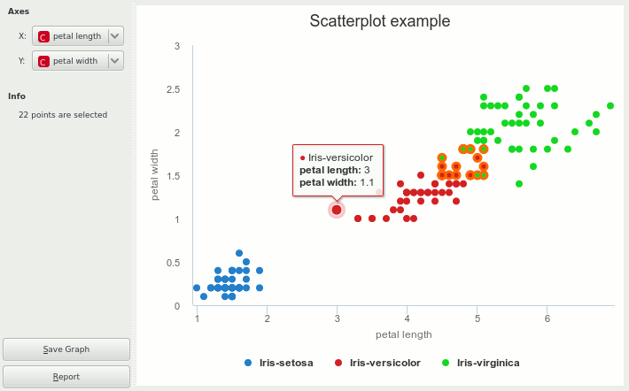

################################
Visualization with Highcharts JS
################################

This tutorial is about making a widget that uses Highcharts to build an
interactive scatter plot widget. This is the end result:

When your wish your widget to include interactive visualization, there are
three main approaches you can take in Orange:

* Use PyQtGraph, a scientific graphics and GUI library for Python that most
  of our widgets use. While the library was great in the past and still has
  little Python alternative, it is quickly becoming fairly obsolete when
  JavaScript, d3.js, and other SVG-based manipulators are so prominently
  taking over. It's also too undocumented and unmaintained for such a core
  visualization library, in our opinion.
* Use Qt with its ``QGraphicsView``, ``QGraphicsScene`` and ``QGraphicsItem``
  objects directly. These constructs are best used when you need custom graphic
  constructs and specifically don't need axes with ticks and other standard
  chart features.
* Use Highcharts_, which is one of the most widely used JavaScript
  charting libraries. It is best suited to visualization tasks that
  build upon one of the `premade visualizations`_ but can be used to render
  anything.

We make Highcharts with its `full API`_ available in Orange through Python.

The widget below receives :class:`~Orange.data.Table` as input, allows
selecting the scatter axes attributes, and outputs the data subset as
selected by the user.

Note, the tutorial assumes basic familiarity with
:doc:`building Orange widgets <index>`.

.. _Highcharts: http://www.highcharts.com/
.. _premade visualizations: http://www.highcharts.com/demo/
.. _full API: http://api.highcharts.com/highcharts

Since source code says more than a thousands words, we show here the full,
documented module:

.. literalinclude:: code/owScatterplot.py

For more and up-to-date information see the docstrings of the
:class:`~Orange.widgets.highcharts.Highchart` class.
