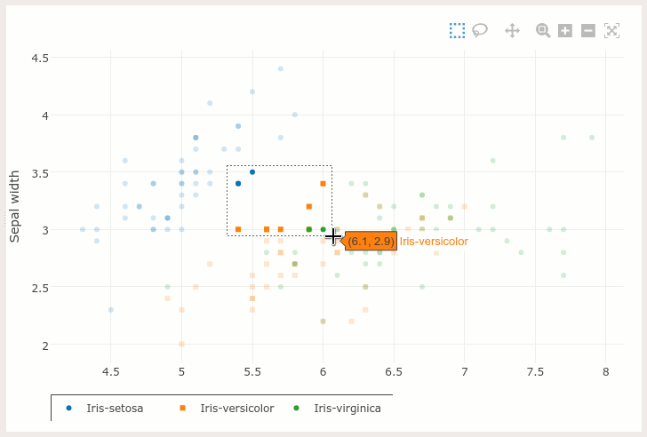

############################
Visualization with Plotly JS
############################

This tutorial will show you how to make a simple scatter plot widget, rendering
the plot using Plotly_, a modern JavaScript visualization library.

Orange exposes a thin wrapper around `Plotly Offline Python API`_ in
:class:`Orange.widgets.utils.plotly_widget.Plotly` class, which this
example will base on. This is approximately the expected result:

.. _Plotly: https://plot.ly/
.. _Plotly Offline Python API: https://plot.ly/python/

The simple Orange widget below doesn't accept any input, and it doesn't output
anything. It just plots a scatter plot of *sepal width* and *sepal length*
attributes of the well-known *iris* data set, and it prints selections on
the standard output.

Since source code proverbially says more than a thousands words, we show
here the full, module with comments in-line:

.. literalinclude:: code/plotlyScatter.py
   :language: py3

For additional parameters to ``Plotly.plot()``, to ``go.Scatter()``, or to any
other available plotly graph objects, see class' and methods' docstrings and
the full online `Plotly documentation`_ and `reference`_.

.. _Plotly documentation: https://plot.ly/python/
.. _reference: https://plot.ly/python/reference/

JavaScript API
==============
You can reference the container object of plotly charts, which exposes
some of Plot.ly JS APIs, as ``window.container``. For example:

.. code-block:: javascript

   let first_series_plot_type = container.data[0].type;

``plotly_*`` events
-------------------
To subscribe to `JavaScript events`_ emitted by Plotly charts,
create a global function matching the event name, prefixed with ``on_``,
e.g.

.. code-block:: javascript

   window.on_plotly_click = function(click_data) {
       console.log('Called when a point is clicked');
   }

``Plotly`` wrapper automatically connects plotly events to their matching
handlers, if available.

The function ``on_plotly_selected()`` is already provided and it handles ranges
and points selections channelling them into their designated Python callbacks.

.. _JavaScript events: https://plot.ly/javascript/plotlyjs-events/
