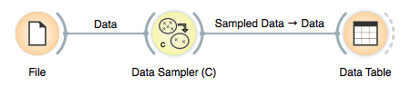
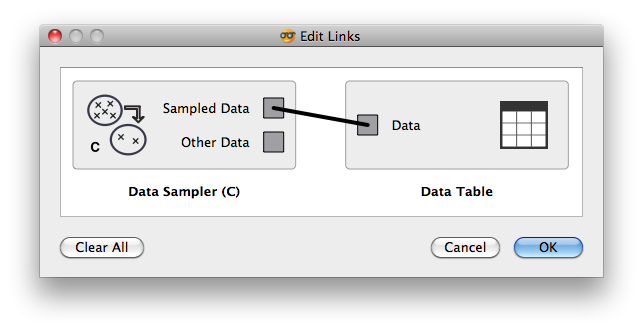
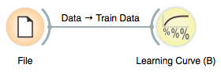

###################
Channels and Tokens
###################

Our data sampler widget was, regarding the channels, rather simple
and linear: the widget was designed to receive the token from one
widget, and send an output token to another widget. Just like in an
example schema below:

.. image:: images/schemawithdatasamplerB.png

There's quite a bit more to channels and management of tokens, and
we will overview most of the stuff you need to know to make your more
complex widgets in this section.

********************
Multi-Input Channels
********************

In essence, the basic idea about "multi-input" channels is that they can
be used to connect them with several output channels. That is, if a
widget supports such a channel, several widgets can feed their input
to that widget simultaneously.

Say we want to build a widget that takes a dataset and test
various predictive modeling techniques on it. A widget has to have an
input data channel, and this we know how to deal with from our
:doc:`previous <tutorial-settings>` lesson. But, somehow differently, we
want to connect any number of widgets which define learners to our
testing widget. Just like in a schema below, where three different
learners are used:

.. image:: images/learningcurve.png

We will here take a look at how we define the channels for a learning
curve widget, and how we manage its input tokens. But before we do it,
just in brief: learning curve is something that you can use to test
some machine learning algorithm in trying to see how its performance
depends on the size of the training set size. For this, one can draw a
smaller subset of data, learn the classifier, and test it on remaining
dataset. To do this in a just way (by Salzberg, 1997), we perform
k-fold cross validation but use only a proportion of the data for
training. The output widget should then look something like:

.. image:: images/learningcurve-output.png

Now back to channels and tokens. Input and output channels for our
widget are defined by

.. literalinclude:: orange-demo/orangedemo/OWLearningCurveA.py
   :start-after: start-snippet-1
   :end-before: end-snippet-1

Notice that everything is pretty much the same as it was with
widgets from previous lessons, the only difference being the additional argument
``multiple=True``, which says that this input can be connected to outputs of
multiple widgets.

Handlers of multiple-input signals must accept two arguments: the sent object
and the id of the sending widget.

.. literalinclude:: orange-demo/orangedemo/OWLearningCurveA.py
   :pyobject: OWLearningCurveA.set_learner

OK, this looks like one long and complicated function. But be
patient! Learning curve is not the simplest widget there is, so
there's some extra code in the function above to manage the
information it handles in the appropriate way. To understand the
signals, though, you should only understand the following. We store
the learners (objects that learn from data) in an
:class:`~collections.OrderedDict` :obj:`self.learners`. This dictionary
is a mapping of input *id* to the input value (the input learner itself).
The reason this is an :class:`~collections.OrderedDict` is that the order
of the input learners is important as we want to maintain a consistent column
order in the table view of the learning curve point scores.

The function above first checks if the channel `id` is already in
:obj:`self.learners` and if so either deletes the corresponding entry if
``learner`` is ``None`` (remember receiving a ``None`` value means the
link was removed/closed) or invalidates the cross validation results
and curve point for that channel id, marking for update in
:func:`~Orange.widgets.widget.OWWidget.handleNewSignals`. A similar case is
when we receive a learner for a new channel id.

Note that in this widget the evaluation (k-fold cross
validation) is carried out just once given the learner, dataset and
evaluation parameters, and scores are then derived from class
probability estimates as obtained from the evaluation procedure. Which
essentially means that switching from one to another scoring function
(and displaying the result in the table) takes only a split of a
second. To see the rest of the widget, check out
:download:`its code <orange-demo/orangedemo/OWLearningCurveA.py>`.

*****************************
Using Several Output Channels
*****************************

There's nothing new here, only that we need a widget that has
several output channels of the same type to illustrate the idea of the
default channels in the next section. For this purpose, we will modify
our sampling widget as defined in previous lessons such that it will
send out the sampled data to one channel, and all other data to
another channel. The corresponding channel definition of this widget
is

.. literalinclude:: orange-demo/orangedemo/OWDataSamplerC.py
   :start-after: start-snippet-1
   :end-before: end-snippet-1

We used this in the third incarnation of :download:`data sampler widget
<orange-demo/orangedemo/OWDataSamplerC.py>`, with essentially the only
other change in the code in the :func:`selection` and :func:`commit`
functions

.. literalinclude:: orange-demo/orangedemo/OWDataSamplerC.py
   :pyobject: OWDataSamplerC.selection

.. literalinclude:: orange-demo/orangedemo/OWDataSamplerC.py
   :pyobject: OWDataSamplerC.commit

If a widget that has multiple channels of the same type is
connected to a widget that accepts such tokens, Orange Canvas opens a
window asking the user to confirm which channels to connect. Hence,
if we have just connected *Data Sampler (C)* widget to a Data Table
widget in a schema below:

we would get a following window querying users for information on
which channels to connect:

*************************************************************
Default Channels (When Using Input Channels of the Same Type)
*************************************************************

Now, let's say we want to extend our learning curve widget such
that it does the learning the same way as it used to, but can -
provided that such dataset is defined - test the
learners (always) on the same, external dataset. That is, besides the
training dataset, we need another channel of the same type but used
for training dataset. Notice, however, that most often we will only
provide the training dataset, so we would not like to be bothered (in
Orange Canvas) with the dialog which channel to connect to, as the
training dataset channel will be the default one.

When enlisting the input channel of the same type, the default
channels have a special flag in the channel specification list. So for
our new :download:`learning curve <orange-demo/orangedemo/OWLearningCurveB.py>`
widget, the channel specification is

.. literalinclude:: orange-demo/orangedemo/OWLearningCurveB.py
   :start-after: start-snippet-1
   :end-before: end-snippet-1

That is, the :obj:`Train Data` channel is a single-token
channel which is a default one (third parameter). Note that the flags can
be added (or OR-d) together so ``Default + Multiple`` is a valid flag.
To test how this works, connect a file widget to a learning curve widget
and - nothing will really happen:

That is, no window with a query on which channels to connect to will
open, as the default *"Train Data"* was selected.

*****************
Explicit Channels
*****************

Sometimes when a widget has multiple outputs of different types, some
of them should not be subject to this automatic default connection selection.
An example of this is in Orange's `Logistic Regression` widget that outputs
a supplementary 'Coefficients' data table. Such outputs can be marked with
and :attr:`~Orange.widgets.widget.Explicit` flag, which ensures they are never
selected for a default connection.
