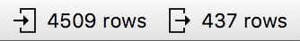
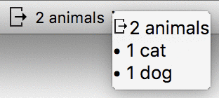

Utilities
*********

Progress Bar
------------

Operations that take more than a split second indicate their
progress with a progress bar

.. image:: images/progressbar.png

and in the title bar of the widget's window.

.. image:: images/progressbar-title.png

There are two mechanisms for implementing this.

Progress bar class
..................

Class `Orange.widgets.gui.ProgressBar` is initialized with a widget and the
number of iterations::

    progress = Orange.widgets.gui.ProgressBar(self, n)

Direct manipulation of progress bar
...................................

The progress bar can be manipulated directly through functions

* :obj:`~Orange.widgets.widget.OWWidget.progressBarInit(self)`
* :obj:`~Orange.widgets.widget.OWWidget.progressBarSet(self, p)`
* :obj:`~Orange.widgets.widget.OWWidget.progressBarFinished(self)`

`progressBarInit` initializes the progress bar, `progressBarSet` sets it
to `p` percents (from 0 to 100), and `progressBarFinished` closes it.

The code that uses these methods must use a try-except or try-finally block
to ensure that the progress bar is removed if the exception is raised.

Issuing warning and errors
--------------------------

Widgets can show information messages, warnings and errors. These are
displayed in the top row of the widget and also indicated in the schema.

.. image:: images/warningmessage.png

Simple messages
...............

If the widget only issues a single error, warning and/or information at a time,
it can do so by calling `self.error(text, shown=True)`,
`self.warning(text, shown=True)` or `self.information(text, shown=True)`.
Multiple messages - but just one of each kind - can be present at the same
time::

    self.warning("Discrete features are ignored.")
    self.error("Fitting failed due to missing data.")

At this point, the widget has a warning and an error message.

    self.error("Fitting failed due to weird data.")

This replaces the old error message, but the warning remains.

The message is removed by setting an empty message, e.g. `self.error()`.
To remove all messages, call `self.clear_messages()`.

If the argument `shown` is set to `False`, the message is removed::

    self.error("No suitable features", shown=not self.suitable_features)

"Not showing" a message in this way also remove any existing messages.

Multiple messages
.................

Widget that issue multiple independent messages that can appear simultaneously,
need to declare them within local classes within the widget class, and derive
them from the corresponding `OWWidget` classes for a particular kind of a
message. For instance, a widget class can contain the following classes::

    class Error(OWWidget.Error):
        no_continuous_features = Msg("No continuous features")

    class Warning(OWWidget.Warning):
        empty_data = Msg("Comtrongling does not work on meta data")
        no_scissors_run = Msg("Do not run with scissors")
        ignoring_discrete = Msg("Ignoring {n} discrete features: {}")

Within the widget, errors are raised via calls like::

    self.Error.no_continuous_features()
    self.Warning.no_scissors_run()

As for the simpler messages, the `shown` argument can be added::

    self.Warning.no_scissors_run(shown=self.scissors_are_available)

If the message includes formatting, the call must include the necessary data
for the `format` method::

    self.Warning.ignoring_discrete(", ".join(attrs), n=len(attr))

Message is cleared by::

    self.Warning.ignoring_discrete.clear()

Multiple messages can be removed as in the simpler schema, with::

    self.Warning.clear()

or::

    self.clear_messages()

Messages of both kinds - those from messages classes and those issued by,
for instance, `self.error` - can coexist. Note, though, that methods for
removing all messages of certain type (e.g. `self.Error.clear()`) or all
messags (`self.clear_message()`) apply to all messages of this type.

**Note**: handling multiple messages through ids, that is, using
`self.information(id, text)`, `self.warning(id, text)` and
`self.error(id, text)` is deprecated and will be removed in the future.

I/O Summaries
-------------

.. versionadded:: 3.19

Widgets can optionally summarize their inputs/outputs via the
:attr:`~Orange.widgets.widget.OWWidget.info` namespace using the
:func:`~Orange.widgets.widget.StateInfo.set_input_summary` and
:func:`~Orange.widgets.widget.StateInfo.set_output_summary` methods.
::

   self.info.set_input_summary("foo")
   self.info.set_output_summary("bar")

Summaries are then displayed in the widget's status bar:

Predefined constants indicating no input/output are available as
``self.info.NoInput`` and ``self.info.NoOutput`` respectively
::

   self.info.set_input_summary(self.info.NoInput)
   self.info.set_output_summary(self.info.NoOutput)

The summaries can also contain more detailed information to be displayed
in tool tip or popup::

   self.info.set_output_summary("2 animals", "• 1 cat\n• 1 dog")

.. seealso::
   :func:`~Orange.widgets.widget.StateInfo.set_input_summary`,
   :func:`~Orange.widgets.widget.StateInfo.set_output_summary`

.. note::
   No I/O summary messages are displayed initially. Widget authors should
   initialize them (to empty state) in the widget's ``__init__`` method.

Tips
----

Widgets can provide tips about features that are not be obvious or
exposed in the GUI.

.. image:: images/usertips.png

Such messages are stored in widget's class attribute `UserAdviceMessages`.
When a widget is first shown, a message from this list is selected for display.
If a user accepts (clicks 'Ok. Got it') the choice is recorded and the message
is never shown again; just closing the message will not mark it as seen.
Messages can be displayed again by pressing Shift + F1.

`UserAdviceMessages` contains instances of
:obj:`~Orange.widgets.widget.Message`. The messages contains a text and an
id (also a string), and, optionally, an icon and an URL with further
information.

The confusion matrix widget sets up the following list::

    UserAdviceMessages = [
        widget.Message("Clicking on cells or in headers outputs the "
                           "corresponding data instances",
                       "click_cell")]

