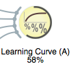
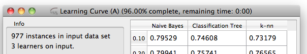
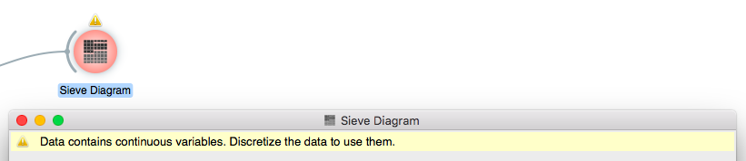

Utilities
*********

Progress Bar
------------

Operations that take more than a split second indicate their
progress with a progress bar

and in the title bar of the widget's window.

There are three mechanisms for implementing this.

Context handlers
................

The recommended and the simplest approach is to wrap the code into
context handler :obj:`~Orange.widgets.widgetOWWidget.progressBar`.

If the operation consists of a known number of steps that take similar
time, the context handler can be used as follows::

    with self.progressBar(n_steps) as progress:
        for k in range(n_steps):
            self.do_some_processing()
            progress.advance()

In general, the argument of `self.progressBar` represents the total
towards which the progress bar advances. Method `progress.advance()` accepts
an argument representing the advance. ::

    with self.progressBar(total) as progress:
        for k in s:
            self.do_some_processing()
            progress.advance(adv)

In this case, the values of `adv` should sum up to the `total`;
`adv` and `total` do not need to be integer numbers.

If `total` is omitted, it defaults to 1, so the advances must sum to 1.

The progress can also be set to absolute values by calling the widget's
methods `self.progressBarSet(perc)`. This method belongs to the group
of methods for direct manipulation of the progress bar (see below) and
expects the state in percents (0 to 100). ::

    with self.progressBar():
        ...
        self.progressBarSet(perc)
        ...

Progress bar class
..................

Class `Orange.widgets.gui.ProgressBar` is initialized with a widget and the
number of iterations::

    progress = Orange.widgets.gui.ProgressBar(self, n)

is equivalent to ::

     with self.progressBar(n) as progress:

This form is useful when the initialization of the progress bar and setting
of its state are not in the same block.

Direct manipulation of progress bar
...................................

The progress bar can be manipulated directly through functions

* :obj:`~Orange.widgets.widget.OWWidget.progressBarInit(self)`
* :obj:`~Orange.widgets.widget.OWWidget.progressBarSet(self, p)`
* :obj:`~Orange.widgets.widget.OWWidget.progressBarFinished(self)`

`progressBarInit` initializes the progress bar, `progressBarSet` sets it
to `p` percents (from 0 to 100), and `progressBarFinished` closes it.

The code that uses these methods must use a try-except or try-finally block
to ensure that the progress bar is removed if the exception is raised.

Issuing warning and errors
--------------------------

Widgets can show information messages, warnings and errors. These are
displayed in the top row of the widget and also indicated in the schema.

Messages, warning and errors are issued by methods
`self.information(id, text)`, `self.warning(id, text)` and
`self.error(id, text)`, respectively. A warning like the one above is
issued by ::

    self.warning(42, "Data contains continuous variables. "
                 "Discretize the data to use them.")

and removed by ::

    self.warning(42)

A widget can have multiple such messages at the same time. They are
distinguished by different id's, like `42` above. The id numbers are
arbitrary and are assigned by the programmer. They need to be unique
for a widget.

Multiple error messages can be removed by calling the function with a
list of id's, `self.warning([1, 13, 42])`.

Since most widgets have only a single error message, the id can be omitted
(in which case it defaults to 0). In this case, ::

    self.warning("Data contains continuous variables. "
                 "Discretize the data to use them.")

issues the warning, and ::

    self.warning()

removes it.

Tips
----

Widgets can provide tips about features that are not be obvious or
exposed in the GUI.

.. image:: images/usertips.png

Such messages are stored in widget's class attribute `UserAdviceMessages`.
When a widget is first shown, a message from this list is selected for display.
If a user accepts (clicks 'Ok. Got it') the choice is recorded and the message
is never shown again; just closing the message will not mark it as seen.
Messages can be displayed again by pressing Shift + F1.

`UserAdviceMessages` contains instances of
:obj:`~Orange.widgets.widget.Message`. The messages contains a text and an
id (also a string), and, optionally, an icon and an URL with further
information.

The confusion matrix widget sets up the following list::

    UserAdviceMessages = [
        widget.Message("Clicking on cells or in headers outputs the "
                           "corresponding data instances",
                       "click_cell")]

