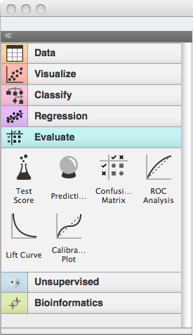

.. _getting started:

###############
Getting Started
###############

Orange Widgets are components in Orange Canvas, a visual programming
environment of Orange. They represent some self contained functionalities and
provide a graphical user interface (GUI). Widgets communicate with each other and
pass objects through communication channels to interact with other
widgets.

On this page, we will start with some simple essentials, and then
show you how to build a simple widget that will be ready to run within
Orange Canvas.

Prerequisites
*************

Each Orange widget belongs to a category and has an associated priority
within that category. When opening Orange Canvas, a visual
programming environment that comes with Orange, widgets are listed in
a toolbox on the left:

Each widget has a name description and a set of input/outputs
(referred to as the widget's meta description).

This meta data is discovered at Orange Canvas application startup
leveraging setuptools/distribute and its `entry points`_ protocol.
Orange Canvas looks for widgets using an ``orange.widgets`` entry point.

.. _`entry points`: https://pythonhosted.org/setuptools/setuptools.html#dynamic-discovery-of-services-and-plugins

Defining a widget
*****************

:class:`~Orange.widgets.widget.OWWidget` is the base class of a widget
in the Orange Canvas workflow.

Every widget in the canvas framework needs to define its meta data.
This includes the widget's name and text descriptions and more
importantly its input/output specification. This is done by
defining constants in the widget's class namespace.

We will start with a very simple example. A widget that will output
a single integer specified by the user.

.. code-block:: python

    from Orange.widgets.widget import OWWidget, Output
    from Orange.widgets.settings import Setting
    from Orange.widgets import gui

    class IntNumber(OWWidget):
        # Widget's name as displayed in the canvas
        name = "Integer Number"
        # Short widget description
        description = "Lets the user input a number"

        # An icon resource file path for this widget
        # (a path relative to the module where this widget is defined)
        icon = "icons/number.svg"

        # Widget's outputs; here, a single output named "Number", of type int
        class Outputs:
            number = Output("Number", int)

By design principle, Orange widgets in an interface are most
often split to control and main area. Control area appears on the left
and should include any controls for settings or options that your widget
will use. Main area would most often include a graph, table or some
drawing that will be based on the inputs to the widget and current
options/setting in the control area.
:class:`~Orange.widgets.widget.OWWidget` makes these two areas available
through its attributes :obj:`self.controlArea` and :obj:`self.mainArea`.
Notice that while it would be nice for all widgets to have this common
visual look, you can use these areas in any way you want, even
disregarding one and composing your widget completely unlike the
others in Orange.

We specify the default layout with class attribute flags.
Here we will only be using a single column (controlArea) GUI.

.. code-block:: python

       # Basic (convenience) GUI definition:
       #   a simple 'single column' GUI layout
       want_main_area = False
       #   with a fixed non resizable geometry.
       resizing_enabled = False

We want the current number entered by the user to be saved and restored
when saving/loading a workflow. We can achieve this by declaring a
special property/member in the widget's class definition like so:

.. code-block:: python

       number = Setting(42)

And finally the actual code to define the GUI and the associated
widget functionality:

.. code-block:: python

       def __init__(self):
           super().__init__()

           from AnyQt.QtGui import QIntValidator
           gui.lineEdit(self.controlArea, self, "number", "Enter a number",
                        box="Number",
                        callback=self.number_changed,
                        valueType=int, validator=QIntValidator())
           self.number_changed()

       def number_changed(self):
           # Send the entered number on "Number" output
           self.Outputs.number.send(self.number)

.. seealso::
   :func:`Orange.widgets.gui.lineEdit`,

By itself this widget is useless because no widget accepts its output.
So let us define a widget that displays a number.

.. code-block:: python

   from Orange.widgets.widget import OWWidget, Input
   from Orange.widgets import gui

   class Print(OWWidget):
       name = "Print"
       description = "Print out a number"
       icon = "icons/print.svg"

       class Inputs:
           number = Input("Number", int)

       want_main_area = False

       def __init__(self):
           super().__init__()
           self.number = None

           self.label = gui.widgetLabel(self.controlArea, "The number is: ??")

       @Inputs.number
       def set_number(self, number):
           """Set the input number."""
           self.number = number
           if self.number is None:
               self.label.setText("The number is: ??")
           else:
               self.label.setText("The number is {}".format(self.number))

We define inputs with a class `Inputs`, just like outputs are defined by
`Outputs`. However, each input must be handled by a class methods. We mark
the handlers by decorating them; in above case by putting `@Inputs.number`
before the method's definition.

Notice how in the `set_number` method we check whether the number is `None`.
`None` is sent to the widget when a connection between the widgets is removed
or if the sending widget to which we are connected intentionally emptied
the channel.

Now we can use one widget to input a number and another to display it.

One more:

.. code-block:: python

   from Orange.widgets.widget import OWWidget, Input, Output

   class Adder(OWWidget):
       name = "Add two integers"
       description = "Add two numbers"
       icon = "icons/add.svg"

       class Inputs:
           a = Input("A", int)
           b = Input("B", int)

       class Outputs:
           sum = Output("A + B", int)

       want_main_area = False

       def __init__(self):
           super().__init__()
           self.a = None
           self.b = None

       @Inputs.a
       def set_A(self, a):
           """Set input 'A'."""
           self.a = a

       @Inputs.b
       def set_B(self, b):
           """Set input 'B'."""
           self.b = b

       def handleNewSignals(self):
           """Reimplemeted from OWWidget."""
           if self.a is not None and self.b is not None:
               self.Outputs.sum.send(self.a + self.b)
           else:
               # Clear the channel by sending `None`
               self.Outputs.sum.send(None)

.. seealso:: :func:`~Orange.widgets.widget.OWWidget.handleNewSignals`

A 'Demo' package
****************

After learning what an Orange Widget is and how to define them on
a toy example, we will build an semi-useful widgets that can
work together with the existing Orange Widgets.

We will start with a very simple one, that will receive a dataset
on the input and will output a dataset with 10% of the data instances.
We will call this widget `OWDataSamplerA` (OW for Orange Widget,
DataSampler since this is what widget will be doing, and A since we
prototype a number of this widgets in our tutorial).

First in order to include our new widgets in the Orange Canvas's
toolbox we will create a dummy `python project
<https://python-packaging-user-guide.readthedocs.org/>`_
named *orange-demo*

The layout should be::

   orange-demo/
         setup.py
         orangedemo/
                     __init__.py
                     OWDataSamplerA.py

and the :download:`orange-demo/setup.py` should contain

.. literalinclude:: orange-demo/setup.py

Note that we declare our *orangedemo* package as containing widgets
from an ad hoc defined category *Demo*.

.. seealso::
   https://github.com/biolab/orange3/wiki/Add-Ons

..
   TODO: Additional tutorial for Add-on declaration

Following the previous examples, our module defining the OWDataSamplerA
widget starts out as:

.. literalinclude:: orange-demo/orangedemo/OWDataSamplerA.py
   :start-after: start-snippet-1
   :end-before: end-snippet-1

The widget defines an input channel "Data" and an output channel called
"Sampled Data". Both will carry tokens of the type :class:`Orange.data.Table`.
In the code, we will refer to the signals as `Inputs.data` and `Outputs.sample`.

Channels can carry tokens of arbitrary types. However, the purpose of widgets
is to talk with other widgets, so as one of the main design principles we try
to maximize the flexibility of widgets by minimizing the number of different
channel types. Do not invent new signal types before checking whether you cannot
reuse the existing.

As our widget won't display anything apart from some info, we will
place the two labels in the control area and surround it with the box
"Info".

The next four lines specify the GUI of our widget. This will be
simple, and will include only two lines of text of which, if nothing
will happen, the first line will report on "no data yet", and second
line will be empty.

In order to complete our widget, we now need to define a method that will
handle the input data. We will call it :func:`set_data`; the name is arbitrary,
but calling the method `set_<the name of the input>` seems like a good practice.
To designate it as the method that accepts the signal defined in `Inputs.data`,
we decorate it with `@Inputs.data`.

.. literalinclude:: orange-demo/orangedemo/OWDataSamplerA.py
   :start-after: start-snippet-2
   :end-before: end-snippet-2

The :obj:`dataset` argument is the token sent through the input
channel which our method needs to handle.

To handle a non-empty token, the widget updates the interface
reporting on number of data items on the input, then does the data
sampling using Orange's routines for these, and updates the
interface reporting on the number of sampled instances. Finally, the
sampled data is sent as a token to the output channel defined as
`Output.sample`.

Although our widget is now ready to test, for a final touch, let's
design an icon for our widget. As specified in the widget header, we
will call it
:download:`DataSamplerA.svg <orange-demo/orangedemo/icons/DataSamplerA.svg>`
and put it in `icons` subdirectory of `orangedemo` directory.

With this we can now go ahead and install the orangedemo package. We
will do this by running ``pip install -e .`` command from
within the `orange-demo` directory.

.. note::
   Depending on your python installation you might need
   administrator/superuser privileges.

For a test, we now open Orange Canvas. There should be a new pane in a
widget toolbox called Demo. If we click on this pane, it displays an
icon of our widget. Try to hover on it to see if the header and channel
info was processed correctly:

.. image:: images/samplewidgetontoolbox.png

Now for the real test. We put the File widget on the schema (from
Data pane) and load the iris.tab dataset. We also put our Data
Sampler widget on the scheme and open it (double click on the icon,
or right-click and choose Open):

.. image:: images/datasamplerAempty.png

Now connect the File and Data Sampler widget (click on an output
connector of the File widget, and drag the line to the input connector
of the Data Sampler). If everything is ok, as soon as you release the
mouse, the connection is established and, the token that was waiting
on the output of the file widget was sent to the Data Sampler widget,
which in turn updated its window:

.. image:: images/datasamplerAupdated.png

To see if the Data Sampler indeed sent some data to the output,
connect it to the Data Table widget:

.. image:: images/schemawithdatatable.png

Try opening different data files (the change should propagate
through your widgets and with Data Table window open, you should
immediately see the result of sampling). Try also removing the
connection between File and Data Sampler (right click on the
connection, choose Remove). What happens to the data displayed in the
Data Table?

Testing Your Widget Outside Orange Canvas
*****************************************

For debugging purposes, we want to be able to run widgets standalone: if the
file with the widget code is executed as a main script, it should show the
widget and feed it some suitable data. The simplest way to do so is to use
:obj:`Orange.widgets.utils.WidgetPreview` and pass it the data for the
default signal.

.. literalinclude:: orange-demo/orangedemo/OWDataSamplerA.py
   :start-after: start-snippet-3
   :end-before: end-snippet-3
