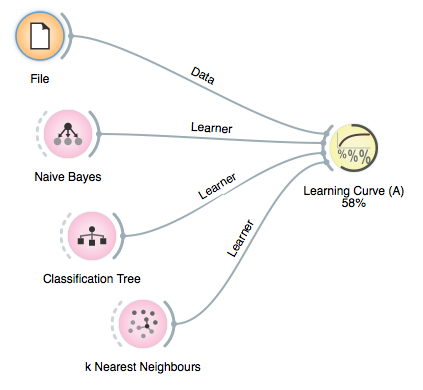
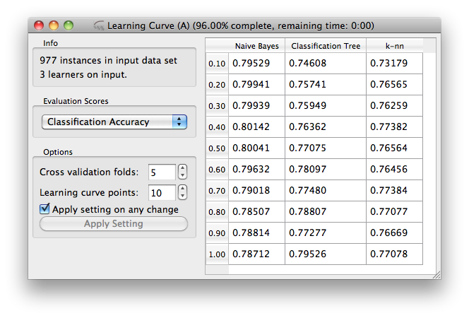

************
Progress Bar
************

Widgets, where there is any chance that their operation can be
slower than split second, should report on the progress of their
computation. For that purpose orange widgets use progress bar
functions, to which they report progress in terms of per-cent
completion of the task. The progress is then either on the icon
of the widget in Orange Canvas

or in the title bar of the widget's window. There, Orange also
reports on the estimated time of completion of the task:

:class:`~Orange.widgets.widget.OWWidget` has for this purpose a set of
functions, which include:

* :func:`~Orange.widgets.widget.OWWidget.progressBarInit`
* :func:`~Orange.widgets.widget.OWWidget.progressBarSet`
* :func:`~Orange.widgets.widget.OWWidget.progressBarFinished`

where value is any number between 0 and 100.

Sometimes, we know about the number of iterations involved in
computation, and we would only like to advance the progress bar for
some constant at the end of the iteration. For this, we use
:class:`Orange.widgets.gui.ProgressBar` class.

..
   and the code in
   the learning curve widget described in the previous lesson that does
   it is as follows
   
   .. literalinclude:: OWLearningCurveA.py
      :pyobject: OWLearningCurveA.getLearningCurve
   
   
   :class:`ProgressBar` class removes the need to define any special
   function to compute the percent of the task done and set the
   progress bar, and instead uses :class:`ProgressBar`'s method
   :func:`advance` for this purpose.
