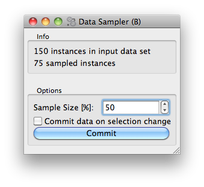
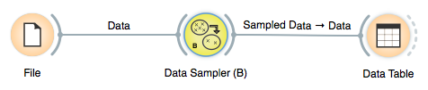

################################
Tutorial (Settings and Controls)
################################

In the :doc:`previous section <tutorial-cont>` of our tutorial we
have just built a simple sampling widget. Let us now make this widget
a bit more useful, by allowing a user to set the proportion of data
instances to be retained in the sample. Say we want to design a widget
that looks something like this:

What we added is an Options box, with a spin entry box to set the
sample size, and a check box and button to commit (send out) any
change we made in setting. If the check box with "Commit data on
selection change" is checked, than any change in the sample size will
make the widget send out the sampled data set. If data sets are large
(say of several thousands or more) instances, we may want to send out
the sample data only after we are done setting the sample size, hence
we left the commit check box unchecked and press "Commit" when we are
ready for it.

This is a very simple interface, but there is something more to
it. We want the settings (the sample size and the state of the commit
button) to be saved. That is, any change we made, we want to save it so
that the next time we open the widget the settings is there as we have left
it

.. 
   There is some complication to it, as widget can be part of an
   application, or part of some schema in the Canvas, and we would like
   to have the settings application- or schema-specific.

Widgets Settings
****************

Luckily, since we use the base class :class:`~Orange.widgets.widget.OWWidget`,
the settings will be handled just fine. We only need to tell which variables
we want to use for persistent settings.

.. 
   For Python inspired readers: these
   variables can store any complex object, as long as it is
   picklable. 

In our widget, we will use two settings variables, and we declare this
in the widget class definition (after the `inputs`, `outputs` definitions).

.. literalinclude:: orange-demo/orangedemo/OWDataSamplerB.py
   :start-after: start-snippet-1
   :end-before: end-snippet-1

All settings have to specify their default value. When a widget is
created the widget's members are already restored and ready to use
in its `__init__` method.
The contents of the two variables (:obj:`self.proportion` and
:obj:`self.commitOnChange`) will be saved upon closing our widget.
In our widget, we won't be setting these variables directly,
but will instead use them in conjunction with GUI controls.

Controls and OWGUI
******************

We will use the :mod:`Orange.widgets.gui` to create/define the gui.
With this library, the GUI definition part of the options box is a bit
dense but rather very short

.. literalinclude:: orange-demo/orangedemo/OWDataSamplerB.py
   :start-after: start-snippet-3
   :end-before: end-snippet-3

We are already familiar with the first part - the Info group
box. To make widget nicer, we put a separator between this and Options
box. After defining the option box, here is our first serious
:mod:`~Orange.widgets.gui` control: a :func:`Orange.widgets.gui.spin`.
The first parameter specifies its parent widget/layout, in this case
:obj:`self.optionsBox` (the resulting widget object will automatically
append itself to the parent's layout). The second (:obj:`self`) and
third (``'proportion'``) define the *property binding* for the spin box.
I.e. any change in the spin box control will automatically be propagated
to the :obj:`self.proportions` and vice versa - changing the value of
`self.proprotions` in the widget code by assignment
(e.g. ``self.proprotions = 30``) will update the spin box's state to match.

The rest of the spin box call gives some parameters for the
control (minimum and maximum value and the step size), tells about the
label which will be placed on the top, and tells it which functions to
call when the value in the spin box is changed. We need the first
callback to make a data sample and report in the Info box what is the
size of the sample, and a second callback to check if we can send this
data out. In :mod:`Orange.widgets.gui`, callbacks are either references
to functions, or a list with references, just like in our case.

With all of the above, the parameters for the call of
:func:`Orange.widgets.gui.checkBox` should be clear as well. Notice that
this and a call to :func:`Orange.widgets.gui.spin` do not need a parameter
which would tell the control the value for initialization: upon
construction, both controls will be set to the value that is
pertained in the associated setting variable.

That's it. Notice though that we have, as a default, disabled all
the controls in the Options box. This is because at the start of the
widget, there is no data to sample from. But this also means that when
process the input tokens, we should take care for enabling and
disabling. The data processing and token sending part of our widget
now is

.. literalinclude:: OWDataSamplerB.py
   :start-after: start-snippet-4
   :end-before: end-snippet-4

You can now also inspect the :download:`complete code <orange-demo/orangedemo/OWDataSamplerB.py>`
of this widget. To distinguish it with a widget we have developed in the
previous section, we have designed a special
:download:`icon <orange-demo/orangedemo/icons/DataSamplerB.svg>` for it.
If you wish to test this widget in the Orange Canvas, put its code in
the `orangedemo` directory we have created for the previous widget and try
it out using a schema with a File and Data Table widget.

Well-behaved widgets remember their settings - the state of their
checkboxes and radio-buttons, the text in their line edits, the
selections in their combo boxes and similar.

Context dependent settings
**************************

Context dependent settings are settings which depend on the widget's
input. For instance, the scatter plot widget contains settings that
specify the attributes for x and y axis, and the settings that
define the color, shape and size of the examples in the graph.

An even more complicated case is the widget for data
selection with which one can select the examples based on values of
certain attributes. Before applying the saved settings, these widgets
needs to check their compliance with the domain of the actual data
set. To be truly useful, context dependent settings needs to save a
setting configuration for each particular data set used. That is, when
given a particular data set, it has to select the saved settings that
is applicable and matches best currently used data set.

Saving, loading and matching contexts is taken care of by context
handlers. Currently, there are only two classes of context handlers
implemented. The first one is the abstract :class:`ContextHandler`
and the second one is :class:`DomainContextHandler` in which the
context is defined by the data set domain and where the settings
contain attribute names. The latter should cover most of your needs,
while for more complicated widgets you will need to derive a new
classes from it. There may even be some cases in which the context is
not defined by the domain, in which case the
:class:`ContextHandler` will be used as a base for your new
handler.

Contexts need to be declared, opened and closed. Opening and
closing usually takes place (in the opposite order) in the function
that handles the data signal. This is how it looks in the scatter plot
(the code is somewhat simplified for clarity).

.. code-block:: python

    def set_data(self, data):
        self.closeContext()
        self.data = data
        self.graph.setData(data)

        self.initAttrValues()

        if data is not None:
            self.openContext(data.domain)

        self.updateGraph()
        self.sendSelections()

In general, the function should go like this:

* Do any clean-up you need, but without clearing any of the settings that need
  to be saved. Scatter plot needs none.
* Call ``self.closeContext()``; this ensures that all the context dependent
  settings (e.g. attribute names from the list boxes) are remembered.
* Initialize the widget state and set the controls to some defaults as
  if there were no context retrieving mechanism. Scatter plot does it by
  calling ``self.initAttrValues()`` which assigns the first two attributes to
  the x and y axis and the class attribute to the color. At this phase, you
  shouldn't call any functions that depend on the settings, such as drawing
  the graph.
* Call ``self.openContext(data.domain)`` (more about the arguments later).
  This will search for a suitable context and assign the controls new values
  if one is found. If there is no saved context that can be used, a new
  context is created and filled with the default values that were assigned
  at the previous point.
* Finally, adjust the widget according to the retrieved controls. Scatter plot
  now plots the graph by calling ``self.updateGraph()``.

When opening the context, we provide the arguments on which the context
depends. In case of :class:`DomainContextHandler`, which scatter plot uses, we
can give it a :class:`Orange.data.Domain`. Whether a saved context can be
reused is judged upon the presence of attributes in the domain.

If the widget is constructed appropriately (that is, if it strictly uses
:mod:`Orange.widgets.gui` controls instead of the Qt's), no other
administration is needed to switch the context.

Except for declaring the context settings, that is. Scatter plot has this in
its class definition

.. code-block:: python

    settingsHandler = DomainContextHandler()
    attr_x = ContextSetting("")
    attr_y = ContextSetting("")

    auto_send_selection = Setting(True)
    toolbar_selection = Setting(0)
    color_settings = Setting(None)
    selected_schema_index = Setting(0)

``settingsHandler = DomainContextHandler()`` declares that Scatter plot uses
:class:`DomainContextHandler`. The :obj:`attr_x` and :obj:`attr_y` are
declared as :class:`~Orange.widgets.settings.ContextSetting`.
