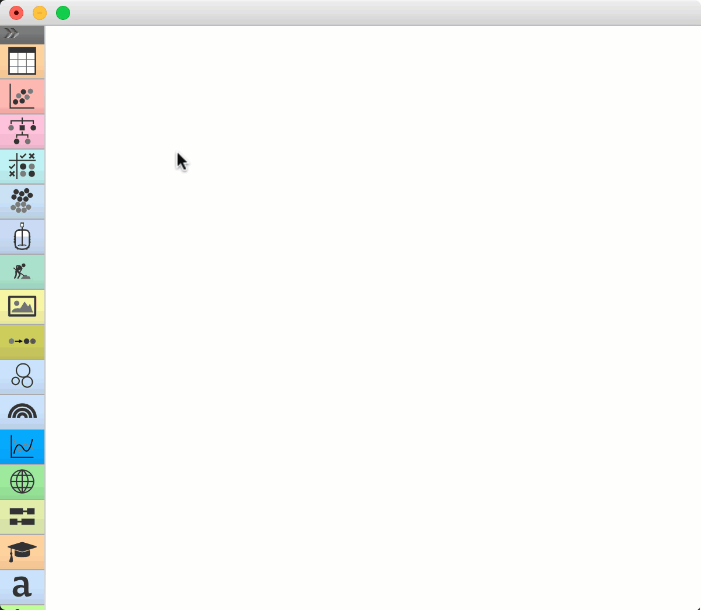
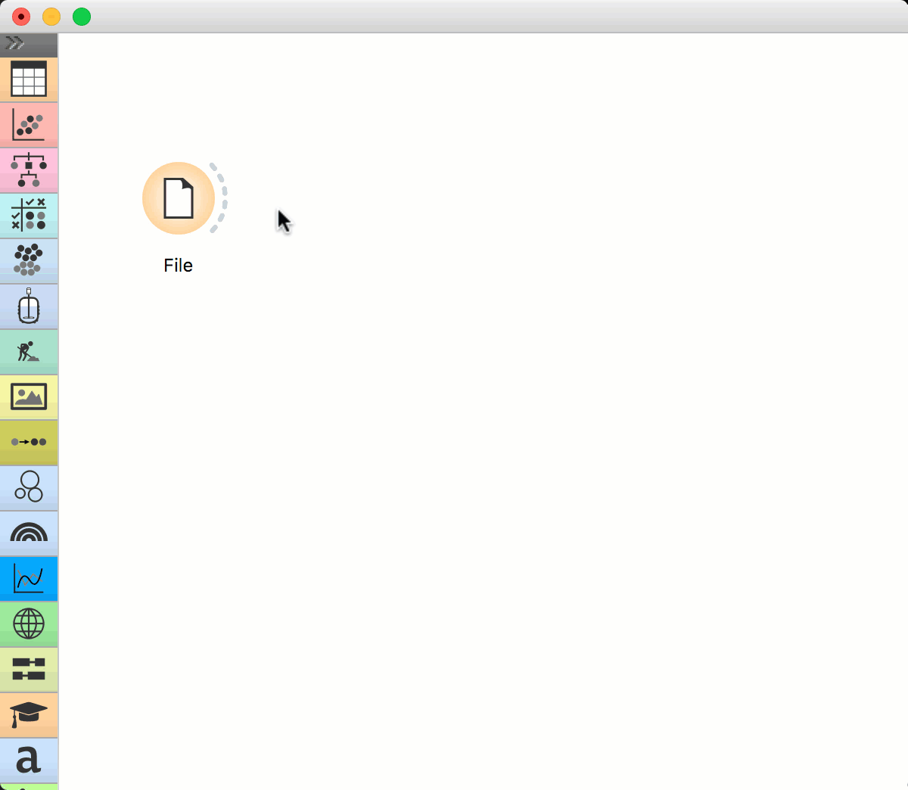
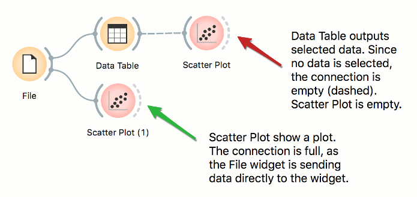
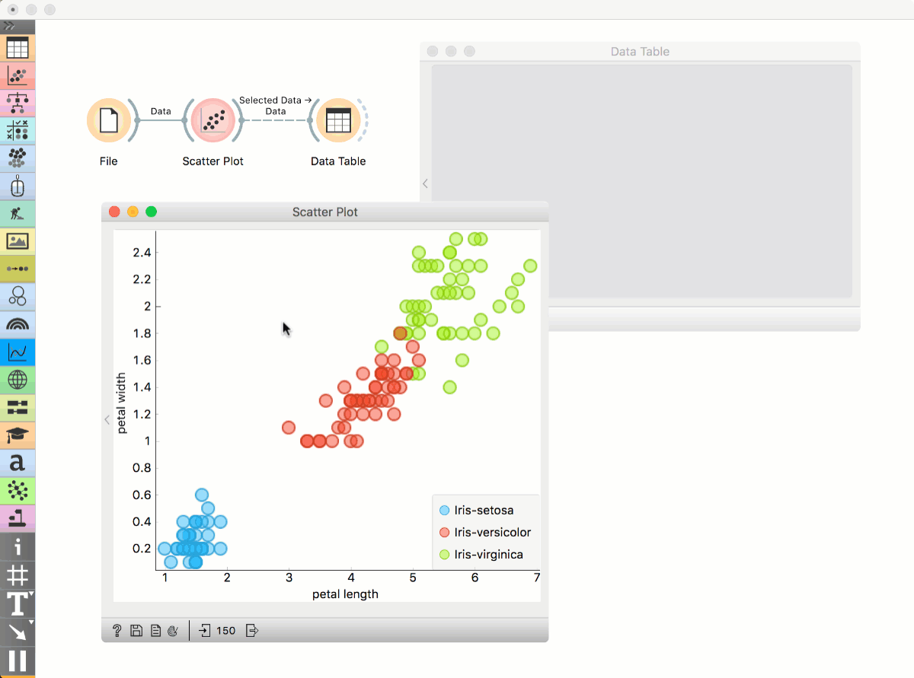
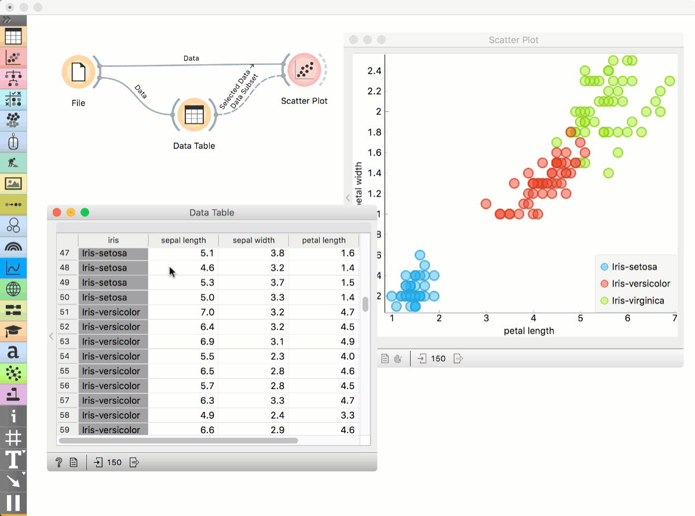
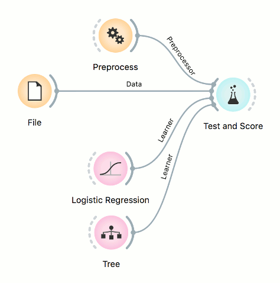
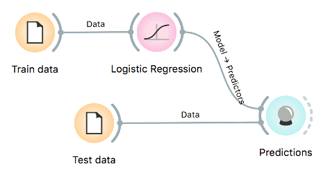

# Building Workflows

The core principle of Orange is visual programming, which means each analytical step in contained within a widget. Widgets are placed on the canvas and connected into an analytical workflow, which is executed from left to right. Orange never passes data backwards.

## Simple workflow

Let us start with a simple workflow. We will load the data with the File widget, say the famous *Iris* data set. Right-click on the canvas. A menu will appear. Start typing "File", then press Enter to confirm the selection. [File](../widgets/data/file.md) widget will be placed on the canvas.

**File** widget has an "ear" on its right side – this is the output of the widget. Click on the "ear" and drag a connection out of it. Upon releasing the connection, a menu will appear. Start typing the name of the widget to connect with the File widget, say Data Table. Select the widget and press enter. The widget is added to the canvas.

This is a simple workflow. The File widget loads the data and sends it to the output. Data Table receives the data and displays it in a table. Please note that Data Table is a viewer and passes onwards only the selection. The data is always available at the source - in the File widget.

## Workflows with subsets

Visualizations in Orange are interactive, which means the user can select data instances from the plot and pass them downstream. Let us look at two examples with subsets.

### Selecting subsets

Place **File** widget on the canvas. Then connect [Scatter Plot](../widgets/visualize/scatterplot.md) to it. Click and drag a rectangle around a subset of points. Connect [Data Table](../widgets/data/datatable.md) to Scatter Plot. Data Table will show selected points.

### Highlighting workflows

Place **File** widget on the canvas. Then connect **Scatter Plot** to it and a **Data Table**. Connect Data Table to Scatter Plot. Select a subset of points from the Data Table. Scatter Plot will highlight selected points.

## Workflows with models

Predictive models are evaluated in [Test and Score](../widgets/evaluate/testandscore.md) widget, while predictions on new data are done in [Predictions](../widgets/evaluate/predictions.md). Test and Score accepts several inputs: data (data set for evaluating models), learners (algorithms to use for training the model), and an optional preprocessor (for normalization or feature selection).

For prediction, the training data is first passed to the model. Once the model is trained, it is passed to **Predictions**. The Predictions widget also needs data to predict on, which are passed as a second input.

