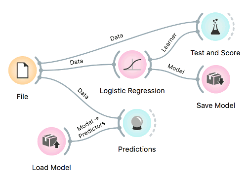

# Exporting Models

Predictive models can be saved and re-used. Models are saved in Python [pickle](https://docs.python.org/3/library/pickle.html) format.



## Save model

Models first require data for training. They output a trained model, which can be saved with [Save Model](../widgets/model/savemodel.md) widget in the pickle format.

## Load model

Models can be reused in different Orange workflows. [Load Model](../widgets/model/loadmodel.md) loads a trained model, which can be used in [Predictions](../widgets/evaluate/predictions.md) and elsewhere.

## Load in Python

Models can also be imported directly into Python and used in a script.

```python
import pickle

with open('model.pkcls', 'rb') as model:
    lr = pickle.loads(model)

lr
>> LogisticRegressionClassifier(skl_model=LogisticRegression(C=1,
                                class_weight=None, dual=False, 
                                fit_intercept=True, intercept_scaling=1.0, 
                                l1_ratio=None, max_iter=10000, 
                                multi_class='auto', n_jobs=1, penalty='l2', 
                                random_state=0, solver='lbfgs', tol=0.0001, 
                                verbose=0, warm_start=False))
```
