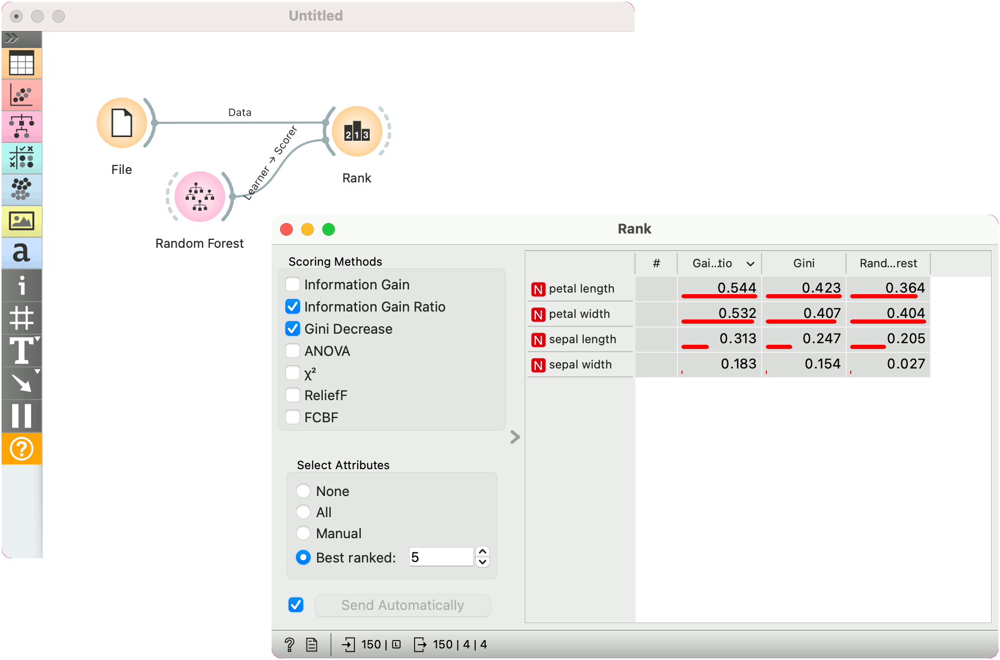

# Learners as Scorers

Certain learners can be used as feature scorers in Orange. Here's a quick example with [Random Forest](../widgets/model/randomforest.md).

We are using the *iris* data for the example. Connect [File](../widgets/data/file.md) with [Rank](../widgets/data/rank.md). Then connect **Random Forest** to Rank. Random Forest will be used as a Scorer in this case. Rank will use Random Forest's feature importance to rank the attributes.

Passing additional scorers works for both, classification and regression:

- [Logistic Regression](../widgets/model/logisticregression.md) (classification) / [Linear Regression](../widgets/model/linearregression.md) (regression)
- [Stochastic Gradient Descent](../widgets/model/stochasticgradient.md)
- [Gradient Boosting](../widgets/model/gradientboosting.md)
- Random Forest
