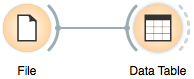
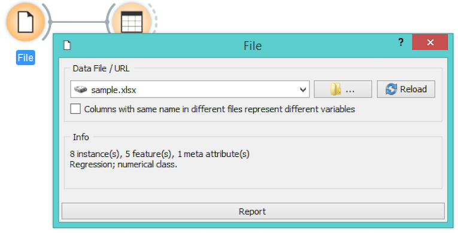
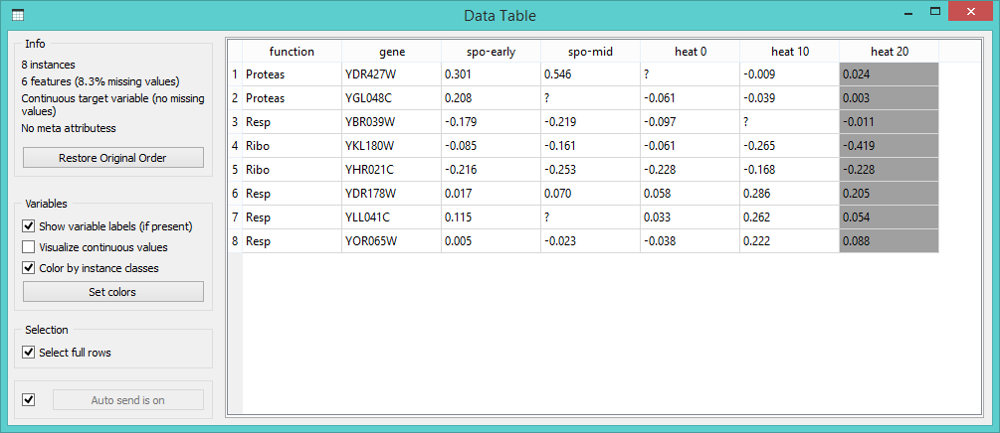
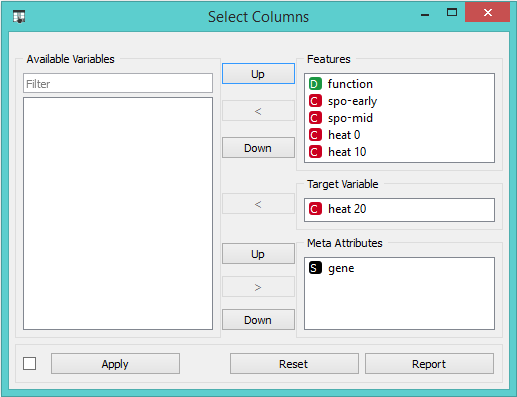
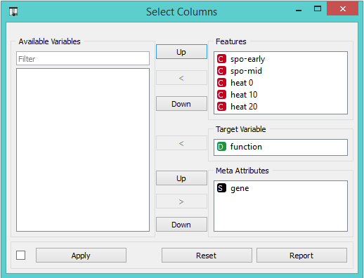
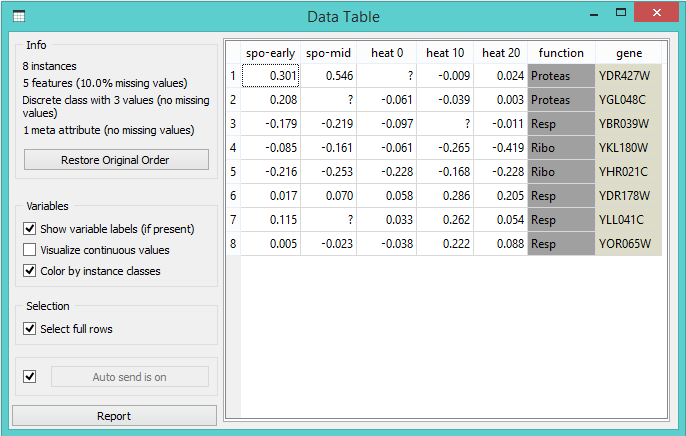
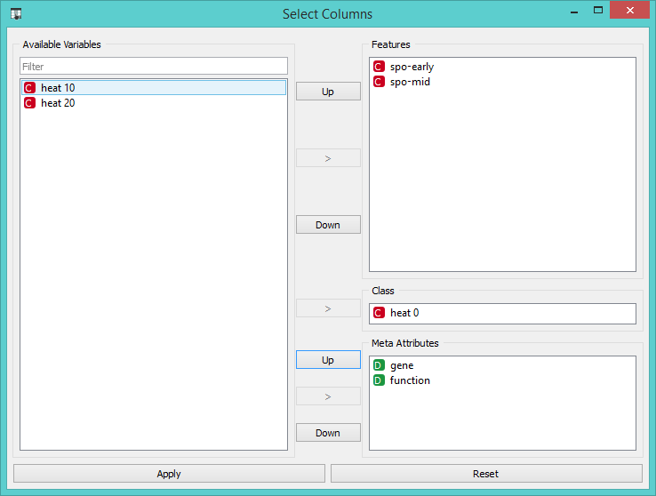
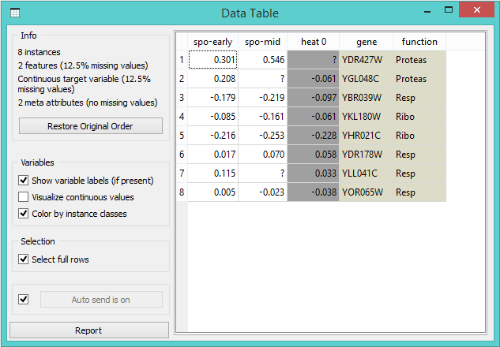
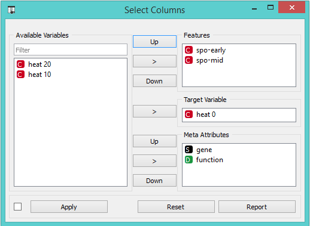

Loading your Data
=================

Orange comes with its [own data format] (http://docs.orange.biolab.si/reference/rst/Orange.data.formats.html#tab-delimited), but can
also handle Excel (.xlsl), comma or tab delimited data files. The input data
set is usually a table, with data instances (samples) in rows and
data attributes in columns. Attributes can be of different types
(continuous, discrete, and strings), with different elements (input variables, meta
attributes, and class). Data attribute type and element can be provided
in the data table header. and can be changed later, after reading the
data, with several specialized widgets, such as Select Rows and [Select Columns] (http://docs.orange.biolab.si/widgets/rst/data/selectattributes.html#select-attributes).

In a Nutshell
-------------

-   Orange can import any comma, .xlsx or tab-delimited data file. Use [File] (http://docs.orange.biolab.si/widgets/rst/data/file.html#file)
    widget and then, if needed, select class and meta attributes in
    [Select Columns] (http://docs.orange.biolab.si/widgets/rst/data/selectattributes.html#select-attributes) widget.
-   To specify the domain and the type of the attribute, attribute names
    can be preceded with a label followed by a hash. Use c for class
    and m for meta attribute, i to ignore a column, and C, D, S for
    continuous, discrete and string attribute types. Examples: C\#mpg,
    mS\#name, i\#dummy. Make sure to set **Import Options** in [File] (http://docs.orange.biolab.si/widgets/rst/data/file.html#file)
    widget and set the header to **Orange simplified header**.
-   Orange's native format is a tab-delimited text file with three
    header rows. The first row contains attribute names, the second the
    type (**continuous**, **discrete** or **string**), and the third
    the optional element (**class**, **meta** or **string**).

Data from Excel
---------------

Orange 3.0 recognises Excel files directly, thus simply open your .xlsx file in the program.

To load the data set in Orange, we can design a simple workflow with
File and Data Table widgets,

open the File widget (double click on its icon) and click on the file
browser icon,

locate the data file ( e.g. [sample.xlsx] (sample.xlsx)) and open
it. The **File** widget sends data to **Data Table** widget, which displays the following result:

Notice that our data contains 8 data instances (rows) and 7 data
attributes (columns).
Question marks in the data table denote missing data entries. These
entries correspond to empty cells in the Excel table. Rows in our
exemplary data set represent genes, with values in the first column
denoting a gene class. The second column stores gene names, while the
remaining columns record measurements that characterize each gene. Gene
class can be used for classification. Gene name is a meta information, a
label that is not relevant to any data mining algorithm, but can identify
a data instance in, say, visualizations like scatter plot. We need to
tell Orange that these first two columns are special. One way to do this
within Orange is through [Select Columns] (http://docs.orange.biolab.si/widgets/rst/data/selectattributes.html#select-attributes) widget:

Opening the [Select Columns] (http://docs.orange.biolab.si/widgets/rst/data/selectattributes.html#select-attributes) widget reveals that in our input data file
all six columns are treated as ordinary attributes (input variables),
with the only distinction being that the first variable is categorical
(discrete) and the other five are real-valued (continuous):

To correctly reassign attribute types, drag attribute named `function`
to a **Class** box, and attribute named `gene` to a **Meta Attribute**
box. The [Select Columns] (http://docs.orange.biolab.si/widgets/rst/data/selectattributes.html#select-attributes) widget should now look like this:

Change of attribute types in *Select Columns* widget should be confirmed
by clicking the **Apply** button. The data from this widget is fed into
[Data Table] (http://docs.orange.biolab.si/widgets/rst/data/datatable.html#data-table) widget, that now renders class and meta attributes in a
color different from those of input features:

We could also define the domain for this data set in a different way.
Say, we could make the data set ready for regression, and use `heat 0`
as a continuous class variable, keep gene function and name as meta
variables, and remove `heat 10` and `heat 20` from the data set (making
these two attributes available for type assignment, without including
them in the data on the output of [Select Columns] (http://docs.orange.biolab.si/widgets/rst/data/selectattributes.html#select-attributes) widget):

By setting the attributes as above, the rendering of the data in the
Data Table widget gives the following output:

Header with Attribute Type Information
--------------------------------------

Let us open the
[sample.xlsx] (sample.xlsx) data set in Excel again. This time,
however, we will augment the names of the attributes with prefix
characters expressing attribute type (class or meta attribute) and/or
its domain (continuous, discrete, string), and separate them from the
attribute name with a hash sign ("\#"). Abbreviations for the type are:

-   c: class attribute
-   m: meta attribute
-   i: ignore the attribute

and for the domain:

-   C: Continuous
-   D: Discrete
-   S: String

This is how the header with augmented attribute names looks like in
Excel [sample-head.xlsx] (sample-head.xlsx):

We can again use a [Data Table] (http://docs.orange.biolab.si/widgets/rst/data/datatable.html#data-table) widget to read the data from Excel file. Orange will automatically recognize attribute values, which is evident in the modified class icons:

Notice that the attributes we have ignored (label "i" in the
attribute name) are not present in the data set.

Native Data Format of Orange
----------------------------

Orange's native data format is a tab-delimited text file with three
header rows. The first row lists attribute names, the second row defines
their domain (continuous, discrete and string, or abbreviated c, d and
s), and the third row an optional type (class, meta, or ignore). Here is
an example:

The above screenshot is from Excel, but the file was actually saved using "Tab Delimited Text (.txt)" format. If you want to 
save your files in .tab format, you have to rename the file so that it ends with ".tab" extension (say from sample.txt to 
sample.tab). In Windows, you can bypass this step by placing the name of the file and the .tab extension in quotes when using
*Save As* ... command (e.g., "sample.tab"). However, in Orange 3.0 this process is redundant since you can open several file 
types without having to convert them first.

Saving Files in LibreOffice
---------------------------

If you are using LibreOffice, simply save your files in .xlsl format (available from the drop-down menu under *Save As Type*).

