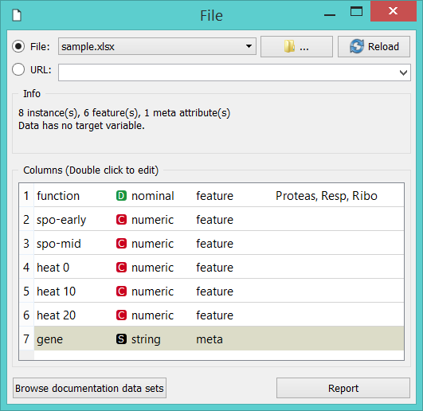
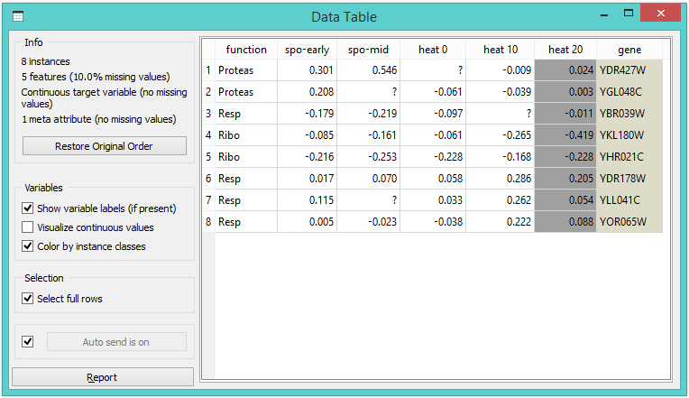
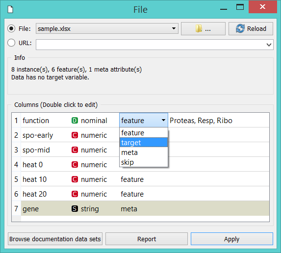
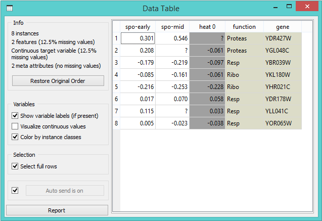
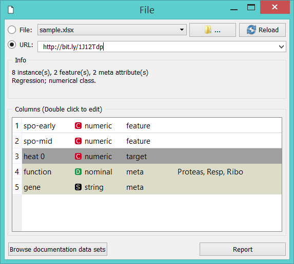

# Loading your Data

Orange comes with its [own data format](https://docs.biolab.si/3/data-mining-library/tutorial/data.html#data-input), but can also handle native Excel, comma- or tab-delimited data files. The input data set is usually a table, with data instances (samples) in rows and data attributes in columns. Attributes can be of different *types* (numeric, categorical, datetime, and text) and have assigned *roles* (input features, meta attributes, and class). Data attribute type and role can be provided in the data table header. They can also be changed in the [File](../widgets/data/file.md) widget, while data role can also be modified with [Select Columns](../widgets/data/selectcolumns.md) widget.

### In a Nutshell

- Orange can import any comma- or tab-delimited data file, or Excel's native files or Google Sheets document. Use [File](../widgets/data/file.md) widget to load the data and, if needed, define the class and meta attributes.
- Types and roles can be set in the File widget.
- Attribute names in the column header can be preceded with a label followed by a hash. Use c for class and m for meta attribute, i to ignore a column, w for weights column, and C, D, T, S for continuous, discrete, time, and string attribute types. Examples: C\#mph, mS\#name, i\#dummy.
- An alternative to the hash notation is Orange's native format with three header rows: the first with attribute names, the second specifying the type (**continuous**, **discrete**, **time**, or **string**), and the third proving information on the attribute role (**class**, **meta**, **weight** or **ignore**).

## Data from Excel

Here is an example dataset ([sample.xlsx](http://file.biolab.si/datasets/sample.xlsx)) as entered in Excel:

The file contains a header row, eight data instances (rows) and seven data attributes (columns). Empty cells in the table denote missing data entries. Rows represent genes; their function (class) is provided in the first column and their name in the second. The remaining columns store measurements that characterize each gene. With this data, we could, say, develop a classifier that would predict gene function from its characteristic measurements.

Let us start with a simple workflow that reads the data and displays it in a table:

To load the data, open the File widget (double click on the icon of the widget), click on the file browser icon ("...") and locate the downloaded file (called [sample.xlsx](http://file.biolab.si/datasets/sample.xlsx)) on your disk:

### File Widget: Setting the Attribute Type and Role

The **File** widget sends the data to the **Data Table**. Double click the **Data Table** to see its contents:

Orange correctly assumed that a column with gene names is meta information, which is displayed in the **Data Table** in columns shaded with light-brown. It has not guessed that *function*, the first non-meta column in our data file, is a class column. To correct this in Orange, we can adjust attribute role in the column display of File widget (below). Double-click the *feature* label in the *function* row and select *target* instead. This will set *function* attribute as our target (class) variable.

You can also change attribute type from nominal to numeric, from string to datetime, and so on. Naturally, data values have to suit the specified attribute type. Datetime accepts only values in [ISO 8601](https://en.wikipedia.org/wiki/ISO_8601) format, e.g. 2016-01-01 16:16:01. Orange would also assume the attribute is numeric if it has several different values, else it would be considered nominal. All other types are considered strings and are as such automatically categorized as meta attributes.

Change of attribute roles and types should be confirmed by clicking the **Apply** button.

### Select Columns: Setting the Attribute Role

Another way to set the data role is to feed the data to the [Select Columns](../widgets/data/selectcolumns.md) widget:

Opening [Select Columns](../widgets/data/selectcolumns.md) reveals Orange's classification of attributes. We would like all of our continuous attributes to be data features, gene function to be our target variable and gene names considered as meta attributes. We can obtain this by dragging the attribute names around the boxes in **Select Columns**:

To correctly reassign attribute types, drag attribute named *function* to a **Class** box, and attribute named *gene* to a **Meta Attribute** box. The [Select Columns](../widgets/data/selectcolumns.md) widget should now look like this:

Change of attribute types in *Select Columns* widget should be confirmed by clicking the **Apply** button. The data from this widget is fed into [Data Table](../widgets/data/datatable.md) that now renders the data just the way we intended:

We could also define the domain for this dataset in a different way. Say, we could make the dataset ready for regression, and use *heat 0* as a continuous class variable, keep gene function and name as meta variables, and remove *heat 10* and *heat 20* from the dataset:

By setting the attributes as above, the rendering of the data in the
Data Table widget gives the following output:

## Header with Attribute Type Information

Consider again the [sample.xlsx](http://file.biolab.si/datasets/sample.xlsx) dataset. This time we will augment the names of the attributes with prefixes that define attribute type (continuous, discrete, time, string) and role (class or meta attribute). Prefixes are separated from the attribute name with a hash sign ("\#"). Prefixes for attribute roles are:

- c: class attribute
- m: meta attribute
- i: ignore the attribute
- w: instance weights

and for the type:

- C: Continuous
- D: Discrete
- T: Time
- S: String

This is how the header with augmented attribute names looks like in Excel ([sample-head.xlsx](http://file.biolab.si/datasets/sample-head.xlsx)):

We can again use a **File** widget to load this dataset and then render it in the **Data Table**:

Notice that the attributes we have ignored (label "i" in the attribute name) are not present in the dataset.

## Three-Row Header Format

Orange's legacy native data format is a tab-delimited text file with three header rows. The first row lists the attribute names, the second row defines their type (continuous, discrete, time and string, or abbreviated c, d, t, and s), and the third row an optional role (class, meta, weight, or ignore). Here is an example:

Data from Google Sheets
-----------------------

Orange can read data from Google Sheets, as long as it conforms to the data presentation rules we have presented above. In Google Sheets, copy the shareable link (Share button, then Get shareable link) and paste it in the *Data File / URL* box of the File widget. For a taste, here's one such link you can use: [http://bit.ly/1J12Tdp](http://bit.ly/1J12Tdp), and the way we have entered it in the **File** widget:

## Data from LibreOffice

If you are using LibreOffice, simply save your files in Excel (.xlsx) format (available from the drop-down menu under *Save As Type*).

## Datetime Format

To avoid ambiguity, Orange supports date and/or time formatted in one of the [ISO 8601](https://en.wikipedia.org/wiki/ISO_8601) formats. For example, the following values are all valid:

    2016
    2016-12-27
    2016-12-27 14:20:51
    16:20
