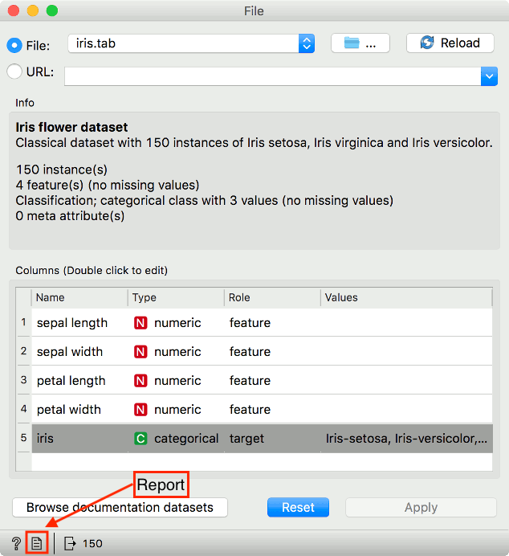
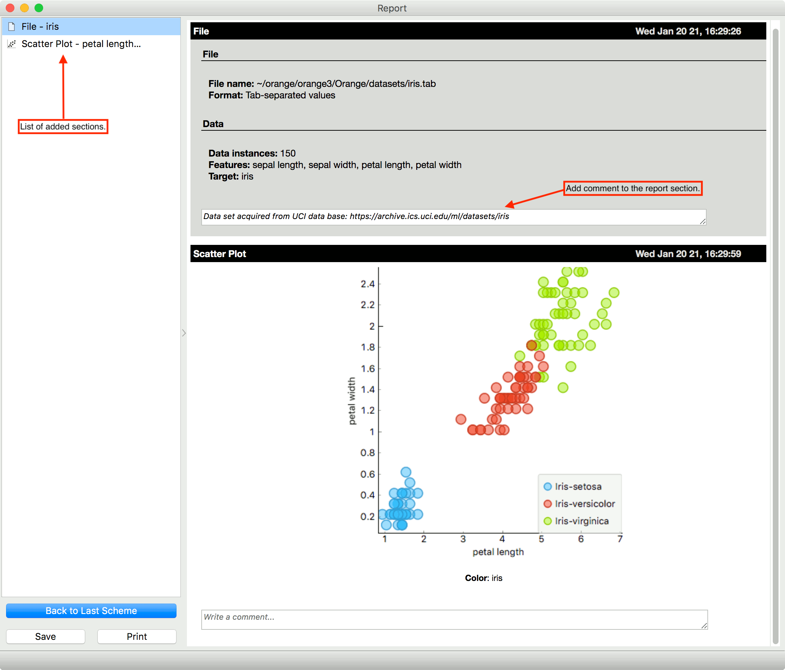

# Report

It is possible to compile a report in Orange. We can save the report in .html, .pdf or .report format. Reports allow us to trace back analytical steps as it saves the workflow at which each report segment was created.

Each widget has a report button in the status bar at the bottom. Pressing on the the File icon adds a new section to the report.

Report can be examined with View - Show report.

## Simple example

We built a simple workflow with File and Scatter Plot, adding a section to the report at each step. Widgets report parameters, visualizations, and other settings. Each section includes a comment for extra explanation.

To remove a report section, hover on the section in the list on the left. A Trash and an Orange icon will appear. The trash icon removes the section from the report list. Orange icon loads the workflow as it was at the time of creating the section. This is very handy if a colleague wishes to inspect the results. This option is available only if the report is saved in .report format.
