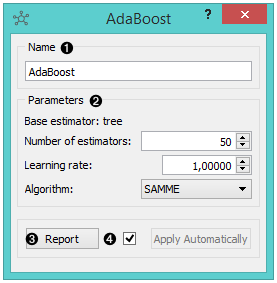
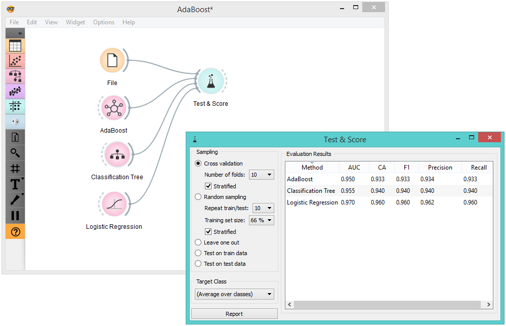
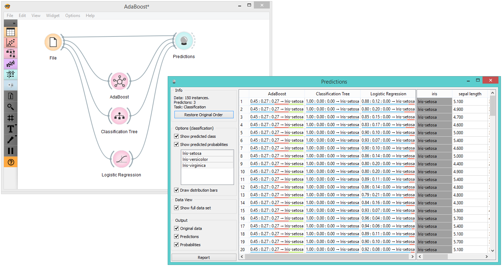

AdaBoost
========

An ensemble meta-algorithm that combines multiple weak learners to build to build more accurate prediction models.

Signals
-------

**Inputs**:

-  **Data**

A data set. 

-  **Preprocessor**

Preprocessed data. 

-  **Learner**

A learning algorithm. 

**Outputs**:

-  **Learner**

`AdaBoost <https://en.wikipedia.org/wiki/AdaBoost>`_ learning algorithm with settings as specified in the dialog.

-  **Classifier**

Trained classifier (a subtype of Classifier). The *AdaBoost classifier* signal sends data only if the learning data (signal Data) is present.

Description
-----------

The **AdaBoost** (short for "Adaptive boosting") widget is a machine-learning algorithm, formulated by `Yoav Freund and Robert Schapire <https://cseweb.ucsd.edu/~yfreund/papers/IntroToBoosting.pdf>`_. It can be used with other learning algorithms to boost their performance. It does so by tweaking the weak learners. 

1. The learner can be given a name under which it will appear in other widgets. The default name is “AdaBoost”.
2. Set the parameters. The base estimator is a tree and you can set: 

   -  the **Number of estimators**
   -  the **Learning rate**: it determines to what extent the newly acquired information will override the old information (0 = the agent will not learn anything, 1 = the agent considers only the most recent information)
   -  the **Algorithm**: SAMME (updates base estimator's weights with classification results) or SAMME.R. (updates base estimator's weight with probability estimates)

3. Produce a report.
4. Click *Apply* after changing the settings. That will put the new learner in the output and, if the training examples are given, construct a new classifier and output it as well. To communicate changes automatically tick *Apply Automatically*. 

Example
-------

For our first example, we loaded the *Iris* data set and compared the results of two different classification algorithms against the *AdaBoost* widget. 

For our second example, we loaded the *Iris* data set, sent the data instances to several different classifiers (**AdaBoost**, :doc:`Classification Tree<../classify/classificationtree>`, :doc:`Logistic Regression<../classify/logisticregression>`) and output them in the :doc:`Predictions<../evaluation/predictions>` widget. 

