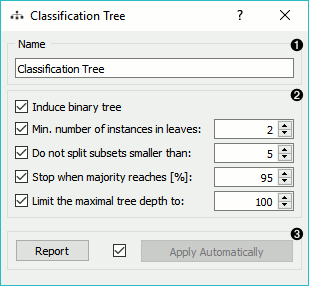
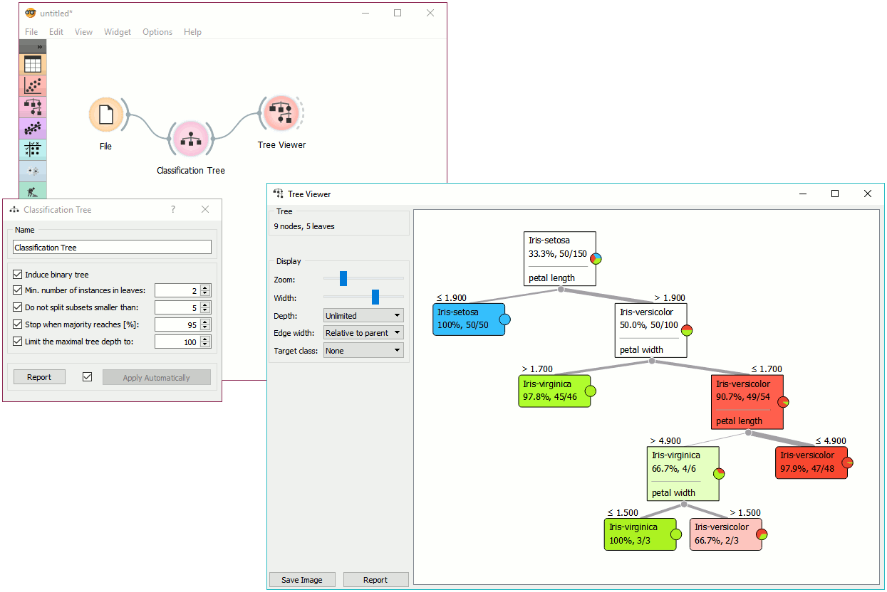
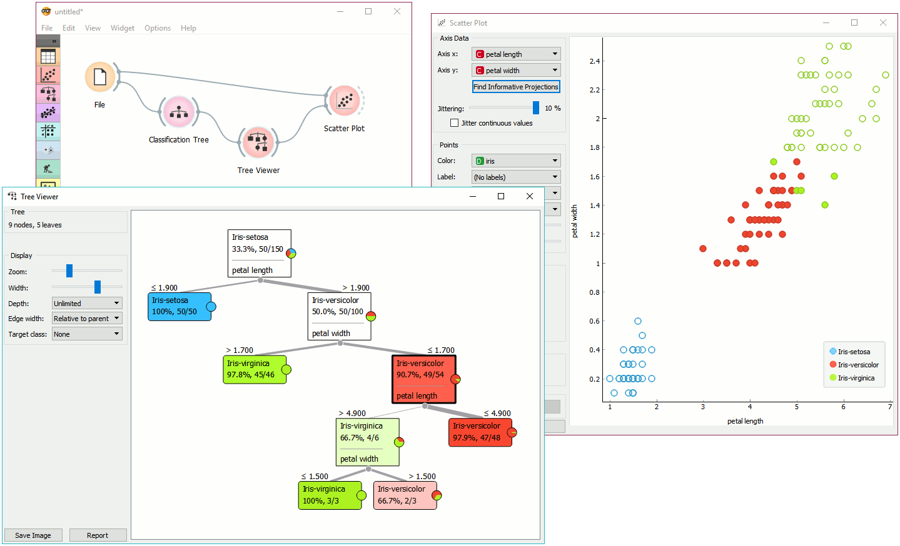

Classification Tree
===================

.. figure:: icons/classification-tree.png

Classification Tree

Signals
-------

**Inputs**:

-  **Data**

   A data set

-  **Preprocessor**

   Preprocessed data.

**Outputs**:

-  **Learner**

   A classification tree learning algorithm with settings as specified in
   the dialog.

-  **Classification Tree**

   A trained classifier (a subtype of Classifier). The signal *Classification
   Tree* sends data only if the learning data (signal **Classified Data**)
   is present.

Description
-----------

**Classification Tree** is a simple classification algorithm that splits the data into nodes by class purity. It is a precursor to :doc:`Random Forest <randomforest>`. Classification Tree in Orange is designed in-house and can handle both discrete and continuous data sets.  

1. The learner can be given a name under which it will appear in other
   widgets. The default name is "Classification Tree".

2. Tree parameters:
   - **Induce binary tree**: build a binary tree (split into two child nodes)
   - **Min. number of instances in leaves**: if checked, the algorithm will never construct a split which would put less than the specified number of training examples into any of the branches.
   - **Do not split subsets smaller than**: forbids the algorithm to split the nodes with less than the given number of instances.
   - **Stop when majority reaches [%]**: stop splitting the nodes after a specified majority threshold is reached
   - **Limit the maximal tree depth**: limits the depth of the classification tree to the specified number of node levels.

3. Produce a report. After changing the settings, you need to click *Apply*, which will
   put the new learner in the output and, if the training examples are
   given, construct a new classifier and output it as well. Alternatively, tick the box on the left and changes will be communicated automatically. 

Examples
--------

There are two typical uses for this widget. First, you may want to
induce a model and check what it looks like. You do it with the schema
below; to learn more about it, see the documentation on
:doc:`Tree Viewer <../visualize/treeviewer>`.

The second schema checks the nodes of the built tree.

We used the *Iris* data set in both examples. 