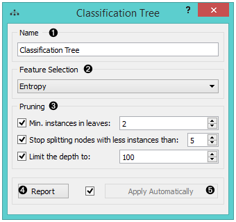

Classification Tree
===================

Classification Tree

Signals
-------

**Inputs**:

-  **Data**

A data set

-  **Preprocessor**

Preprocessed data.

**Outputs**:

-  **Learner**

A classification tree learning algorithm with settings as specified in
the dialog.

-  **Classification Tree**

A trained classifier (a subtype of Classifier). The signal *Classification
Tree* sends data only if the learning data (signal **Classified Data**)
is present.

Description
-----------

1. The learner can be given a name under which it will appear in other
   widgets. The default name is “Classification Tree”.

2. In *Feature selection*, you can choose a measure for split selection:

   -  `Entropy <http://www.saedsayad.com/decision_tree.htm>`__
      (measure of homogeneity)
   -  `Gini
      index <https://en.wikipedia.org/wiki/Gini_coefficient>`__
      (measure of dispersion)

3. *Pruning* criteria:

   -  **Minimal instances in leaves**; if checked, the algorithm will
      never construct a split which would put less than the specified
      number of training examples into any of the branches.
   -  **Stop splitting nodes with less instances than** forbids the
      algorithm to split the nodes with less than the given number of
      instances.
   -  **Limit the depth** of the classification tree.

4. Produce a report. 

5. After changing the settings, you need to click *Apply*, which will
   put the new learner in the output and, if the training examples are
   given, construct a new classifier and output it as well. Alternatively, tick the box on the left and changes will be communicated automatically. 

Examples
--------

There are two typical uses for this widget. First, you may want to
induce a model and check what it looks like. You do it with the schema
below; to learn more about it, see the documentation on
:doc:`Classification Tree Viewer <\classificationtreeviewer>`.

.. figure:: images/ClassificationTreeViewer-SimpleSchema.png

The second schema checks the accuracy of the algorithm.

.. figure:: images/ClassificationTreeViewer-Interaction.png

We used the *Iris* data set in both examples. 