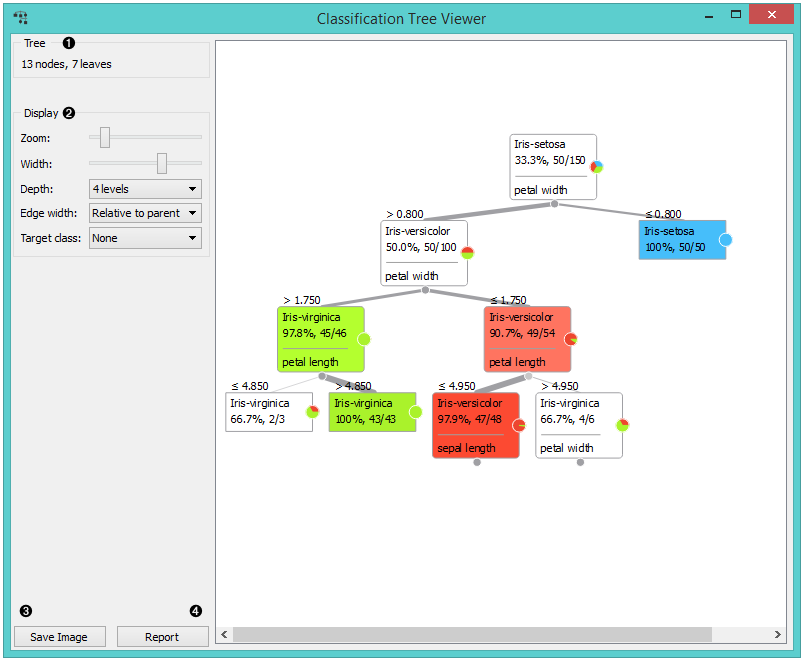
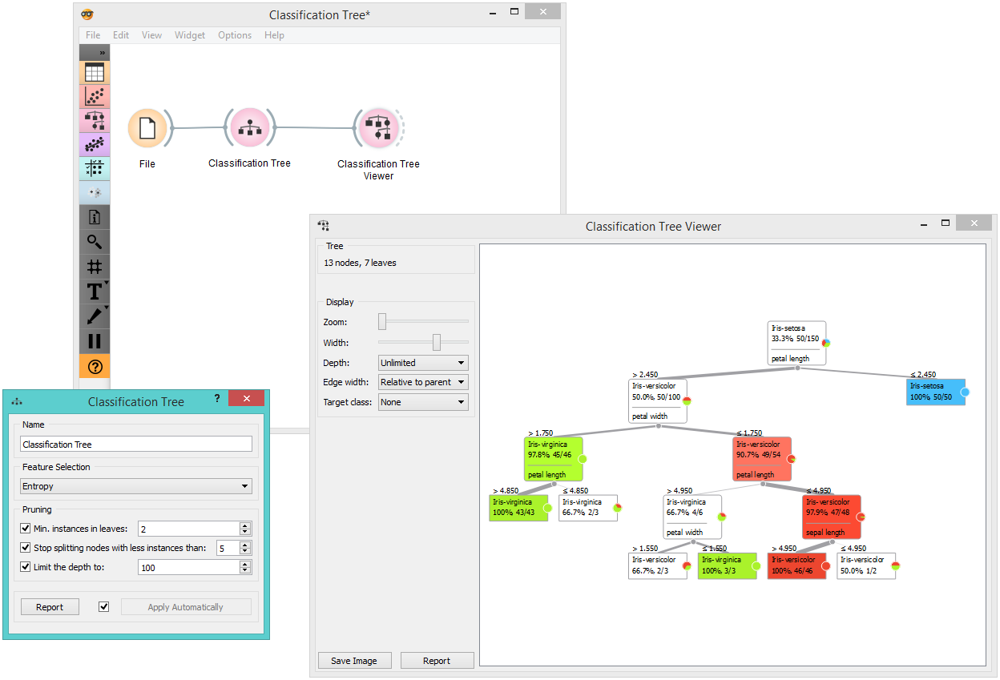
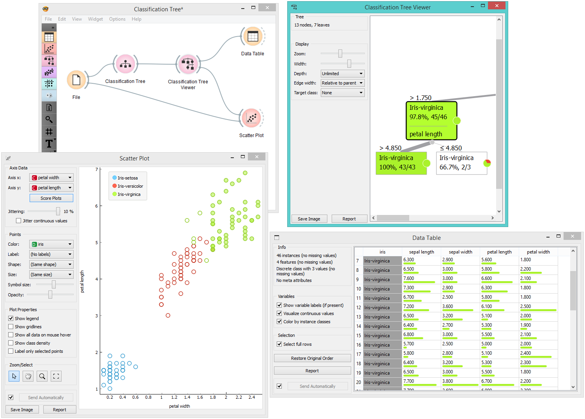

Classification Tree Viewer
==========================

Visualization of classification tree.

Signals
-------

**Inputs**:

- **Classification Tree**

  Classification tree.

**Outputs**:

- **Data**

  Data from the selected tree node.

Description
-----------

This is a versatile widget with 2-D visualization of a [classification tree](https://en.wikipedia.org/wiki/Decision_tree_learning).
The user can select a node, instructing the widget to output the data
associated with the node thus enabling explorative data analysis.

1. Information on the input.

2. Set the zoom and define the tree width. Nodes display
  information bubble when hovering over them.

3. Edges between nodes in the tree graph are drawn based on the selected
  edge width.
    - All the edges will be of equal width if *Fixed* is chosen.
    - When *Relative to root* is selected, the width of the edge will correspond to
    the proportion of instances in the corresponding node with respect to
    all the instances in the training data. Under this selection the edge will get thinner and
  thinner when traversing toward the bottom of the tree.
    - *Relative to parent* makes the edge width correspond to proportion of instances in the
    nodes with respect to the instances in their parent node.

4. Nodes box defines the target class, which you can change based on
  classes in the data. You can also set the color scheme in *Set Colors*.

5. Press *Save Graph* to save the classification tree graph as a file.

Examples
--------

Below is a simple schema where we have read the data, constructed
the classification tree and viewed it in our tree viewer. If
both the viewer and **Classification Tree**
are open, any run of tree induction algorithm will immediately
affect the visualization. You can thus use this combination to
explore how parameters of the induction algorithm influence the
structure of the resulting tree.

Clicking on any node will output the related data instances. This is explored in the schema below
that shows the subset in the data table and in the
**Scatterplot**. Make sure that the tree data is passed as a data subset; this
can be done by connecting the **Scatterplot** to the **File** widget first,
and connecting it to the **Tree Viewer** widget next.

