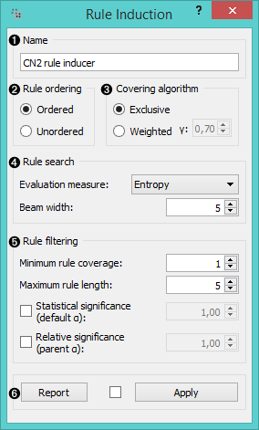

CN2 Rule Induction
==================

.. figure:: icons/classification-tree.png

CN2 Rule Induction

Signals
-------

**Inputs**:

- **Data**

Data set.

- **Preprocessor**

Preprocessed data.

**Outputs**:

-  **Learner**

The CN2 learning algorithm with settings as specified in the dialog.

-  **CN2 Rule Classifier**

Trained classifier (a subtype of Classifier). **CN2 Rule Classifier**
is only trained and forwarded if learning data is connected.

Description
-----------

The CN2 algorithm is a classification technique designed for the
efficient induction of simple, comprehensible rules of form "if *cond*
then predict *class*", even in domains where noise may be present.

1. Name under which the learner appears in other widgets. The default
   name is “CN2 Rule Induction”.

2. *Rule ordering*:

   - **Ordered**; induce ordered rules (decision list). Rule
     conditions are found and the majority class is assigned in the
     rule head.
   - **Unordered**; induce unordered rules (rule set). Learn rules for
     each class individually, in regard to the original learning
     data.

3. *Covering algorithm*:

   - **Exclusive**; after covering a learning instance, remove it from
     further consideration.

   - **Weighted**; after covering a learning instance, decrease its
     weight (multiplication by *gamma*) and in-turn decrease its
     impact on further iterations of the algorithm.

4. *Rule search*:

   - **Evaluation measure**; select a heuristic to evaluate found
     hypotheses:

     a. `Entropy <https://en.wikipedia.org/wiki/Entropy_(information_theory)>`__ (measure of unpredictability of content)
     b. Laplace Accuracy
     c. Weighted Relative Accuracy

   - **Beam width**; remember the best rule found thus far and monitor a
     fixed number of alternatives (the beam).

5. *Rule filtering*:

   - **Minimum rule coverage**; found rules must cover at least the
     minimum required number of covered examples. Unordered rules must
     cover this many target class examples.

   - **Maximum rule length**; found rules may combine at most the
     maximum allowed number of selectors (conditions).

   - **Default alpha**; significance testing to prune out most
     specialised (less frequently applicable) rules in regard to the
     initial distribution of classes.

   - **Parent alpha**; significance testing to prune out most
     specialised (less frequently applicable) rules in regard to the
     parent class distribution.

6. Tick ‘Apply Automatically‘ to auto-communicate changes to other
   widgets and to immediately train the classifier if learning data is
   connected. Alternatively, press ‘Apply‘ after configuration.

Examples
--------

Having trained the model, induced rules can be quickly reviewed and
interpreted. Showcased in the example below is the
:doc:`CN2 Rule Viewer <\cn2ruleviewer>` widget .

.. figure:: images/CN2RuleViewer.png

TODO: windows screenshots

The second schema tests the accuracy of the algorithm, compares its
performance to tree learner on a specific data set, and presents a
standard use of the widget.

TODO: windows screenshots

References
----------

1. "Separate-and-Conquer Rule Learning", Johannes Fürnkranz, Artificial
   Intelligence Review 13, 3-54, 1999

2. "The CN2 Induction Algorithm", Peter Clark and Tim Niblett,
   Machine Learning Journal, 3 (4), pp261-283, (1989)

3. "Rule Induction with CN2: Some Recent Improvements", Peter Clark and
   Robin Boswell, Machine Learning - Proceedings of the 5th
   European Conference (EWSL-91), pp151-163, 1991

4. "Subgroup Discovery with CN2-SD", Nada Lavrač et al., Journal of
   Machine Learning Research 5 (2004), 153-188, 2004