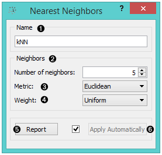
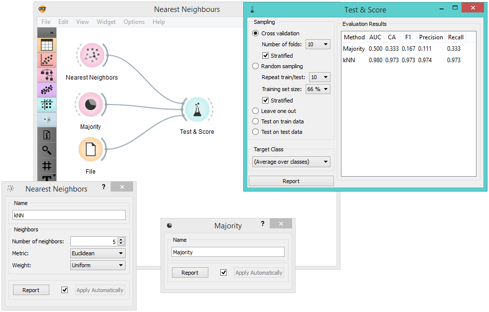

Nearest Neighbors
=================

.. figure:: icons/k-nearest-neighbors.png

k-Nearest Neighbors (kNN) learner

Signals
-------

**Inputs**:

-  **Data**

A data set

-  **Preprocessor**

Preprocessed data

**Outputs**:

-  **Learner**

A kNN learning algorithm with settings as specified in the dialog.

-  **kNN Classifier**

Trained classifier (a subtype of Classifier). Signal **kNN Classifier**
sends data only if the learning data (signal **Data** is present).

Description
-----------

1. A name under which it will appear in other widgets. The default name is
   “kNN”.

2. You can set the *Number of neighbors*. 
3. The *Metrics* you can use are:

   - `Euclidean <https://en.wikipedia.org/wiki/Euclidean_distance>`__
   - `Manhattan <https://en.wikipedia.org/wiki/Taxicab_geometry>`__ (the sum of absolute differences for all attributes)
   - `Chebyshev <https://en.wikipedia.org/wiki/Chebyshev_distance>`__ (the maximal difference between attributes)
   - `Mahalanobis <https://en.wikipedia.org/wiki/Mahalanobis_distance>`__ (difference between an attribute and the mean).

4. You can assign weight to the contributions of the neighbors. The *Weights* you can use are: 

   -  **Uniform**: all points in each neighborhood are weighted equally.
   -  **Distance**: closer neighbors of a query point have a greater influence than the neighbors further away. 

5. Produce a report. 
6. When you change one or more settings, you need to click *Apply*, which
   will put a new learner in the output and, if the training examples
   are given, construct a new classifier and output it as well. Changes can also be applied automatically by clicking the box on the left side of the *Apply* button. 

Example
-------

This schema compares the results of `k-Nearest
neighbors <https://en.wikipedia.org/wiki/K-nearest_neighbors_algorithm>`__
with the default classifier, which always predicts the majority class.

