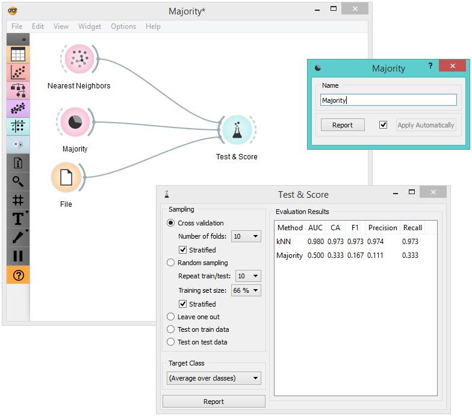

Majority
========

A learner that returns the majority class in the data set for all instances.

Signals
-------

**Inputs**:

- **Data**

  Data set.
  
- **Preprocessor**

  Preprocessed data.

**Outputs**:

- **Learner**

  Majority learning algorithm.

- **Classifier**

  Trained classifier. In the output only if the learning data (signal *Data*) is present.

Description
-----------

This learner produces a classifier that always predicts the [majority](https://en.wikipedia.org/wiki/Predictive_modelling#Majority_classifier) class. When asked for
probabilities, it will return the relative frequencies of the classes in
the training set. When there are two or more majority classes, the
classifier chooses the predicted class randomly, but always returns the
same class for a particular example.

The widget is typically used to compare other learning algorithms with
the default classification accuracy.

The only option is the name under which it will appear in other widgets. The default name is “Majority”. When you change it, you need to click *Apply*.

Example
-------

In a typical use of this widget, it would be connected to *Test Learners*
to compare the scores of other learning algorithms (such as kNN) with the default scores.

