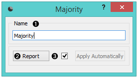

Majority
========

.. figure:: icons/majority.png

A learner that returns a majority class in a data set for all
instances.

Signals
-------

**Inputs**:

-  **Data**

   A data set

-  **Preprocessor**

   Preprocessed data

**Outputs**:

-  **Learner**

   A majority learning algorithm

-  **Classifier**

   A trained classifier. In the output only if the learning data (signal
   *Data*) is present.

Description
-----------

This learner produces a classifier that always predicts the
`majority <https://en.wikipedia.org/wiki/Predictive_modelling#Majority_classifier>`_
class. When asked for probabilities, it will return the relative
frequencies of the classes in the training set. When there are two or
more majority classes, the classifier chooses the predicted class
randomly, but always returns the same class for a particular example.

The widget is typically used to compare other learning algorithms with
the default classification accuracy.

This widget provides the user with two options:

1. The name under which it will appear in other widgets (the default name is "Majority").

2. Producing a report. 

If you change the widget's name, you need to click *Apply*. Alternatively, tick the box on the left side and changes will be communicated automatically. 

Example
-------

In a typical use of this widget, it would be connected to :doc:`Test&Score <../evaluation/testlearners>` 
to compare the scores of other learning algorithms (such as
kNN) with the default scores.

.. figure:: images/Majority-Knn-SchemaLearner.png
