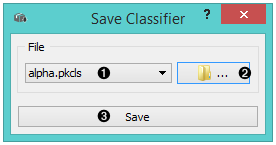
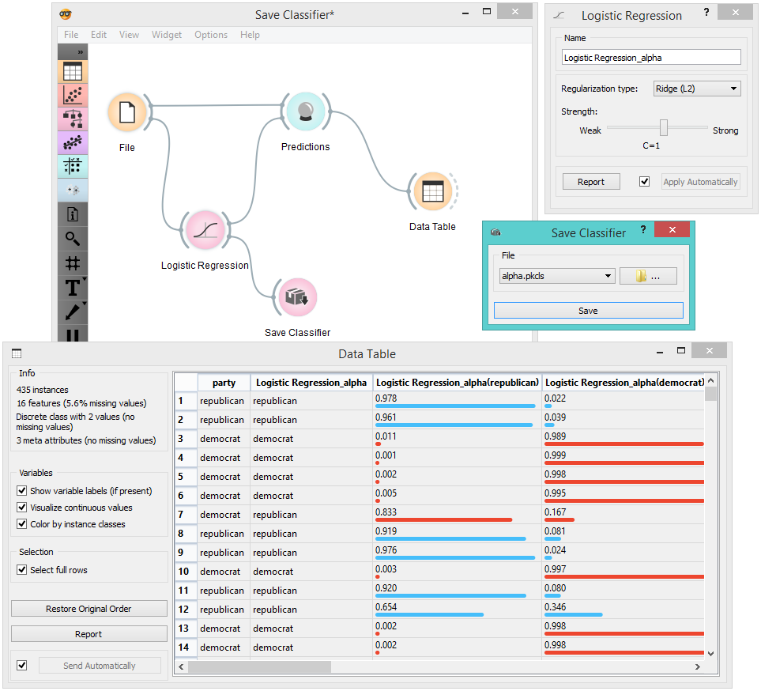

Save Classifier
===============

.. figure:: icons/save-classifier.png

Saves classifier

Signals
-------

**Inputs**:

-  **Classifier**

A classifier with selected parameters

**Outputs**:

-  None

Description
-----------

1. Choose from previously saved classifiers.

2. Save the created classifier with the *Browse* icon. Click on the icon and enter
   the name of the file. The classifier will be saved to a pickled fie. 

.. figure:: images/SaveClassifier-save.png

3. Save the classifier.

Example
-------

When you want to save a custom-set classifier, select the desired
parameters in the classification widget and connect it to :doc:`Save
Classifier<../classify/saveclassifier>`. Name the classifier; load it later into workflows with
data sets containing compatible attributes.

