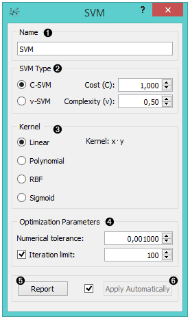
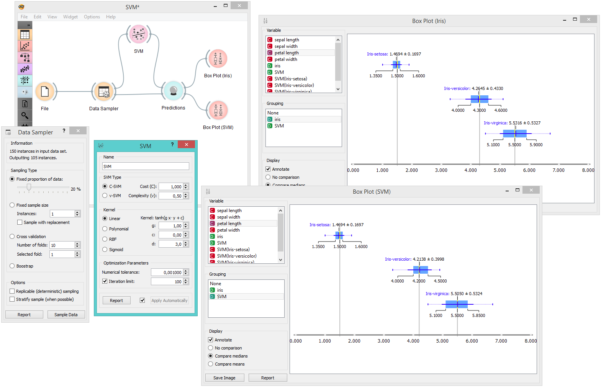
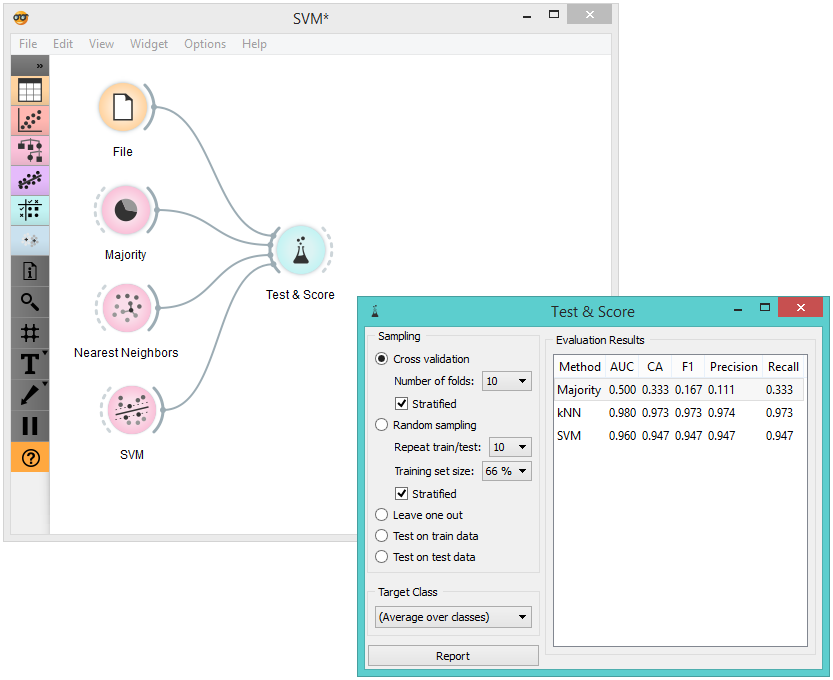
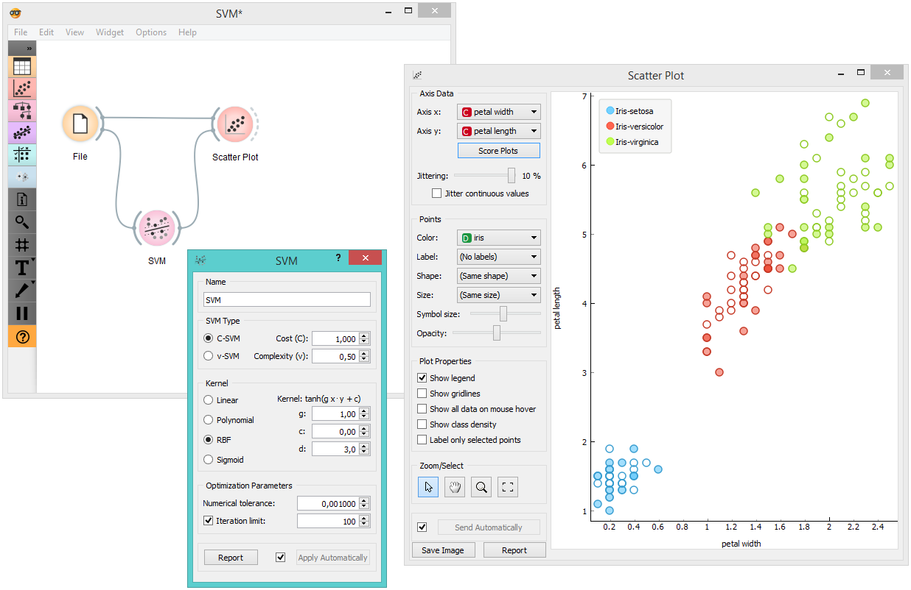
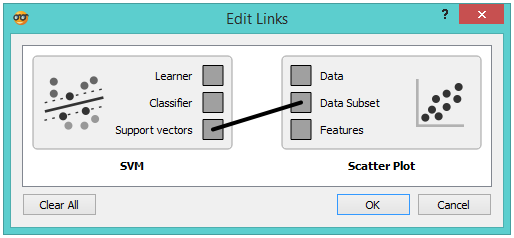

SVM
===

.. figure:: icons/svm-classification.png

Support vector machine learning algorithm.

Signals
-------

**Inputs**:

-  **Data**

   A data set.

-  **Preprocessor**

   Preprocessed data.

**Outputs**:

-  **Learner**

   A support vector machine learning algorithm with settings as specified in
   the dialog.

-  **Classifier**

   A trained SVM classifier

-  **Support Vectors**

   A subset of data instances from the training set that were used as
   support vectors in the trained classifier

Description
-----------

`Support vector machine <https://en.wikipedia.org/wiki/Support_vector_machine>`_
(SVM) is a classification technique that separates the attribute space
with a hyperplane, thus maximizing the margin between the instances of
different classes. The technique often yields supreme predictive
performance results. Orange embeds a popular implementation of SVM from the
`LIBSVM <https://www.csie.ntu.edu.tw/~cjlin/libsvm/>`_ package. This
widget is its graphical user interface.

1. The learner can be given a name under which it will appear in other
   widgets. The default name is “SVM”.
2. Classification type with test error settings. *C-SVM* and *v-SVM* are
   based on different minimization of the error function. On the right
   side, you can set test error bounds,
   `Cost <http://www.quora.com/What-are-C-and-gamma-with-regards-to-a-support-vector-machine>`_
   for C-SVM and *Complexity bound* for v-SVM.
3. The next block of options deals with kernel, a function that
   transforms attribute space to a new feature space to fit the
   maximum-margin hyperplane, thus allowing the algorithm to create
   non-linear classifiers with
   `Polynomial <https://en.wikipedia.org/wiki/Polynomial_kernel>`_,
   `RBF <https://en.wikipedia.org/wiki/Radial_basis_function_kernel>`_ and
   `Sigmoid <http://crsouza.com/2010/03/kernel-functions-for-machine-learning-applications/#sigmoid>`_
   kernels. Functions that specify the kernel are presented besides
   their names, and the constants involved are:

   -  **g** for the gamma constant in kernel function (the recommended
      value is 1/k, where k is the number of the attributes, but since
      there may be no training set given to the widget the default is 0
      and the user has to set this option manually),
   -  **c** for the constant c0 in the kernel function (default 0), and
   -  **d** for the degree of the kernel (default 3).

4. Set permitted deviation from the expected value in *Numerical
   Tolerance*. Tick the box next to *Iteration Limit* to set the maximum
   number of iterations permitted.

5. Produce a report. 

6. Click *Apply* to commit changes. If you tick the box on the left side of the *Apply* button, changes will be communicated automatically. 

Examples
--------

There are two typical uses for this widget, one where the widget is a
classifier and the other where it constructs an object for learning. For
the first one, we have split our data set into two data subsets
(*Sample* and *Remaining Examples*). The sample was sent to SVM which
produced a *Classifier*, which was then used in :doc:`Predictions <../evaluation/predictions>` widget to
classify the data in *Remaning Examples*. A similar schema can be used
if the data is already in two separate files; in this
case, two :doc:`File <../data/file>` widgets would be used instead of the :doc:`File <../data/file>` -
:doc:`Data Sampler <../data/datasampler>` combination.

The second schema shows how to use the **SVM** widget to construct a
learner and compare it in cross-validation with :doc:`Majority <../classify/majority>` and
:doc:`k-Nearest Neighbours <../classify/knearestneighbours>` learners.

The following schema observes a set of support vectors in a
:doc:`Scatterplot <../visualize/scatterplot>` visualization.

For the above schema to work correctly, the channel between **SVM** and
:doc:`Scatterplot <../visualize/scatterplot>` widget has to be set appropriately. Set the channel
between these two widgets by double-clicking on the connection between
the widgets and use the settings as displayed in the dialog below.

References
----------

`Introduction to SVM on StatSoft <http://www.statsoft.com/Textbook/Support-Vector-Machines>`_.