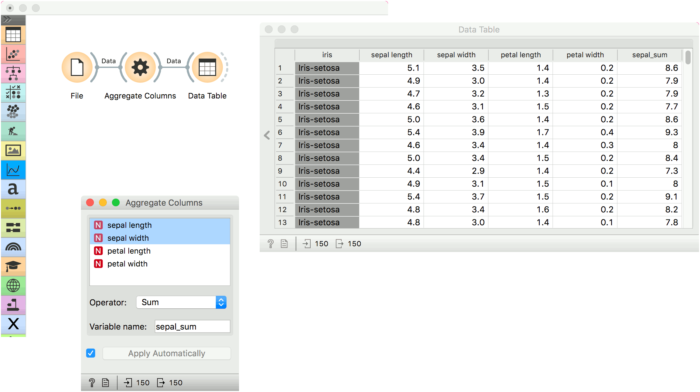

Aggregate Columns
=================

Compute a sum, max, min ... of selected columns.

**Inputs**

- Data: input dataset

**Outputs**

- Data: extended dataset

**Aggregate Columns** outputs an aggregation of selected columns, for example a sum, min, max, etc.

1. Selected attributes.
2. Operator for aggregation:
   - sum
   - product
   - min
   - max
   - mean
   - variance
   - median
3. Set the name of the computed attribute.
4. If *Apply automatically* is ticked, changes will be communicated automatically. Alternatively, click *Apply*.

Example
-------

We will use iris data from the [File](../data/file.md) widget for this example and connect it to **Aggregate Columns**.

Say we wish to compute a sum of *sepal_length* and *sepal_width* attributes. We select the two attributes from the list.

