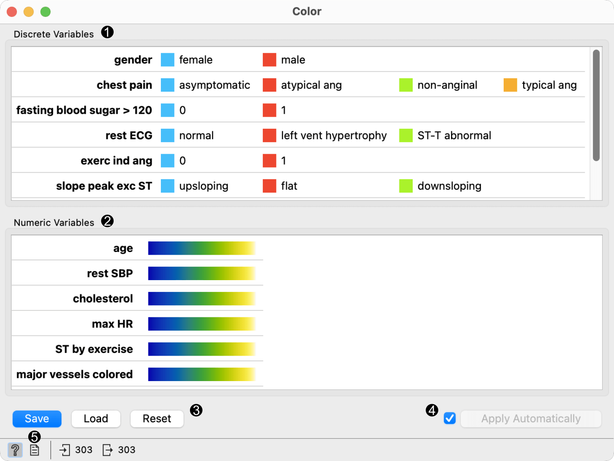
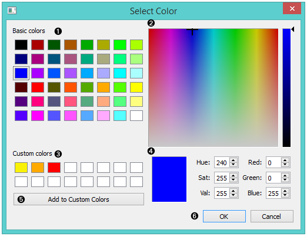
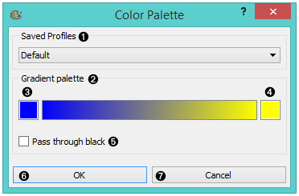
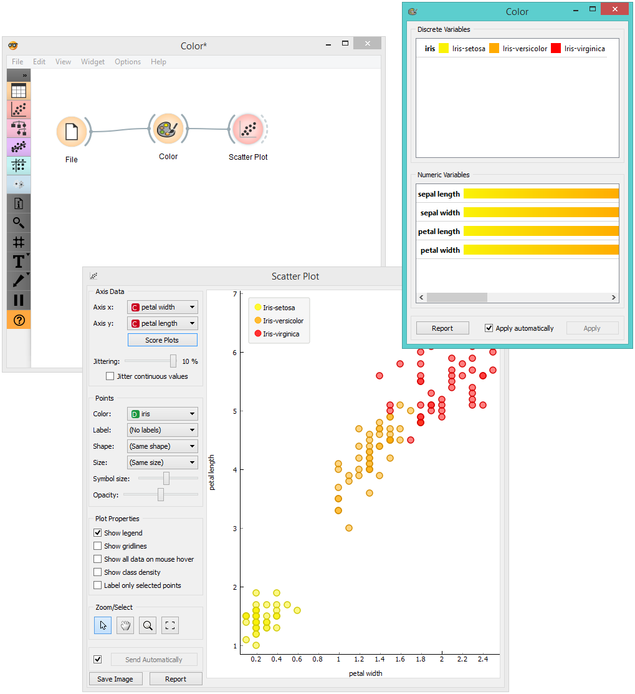
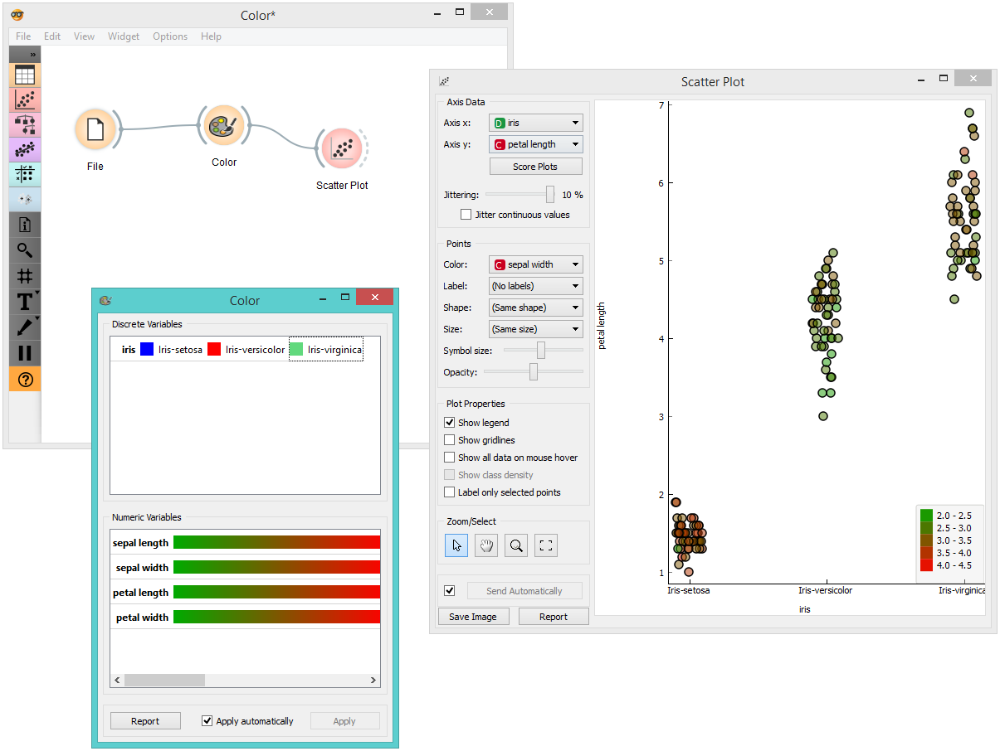

Color
=====

Set color legend for variables. 

Signals
-------

**Inputs**:

-  **Data**

   An input data set. 

**Outputs**:

- **Data**

   A data set with a new color legend. 

Description
-----------

The **Color** widget enables you to set the color legend in your visualizations 
according to your own preferences. This option provides you with the tools for 
emphasizing your results and offers a great variety of color options for presenting your data. It can be combined with most visualizations widgets. 

1. A list of discrete variables. You can set the color of each variable by double-clicking on it and opening the *Color palette* or the *Select color* window. The widget also enables text-editing. By clicking on a variable, you can change its name. 
2. A list of continuous variables. You can customize the color gradients by double-clicking on them. The widget also enables text-editing. By clicking on a variable, you can change its name. If you hover over the right side side of the gradient, *Copy to all* appears. You can then apply your customized color gradient to all variables. 
3. Produce a report.
4. Apply changes. If *Apply automatically* is ticked, changes will be communicated automatically. Alternatively, just click *Apply*. 

Discrete variables
------------------

1. Choose a desired color from the palette of basic colors. 
2. Move the cursor to choose a custom color from the color palette. 
3. Choose a custom color from your previously saved color choices.
4. Specify the custom color by:

  -  entering the red, green, and blue components of the color as values between 0 (darkest) and 255 (brightest)
  -  entering the hue, saturation and luminescence components of the color as values in the range 0 to 255

5. Add the created color to your custom colors.
6. Click *OK* to save your choices or *Cancel* to exit the the color palette. 

Numeric variables
-----------------

1. Choose a gradient from your saved profiles. The default profile is already set. 
2. The gradient palette
3. Select the left side of the gradient. Double clicking the color opens the *Select Color* window. 
4. Select the right side of the gradient. Double clicking the color opens the *Select Color* window. 
5. Pass through black.
6. Click *OK* to save your choices or *Cancel* to exit the color palette. 

Example
-------

We chose to work with the *Iris* data set. We opened the color palette and selected three new colors for the three types of Irises. Then we opened the :doc:`Scatter Plot<../visualize/scatterplot>` widget and viewed the changes made to the scatter plot. 

For our second example, we wished to demonstrate the use of the **Color** widget with continuous variables. We put different types of Irises on the x axis and petal length on the y axis. We created a new color gradient and named it greed (green + red). 
In order to show that sepal length is not a deciding factor in differentiating between different types of Irises, we chose to color the points according to sepal width. 

