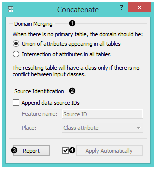
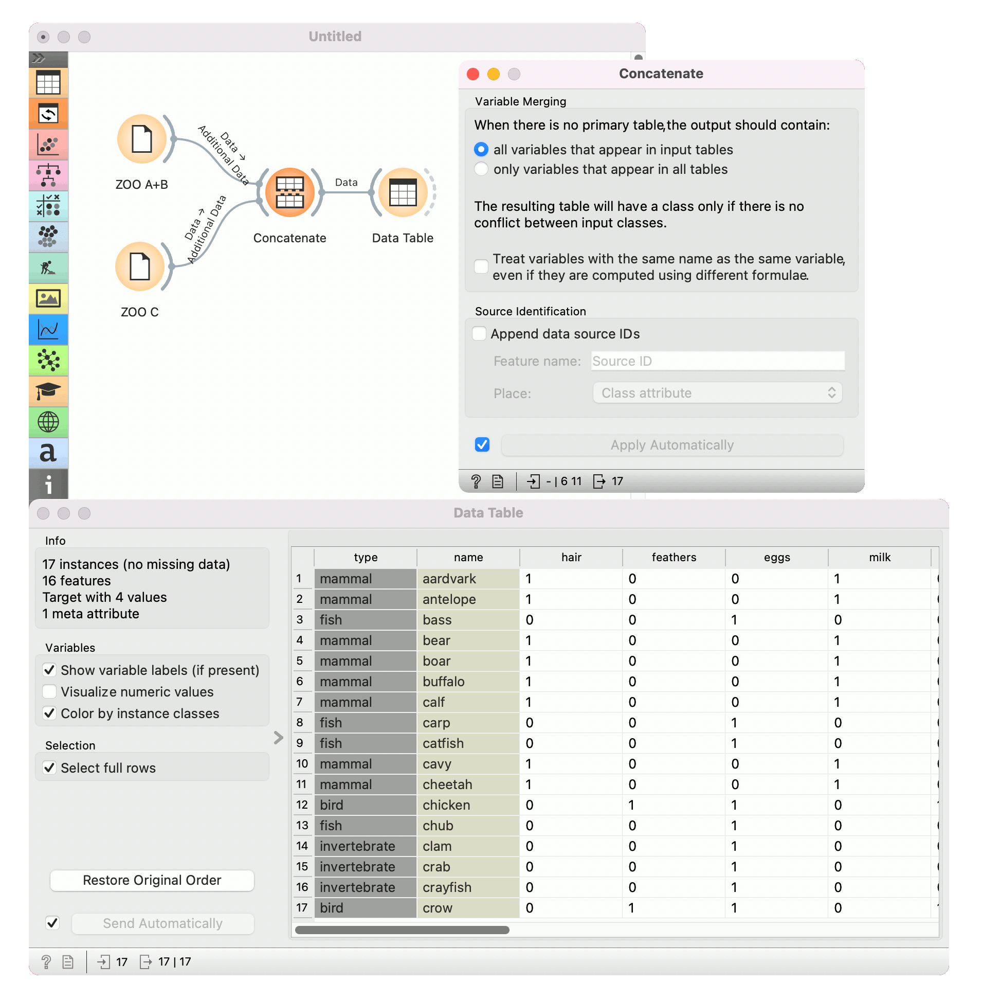

Concatenate
===========

Concatenates data from multiple sources.

Signals
-------

**Inputs**:

-  **Primary Data**

   A data set that defines the attribute set.

-  **Additional Data**

   An additional data set.

**Outputs**:

-  **Data**

Description
-----------

The widget concatenates multiple sets of instances (data sets). The
merge is “vertical”, in a sense that two sets of 10 and 5 instances
yield a new set of 15 instances.

1. Set the attribute merging method.
2. Add the identification of source data sets to the output data set.
3. Produce a report. 
4. If *Apply automatically* is ticked, changes are communicated automatically. Otherwise, click *Apply*. 

If one of the tables is connected to the widget as the primary table,
the resulting table will contain its own attributes. If there is no
primary table, the attributes can be either a union of all attributes
that appear in the tables specified as *Additional Tables*, or their
intersection, that is, a list of attributes common to all the connected
tables.

Example
-------

As shown below, the widget can be used for merging data from two separate files. Let's say we have two data sets with the
same attributes, one containing instances from the first experiment and the other
instances from the second experiment and we wish to join the two data
tables together. We use the **Concatenate** widget to merge the data sets by
attributes (appending new rows under existing attributes).

Below, we used a modified *Zoo* data set. In the
:download:`first <../data/zoo-first.tab>` :doc:`File<../data/file>` widget, we loaded only the animals
beginning with the letters A and B and in the :download:`second <../data/zoo-second.tab>` 
one only the animals beginning with the letter C. Upon concatenation, we
observe the new data in the :doc:`Data Table<../data/datatable>` widget, where we see the
complete table with animals from A to C.

