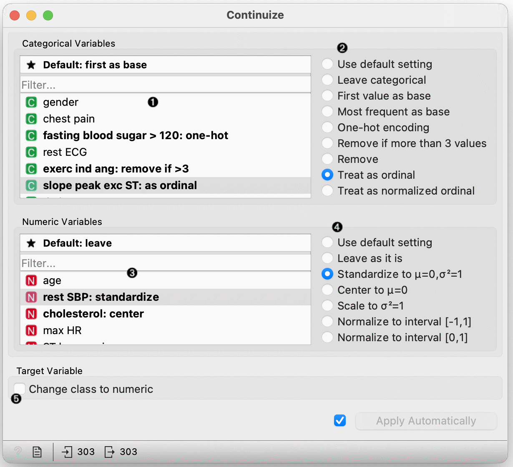
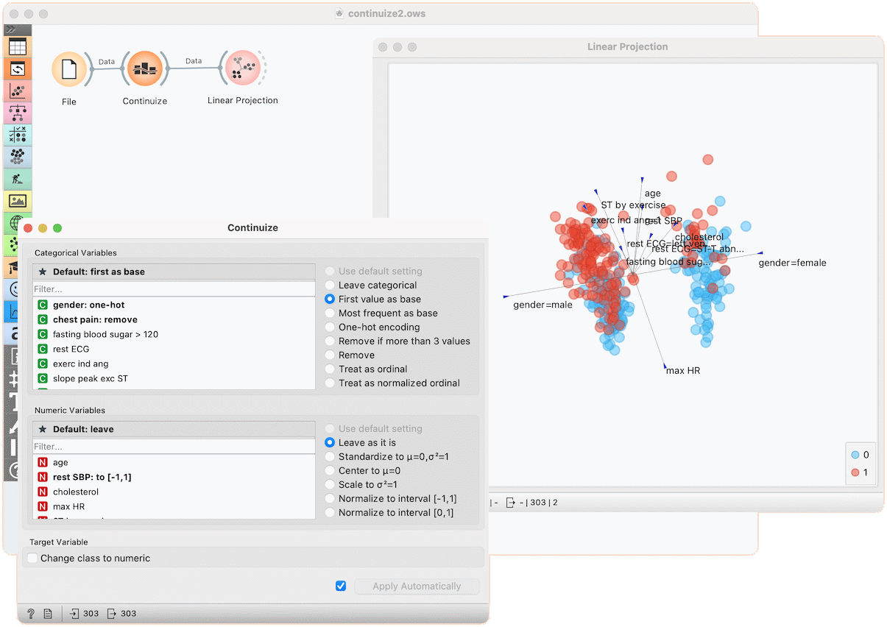

Continuize
==========

Turns discrete variables (attributes) into numeric ("continuous") dummy variables.

**Inputs**

- Data: input data set

**Outputs**

- Data: transformed data set

The **Continuize** widget receives a data set in the input and outputs the same data set in which some or all categorical variables are replaced with continuous ones and numeric variables are scaled.

1. Select a categorical attribute to define its specific treatmen, or click the "Deafult" option above to set the default treatment for all categorical attributes without specific settings.

    Multiple attributes can be chosen.

2. Define the treatment of categorical variables.

    Examples in this section will assume that we have a categorical attribute *status* with values *low*, *middle* and *high*, listed in that order. Options for their transformation are:

   - **Use default setting**: use the default treatment.

   - **Leave categorical**: leave the attribute as it is.

   - **First value as base**: a N-valued categorical variable will be transformed into N-1 numeric variables, each serving as an indicator for one of the original values except for the base value. The base value is the first value in the list. By default, the values are ordered alphabetically; their order can be changed in [Edit Domain](../data/editdomain).

       In the above case, the three-valued variable *status* is transformed into two numeric variables, *status=middle* with values 0 or 1 indicating whether the original variable had value *middle* on a particular example, and similarly, *status=high*.

   - **Most frequent value as base**: similar to the above, except that the most frequent value is used as a base. So, if the most frequent value in the above example is *middle*, then *middle* is considered as the base and the two newly constructed variables are *status=low* and *status=high*.

   - **One-hot encoding**: this option constructs one numeric variable per each value of the original variable. In the above case, we would get variables *status=low*, *status=middle* and *status=high*.

   - **Remove if more than 3 values**: removes non-binary categorical variables from the data.

   - **Remove**: removes the attribute.

   - **Treat as ordinal**: converts the variable into a single numeric variable enumerating the original values. In the above case, the new variable would have the value of 0 for *low*, 1 for *middle* and 2 for *high*. Again note that the order of values can be set in  [Edit Domain](../data/editdomain).

   - **Treat as normalized ordinal**: same as above, except that values are normalized into range 0-1. In our example, the values of the new variable would be 0, 0.5 and 1.

3. Select attributes to set individual treatments or click "Default" to set the default treatment for numeric attributes.

4. Define the treatment of numeric attributes. 

   - **Use default setting**: use the general default.
   - **Leave as it is**: do not change anything.
   - **Standardize**: subtract the mean and divide by the standard deviation (not available for sparse data).
   - **Center**: subtract the mean (not available for sparse data).
   - **Scale**: divide by standard deviation.
   - **Normalize to interval [-1, 1]**: linearly scale the values into interval [-1, 1] (not available for sparse data)
   - **Normalize to interval [0, 1]**: linearly scale the values into interval [0, 1] (not available for sparse data)
 
5. If checked, the class attribute is converted in the same fashion as categorical attributes that are treated as ordinal (see above).

Examples
--------

First, let's see what is the output of the **Continuize** widget. We feed the original data (the *Heart disease* data set) into the [Data Table](../data/datatable) and see how they look like. Then we continuize the discrete values using various options and observe them in another [Data Table](../data/datatable).

In the second example, we show a typical use of this widget - in order to properly plot the linear projection of the data, discrete attributes need to be converted to continuous ones and that is why we put the data through the **Continuize** widget before drawing it. Gender, for instance, is transformed into two attributes "*gender=female*" and *gender=male*.

