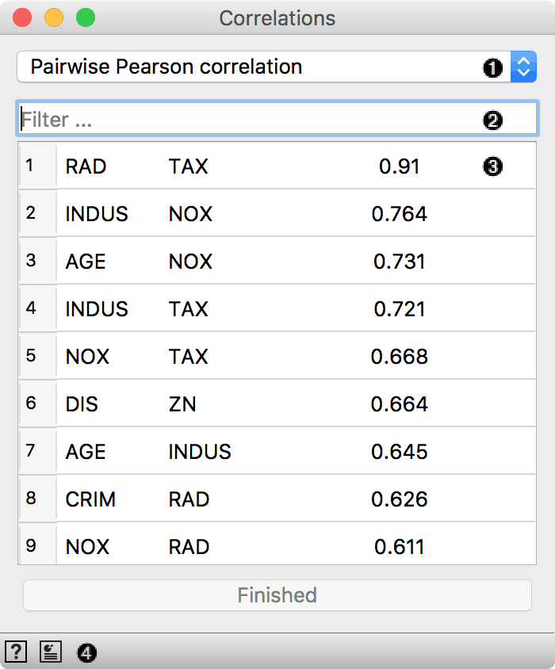
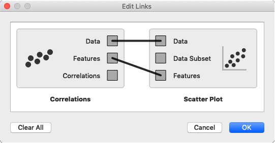
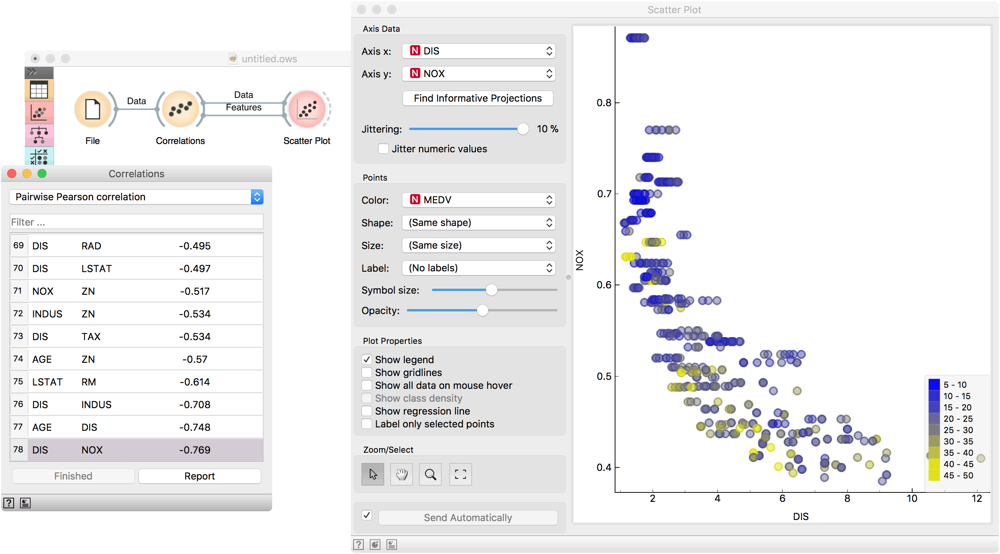

Correlations
============

Compute all pairwise attribute correlations.

**Inputs**

- Data: input dataset

**Outputs**

- Data: input dataset
- Features: selected pair of features
- Correlations: data table with correlation scores

**Correlations** computes Pearson or Spearman correlation scores for all pairs of features in a dataset. These methods can only detect monotonic relationship.

1. Correlation measure:
   - Pairwise [Pearson](https://en.wikipedia.org/wiki/Pearson_correlation_coefficient) correlation.
   - Pairwise [Spearman](https://en.wikipedia.org/wiki/Spearman%27s_rank_correlation_coefficient) correlation.
2. Filter for finding attribute pairs.
3. A list of attribute pairs with correlation coefficient. Press *Finished* to stop computation for large datasets.
4. Access widget help and produce report.

Example
-------

Correlations can be computed only for numeric (continuous) features, so we will use *housing* as an example data set. Load it in the [File](file.md) widget and connect it to **Correlations**. Positively correlated feature pairs will be at the top of the list and negatively correlated will be at the bottom.

Go to the most negatively correlated pair, DIS-NOX. Now connect [Scatter Plot](../visualize/scatterplot.md) to **Correlations** and set two outputs, Data to Data and Features to Features. Observe how the feature pair is immediately set in the scatter plot. Looks like the two features are indeed negatively correlated.

