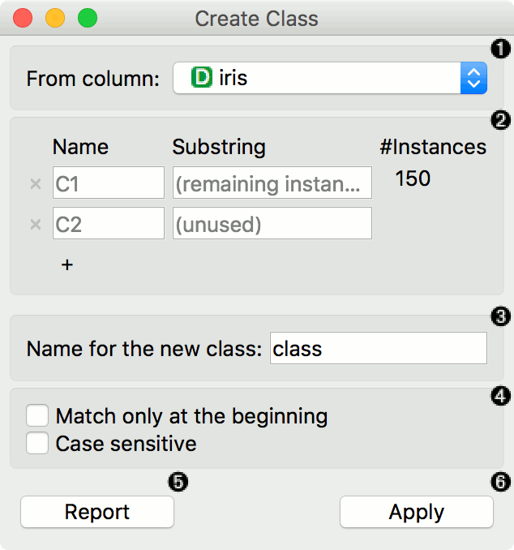
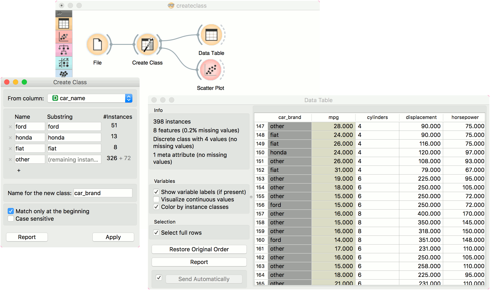

Create Class
============

Create class attribute from a string attribute.

Signals
-------

**Inputs**:

-  **Data**

   Attribute-valued data set.

**Outputs**:

-  **Data**

   Attribute-valued data set.

Description
-----------

**Create Class** creates a new class attribute from an existing discrete or string attribute. The widget matches the string value of the selected attribute and constructs a new user-defined value for matching instances.

1. The attribute the new class is constructed from.
2. Matching:
   - Name: the name of the new class value
   - Substring: regex-defined substring that will match the values from the above-defined attribute
   - Instances: the number of instances matching the substring
   - Press '+' to add a new class value
3. Name of the new class column.
4. Match only at the beginning will begin matching from the beginning of the string. Case sensitive will match by case, too.
5. Produce a report.
6. Press *Apply* to commit the results.

Example
-------

Here is a simple example with the *auto-mpg* data set. Pass the data to **Create Class**. Select *car_name* as a column to create the new class from. Here, we wish to create new values that match the car brand. First, we type *ford* as the new value for the matching strings. Then we define the substring that will match the data instances. This means that all instances containing *ford* in their *car_name*, will now have a value *ford* in the new class column. Next, we define the same for *honda* and *fiat*. The widget will tell us how many instance are yet unmatched (remaining instances). We will name them *other*, but you can continue creating new values by adding a condition with '+'.

We named our new class column *car_brand* and we matched at the beginning of the string.

Finally, we can observe the new column in a :doc:`Data Table <../data/datatable>` or use the value as color in the :doc:`Scatterplot <../visualize/scatterplot>`.
