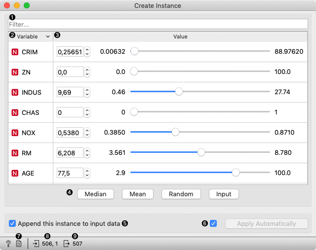
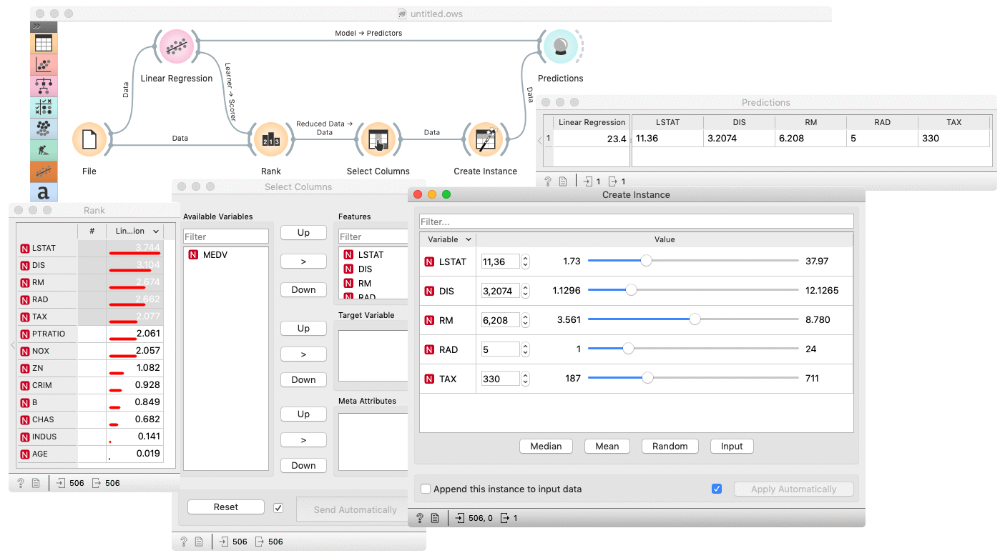
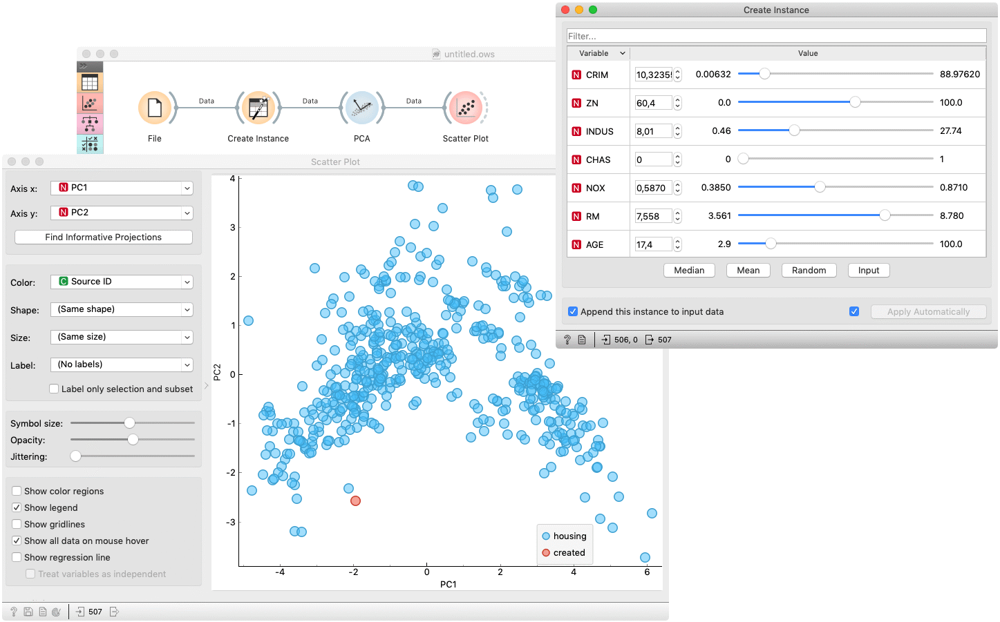

Create Instance
===============

Interactively creates an instance from a sample dataset.

**Inputs**

- Data: input dataset
- Reference: refrence dataset

**Outputs**

- Data: input dataset appended the created instance

The **Create Instance** widget creates a new instance, based on the input data. The widget displays all variables of the input dataset in a table of two columns. The column *Variable* represents the variable's name, meanwhile the column *Value* enables setting the variable's value. Each value is initially set to median value of the variable. The values can be manually set to *Median*, *Mean*, *Random* or *Input* by clicking the corresponding button. For easier searching through the variables, the table has filter attached. When clicking upon one of the mentioned buttons, only filtered variables are considered. One can also set the value by right-clicking a row and selecting an option in a context menu.

1. Filter table by variable name.
2. The column represents a variable's name and type. The table can be sorted by clicking the columns header. 
3. Provides controls for value editing.
4. Set filtered variables' values to:
   - *Median*: median value of variable in the input dataset
   - *Mean*: mean value of variable in the input dataset
   - *Random*: random value in a range of variable in the input dataset
   - *Input*: median value of variable in the reference dataset
5. If *Append this instance to input data* is ticked, the created instance is appended to the input dataset. Otherwise, a single instance appears on the output. To distinguish between created and original data, *Source ID* variable is added.
5. If *Apply automatically* is ticked, changes are committed automatically. Otherwise, you have to press *Apply* after each change.
6. Produce a report.
7. Information on input and reference dataset.
8. Information on output dataset.

Example
-------

The **Create Instance** is usually used to examine a model performance on some arbitrary data. The basic usage is shown in the following workflow, where a (*Housing*) dataset is used to fit a [Linear Regression](../model/linearregression.md) model, which is than used to [predict](../evaluate/predictions.md) a target value for data, created by the *Create Instance* widget. Inserting a [Rank](../data/rank.md) widget between [File](../data/file.md) and *Create Instance* enables outputting (and therefore making predictions on) the most important features. 
A [Select Column](../data/selectcolumns.md) widget is inserted to omit the actual target value.

The next example shows how to check whether the created instance is some kind of outlier. The creates instance is feed to [PCA](../unsupervised/PCA.md) whose first and second componens are then examined in a [Scatter Plot](../visualize/scatterplot.md). The created instance is colored red in the plot and it could be considered as an outlier if it appears far from the original data (blue).

