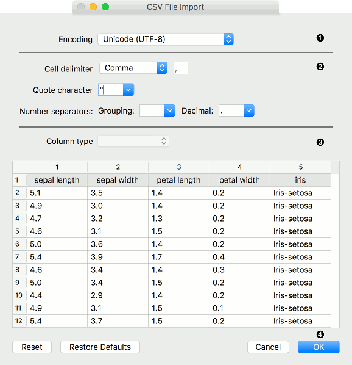
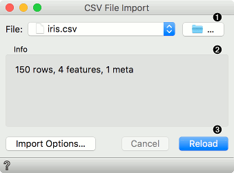
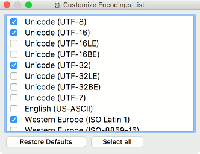
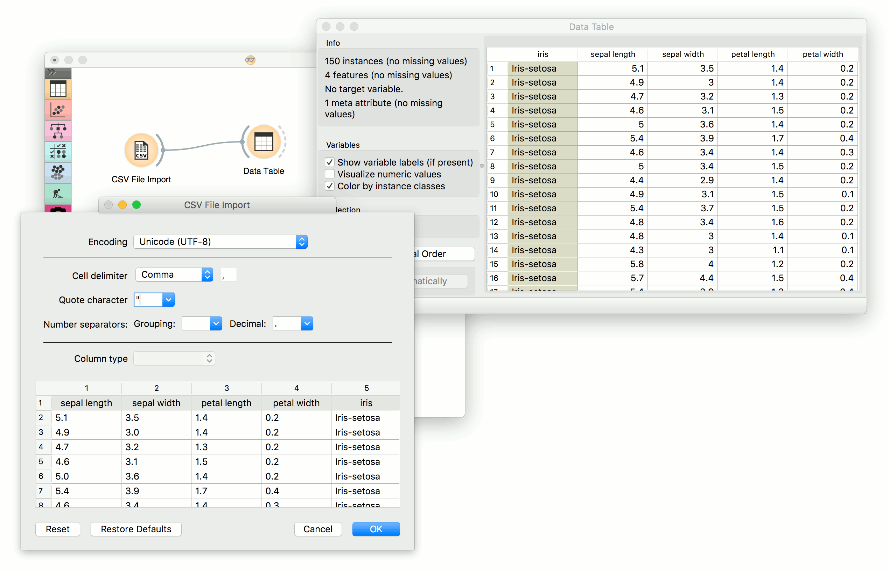

CSV File Import
===============

Import a data table from a CSV formatted file.

**Outputs**

- Data: dataset from the .csv file
- Data Frame: pandas DataFrame object

The **CSV File Import** widget reads comma-separated files and sends the dataset to its output channel. File separators can be commas, semicolons, spaces, tabs or manually-defined delimiters. The history of most recently opened files is maintained in the widget.

*Data Frame* output can be used in the [Python Script](../data/pythonscript.md) widget by connecting it to the `in_object` input (e.g. `df = in_object`). Then it can be used a regular DataFrame.

### Import Options

The import window where the user sets the import parameters. Can be re-opened by pressing *Import Options* in the widget.

Right click on the column name to set the column type. Right click on the row index (on the left) to mark a row as a header, skipped or a normal data row.

1. File encoding. Default is UTF-8. See Encoding subchapter for details.
2. Import settings:
   - *Cell delimiter*:
      - Tab
      - Comma
      - Semicolon
      - Space
      - Other (set the delimiter in the field to the right)
   - *Quote character*: either " or '. Defines what is considered a text.
   - *Number separators*:
      - Grouping: delimiters for thousands, e.g. 1,000
      - Decimal: delimiters for decimals, e.g. 1.234
3. Column type: select the column in the preview and set its type. Column type can be set also by right-clicking on the selected column.
   - *Auto*: Orange will automatically try to determine column type. (default)
   - *Numeric*: for continuous data types, e.g. (1.23, 1.32, 1.42, 1.32)
   - *Categorical*: for discrete data types, e.g. (brown, green, blue)
   - *Text*: for string data types, e.g. (John, Olivia, Mike, Jane)
   - *Datetime*: for time variables, e.g. (1970-01-01)
   - *Ignore*: do not output the column.
4. Pressing *Reset* will return the settings to the previously set state (saved by pressing OK in the Import Options dialogue). *Restore Defaults* will set the settings to their default values. *Cancel* aborts the import, while *OK* imports the data and saves the settings.

### Widget

The widget once the data is successfully imported.

1. The folder icon opens the dialogue for import the local .csv file. It can be used to either load the first file or change the existing file (load new data). The *File* dropdown stores paths to previously loaded data sets.
2. Information on the imported data set. Reports on the number of instances (rows), variables (features or columns) and meta variables (special columns).
3. *Import Options* re-opens the import dialogue where the user can set delimiters, encodings, text fields and so on. *Cancel* aborts data import. *Reload* imports the file once again, adding to the data any changes made in the original file.

### Encoding

The dialogue for settings custom encodings list in the Import Options - Encoding dropdown. Select *Customize Encodings List...* to change which encodings appear in the list. To save the changes, simply close the dialogue. Closing and reopening Orange (even with Reset widget settings) will not re-set the list. To do this, press *Restore Defaults*. To have all the available encodings in the list, press *Select all*.

Example
-------

**CSV File Import** works almost exactly like the [File](../data/file.md) widget, with the added options for importing different types of .csv files. In this workflow, the widget read the data from the file and sends it to the [Data Table](../data/datatable.md) for inspection.

