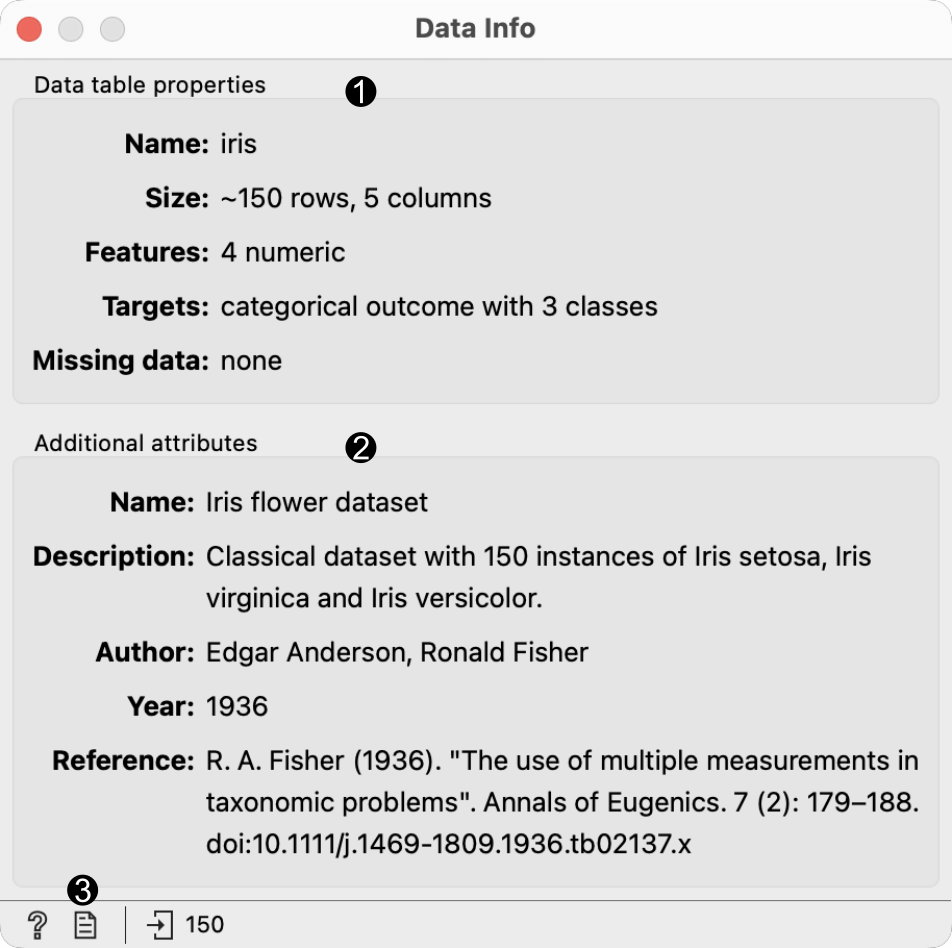

Data Info
=========

Displays information on a selected dataset.

**Inputs**

- Data: input dataset

A simple widget that presents information on the connected dataset.

1. Information on the data table.
2. Additional information the dataset.
3. Produce a report.

Example
-------

Below, we compare the basic statistics of two **Data Info** widgets - one with information on the entire dataset and the other with information on the (manually) selected subset from the [Scatter Plot](../visualize/scatterplot.md) widget. We used the *Iris* dataset.

