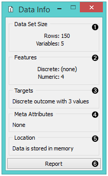
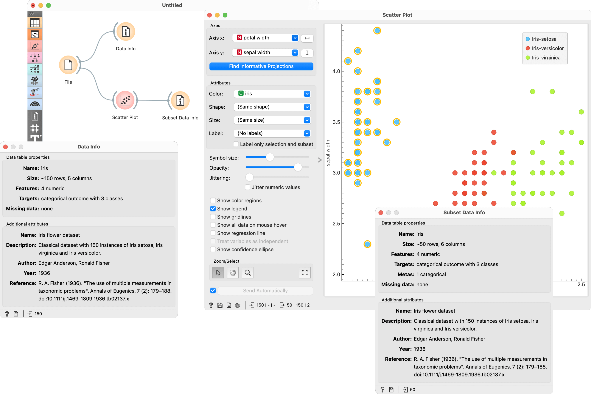

Data Info
=========

Displays information on a selected data set.

Signals
-------

**Inputs**:

-  **Data**

   A data set.

-  **Selected Data**

   A data subset.

**Outputs**:

-  (None)

Description
-----------

A simple widget that presents information on data set size, features,
targets, meta attributes, and location. 

1. Information on data set size
2. Information on discrete and continuous features
3. Information on targets
4. Information on meta attributes
5. Information on where the data is stored
6. Produce a report. 

Example
-------

Below, we compare the basic statistics of two **Data Info** widgets - one
with information on the entire data set and the other with
information on the (manually) selected subset from the :doc:`Scatterplot <../visualize/scatterplot>`
widget. We used the *Iris* data set. 

