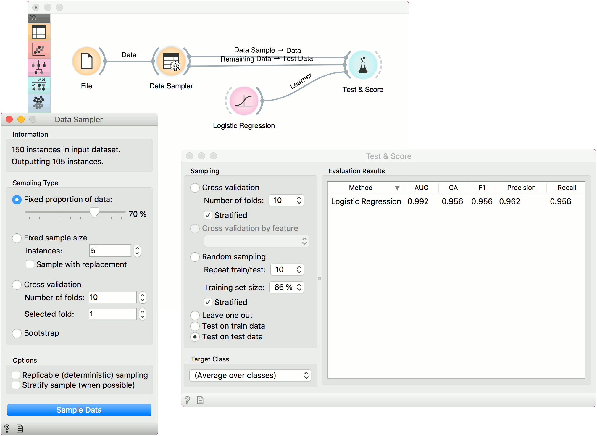
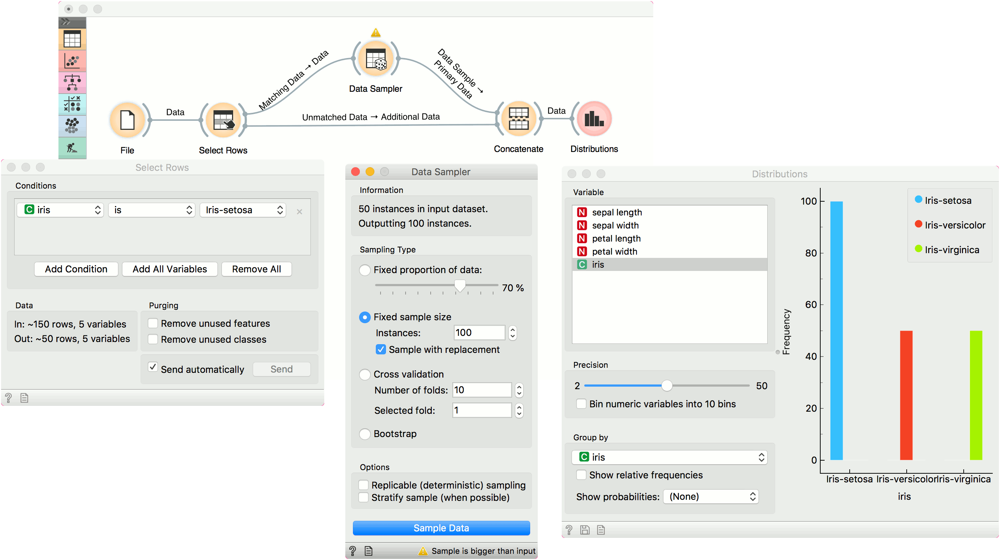

Data Sampler
============

Selects a subset of data instances from an input dataset.

Inputs
    Data
        input dataset

Outputs
    Data Sample
        sampled data instances
    Remaining Data
        out-of-sample data

The **Data Sampler** widget implements several data sampling methods. It outputs a sampled and a complementary dataset (with instances from the input set that are not included in the sampled dataset). The output is processed after the input dataset is provided and *Sample Data* is pressed.

.. figure:: images/DataSampler-stamped.png
   :scale: 50%

1. Information on the input and output dataset.
2. The desired sampling method:

   -  **Fixed proportion of data** returns a selected percentage of the entire data (e.g. 70% of all the data)
   -  **Fixed sample size** returns a selected number of data instances with a chance to set *Sample with replacement*, which always samples from the entire dataset (does not subtract instances already in the subset). With replacement, you can generate more instances than available in the input dataset.
   -  `Cross Validation <https://en.wikipedia.org/wiki/Cross-validation_(statistics)>`_ partitions data instances into complementary subsets, where you can select the number of folds (subsets) and which fold you want to use as a sample.
   - `Bootstrap <https://en.wikipedia.org/wiki/Bootstrapping_(statistics)>`_  infers the sample from the population statistic.
3. *Replicable sampling* maintains sampling patterns that can be carried
   across users, while *stratify sample* mimics the composition of the
   input dataset.
4. Press *Sample Data* to output the data sample.
 

Examples
--------

First, let's see how the **Data Sampler** works. We will use the *iris* data from the :doc:`File <../data/file>` widget. We see there are 150 instances in the data. We sampled the data with the **Data Sampler** widget and we chose to go with a fixed sample size of 5 instances for simplicity. We can observe the sampled data in the :doc:`Data Table <../data/datatable>` widget (Data Table (in-sample)). The second :doc:`Data Table <../data/datatable>` (Data Table (out-of-sample)) shows the remaining 145 instances that weren't in the sample. To output the out-of-sample data, double-click the connection between the widgets and rewire the output to *Remaining Data --> Data*.

.. figure:: images/DataSampler-Example1.png 

Now, we will use the **Data Sampler** to split the data into training and testing part. We are using the *iris* data, which we loaded with the :doc:`File <../data/file>` widget. In **Data Sampler**, we split the data with *Fixed proportion of data*, keeping 70% of data instances in the sample.

Then we connected two outputs to the :doc:`Test & Score <../evaluation/testandscore>` widget, *Data Sample --> Data* and *Remaining Data --> Test Data*. Finally, we added :doc:`Logistic Regression <../model/logisticregression>` as the learner. This runs logistic regression on the Data input and evaluates the results on the Test Data.

Over/Undersampling
------------------

**Data Sampler** can also be used to oversample a minority class or undersample majority class in the data. Let us show an example for oversampling. First, separate the minority class using a :doc:`Select Rows <../data/selectrows>` widget. We are using the *iris* data from the :doc:`File <../data/file>` widget. The data set has 150 data instances, 50 of each class. Let us oversample, say, *iris-setosa*.

In **Select Rows**, set the condition to *iris is iris-setosa*. This will output 50 instances of the *iris-setosa* class. Now, connect *Matching Data* into the **Data Sampler**, select *Fixed sample size*, set it to, say, 100 and select *Sample with replacement*. Upon pressing *Sample Data*, the widget will output 100 instances of *iris-setosa* class, some of which will be duplicated (because we used *Sample with replacement*).

Finally, use :doc:`Concatenate <../data/concatenate>` to join the oversampled instances and the *Unmatched Data* output of the **Select Rows** widget. This outputs a data set with 200 instances. We can observe the final results in the :doc:`Distributions <../visualize/distributions>`.

