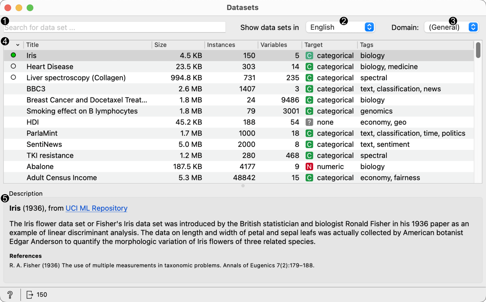
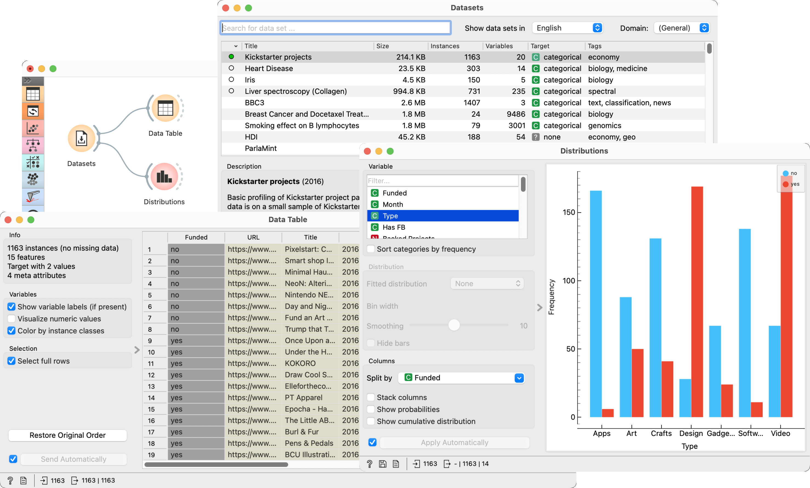

Data Sets
=========

Load a data set from an online repository.

Signals
-------

**Inputs**:

-  (None)

**Outputs**:

-  **Data**

   Attribute-valued data set.

Description
-----------

**Datasets** widget retrives selected data set from the server and sends it to the output. File is downloaded to the local memory and thus instantly available even without the internet connection. Each data set is provided with a description and information on the data size, number of instances, number of variables, target and tags.

1. Information on the number of data sets available and the number of them downloaded to the local memory. 
2. Content of available data sets. Each data set is described with the size, number of instances and variables, type of the target variable and tags.
3. Formal description of the selected data set.
4. If *Send Data Automatically* is ticked, selected data set is communicated automatically. Alternatively, press *Send Data*.

Example
-------

Orange workflows can start with **Data Sets** widget instead of **File** widget. In the example below, the widget retrieves a data set from an online repository (Kickstarter data), which is subsequently sent to both the :doc:`Data Table <../data/datatable>` and the :doc:`Distributions <../visualize/distributions>`.

