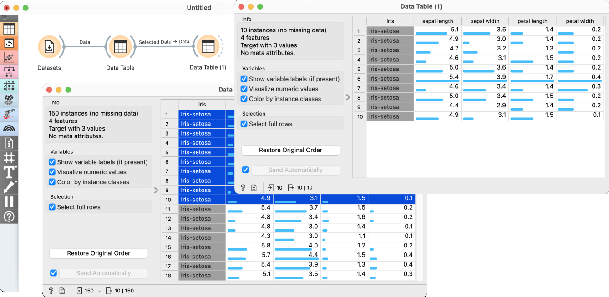
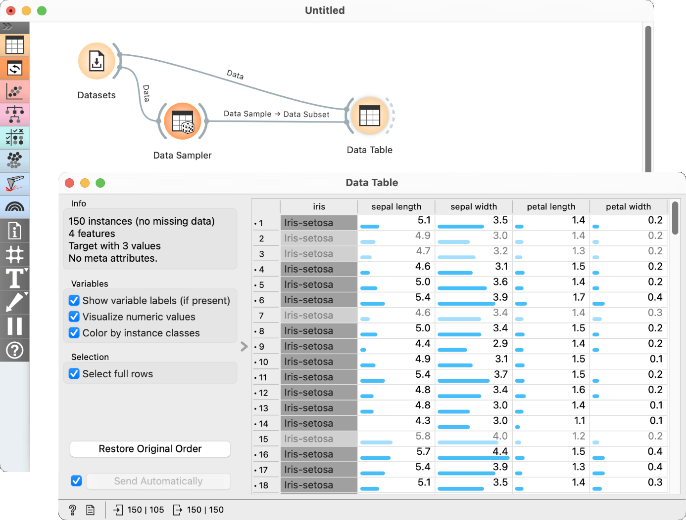

Data Table
==========

Displays attribute-value data in a spreadsheet.

**Inputs**

- Data: input dataset
- Data Subset: a subset of the input dataset

**Outputs**

- Selected Data: instances selected from the table
- Data: the full input dataset

The **Data Table** widget can receive a dataset and a data subset on its input and presents them as a spreadsheet. The widget also supports manual selection of data instances. Data
instances are in rows and their attribute values (features) in columns, which can be used for sorting.  

1. The name of the dataset (usually the input data file). In this
   example, the dataset is sorted by the attribute "sepal length".
2. Info on current dataset size and number and types of attributes
3. Values of continuous attributes can be visualized with bars; colors
   can be attributed to different classes.
4. Data instances (rows) can be selected and sent to the widget's output
   channel.
5. Clicking the *Restore Original Order* button will reset the original data order that might have changed because of sorting.
6. While auto-send is on, all changes will be automatically communicated
   to other widgets. Otherwise, press *Send Selection*.
7. Produce a report.

Examples
--------

In our first example we show how selections work in **Data Table**. First, we send the _iris_ dataset from the **[Datasets](../data/datasets.md)** widget to a **Data Table**. There, we select the first ten data instances and send them to a second **Data Table** widget. The workflow and the two **Data Table** widgets are shown below on the figure.

Since the widget has a _Data Subset_ input, we can use it to inspect selections from upstream processing steps and compare them to the full dataset. In this following example we send the _iris_ dataset to the _Data_ input of **Data Table** and also randomly select data instances using the **[Data Sampler](../data/datasampler.md)** widget. Notice the result in **Data Table**: the selected instances are highlighted in dark grey. 

One could combine the above examples and could further select subsets in subsequent **Data Table** widgets.