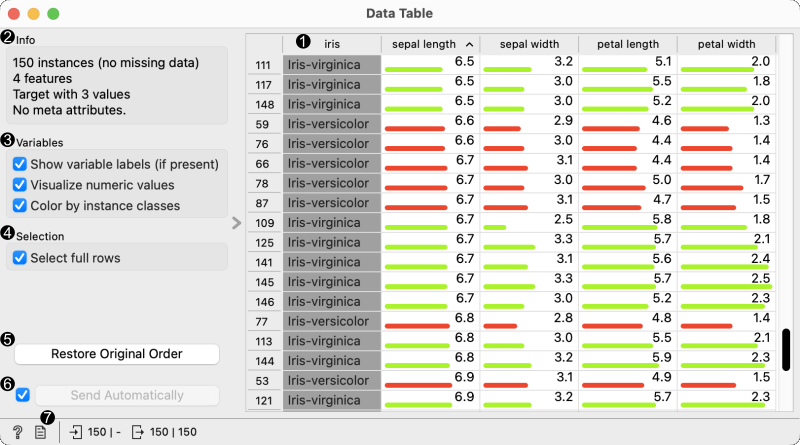
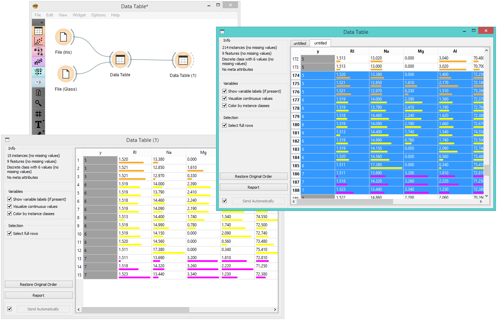

Data Table
==========

Displays attribute-value data in a spreadsheet.

Signals
-------

**Inputs**:

-  **Data**

   Attribute-valued data set.

**Outputs**:

-  **Selected Data**

   Selected data instances.

Description
-----------

The **Data Table** widget receives one or more data sets in its input and
presents them as a spreadsheet. Data instances may be sorted by
attribute values. The widget also supports manual selection of data
instances.

1. The name of the data set (usually the input data file). Data
   instances are in rows and their attribute values in columns. In this
   example, the data set is sorted by the attribute "sepal length".
2. Info on current data set size and number and types of attributes
3. Values of continuous attributes can be visualized with bars; colors
   can be attributed to different classes.
4. Data instances (rows) can be selected and sent to the widget's output
   channel.
5. Use the *Restore Original Order* button to reorder data instances after
   attribute-based sorting.
6. Produce a report. 
7. While auto-send is on, all changes will be automatically communicated
   to other widgets. Otherwise, press *Send Selected Rows*.

Example
-------

We used two :doc:`File <../data/file>` widgets to read the *Iris* and *Glass* data set
(provided in Orange distribution), and send them to the **Data Table**
widget.

.. figure:: images/DataTable-Schema.png

Selected data instances in the first **Data Table** are passed to the
second **Data Table**. Notice that we can select which data set to view
(iris or glass). Changing from one data set to another alters the
communicated selection of data instances if *Commit on any change*
is selected.

