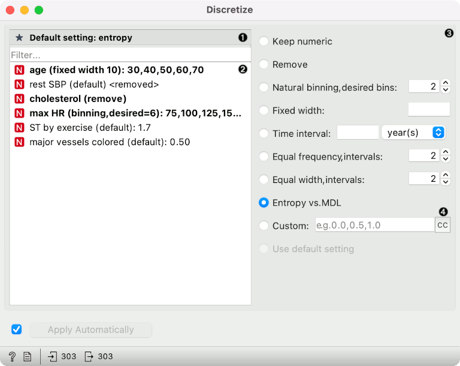

Discretize
==========

Converts numeric attributes to categorical.

**Inputs**

- Data: input dataset

**Outputs**

- Data: dataset with discretized values

The **Discretize** widget [discretizes](https://en.wikipedia.org/wiki/Discretization) numeric variables.

1. Set default method for discretization.

2. Select variables to set specific discretization methods for each. Hovering over a variable shows intervals.

3. Discretization methods

   - **Keep numeric** keeps the variable as it is.
   - **Remove** removes variable.
   - **Natural binning** finds nice thresholds for the variable's range of values, for instance 10, 20, 30 or 0.2, 0.4, 0.6, 0.8. We can set the desired number of bins; the actual number will depend on the interval.
   - **Fixed width** uses a user-defined bin width. Boundaries of bins will be multiples of width. For instance, if the width is 10 and the variable's values range from 35 to 68, the resulting bins will be <40, 40-50, 50-60, >60. This method does not work for time variables. If the width is too large (resulting in a single interval) or too small (resulting in more than 100 intervals), the variable is removed.
   - **Time interval** is similar to Fixed width, but for time variables. We specify the width and a time unit, e.g. 4 months or 3 days. Bin boundaries will be multiples of the interval; e.g. with 4 months, bins will always include Jan-Mar, Apr-Jun, Jul-Sep and Oct-Dec.
   - **[Equal-frequency](http://www.saedsayad.com/unsupervised_binning.htm)** splits the attribute into a given number of intervals with approximately the same number of instances.
   - [Equal-width](https://en.wikipedia.org/wiki/Data_binning) evenly splits the range between the smallest and the largest observed value.
   - [Entropy-MDL](http://ijcai.org/Past%20Proceedings/IJCAI-93-VOL2/PDF/022.pdf) is a top-down discretization invented by Fayyad and Irani, which recursively splits the attribute at a cut maximizing information gain, until the gain is lower than the minimal description length of the cut. This discretization can result in an arbitrary number of intervals, including a single interval, in which case the variable is discarded as useless (removed).
   - **Custom** allows entering an increasing, comma-separated list of thresholds. This is not applicable to time variables.
   - **Use default setting** (enabled for particular settings and not default) sets the method to specified as "Default setting".

4. The CC button sets the method for the currently selected variables to Custom, using their current thresholds. This allows for manual editing of automatically determined bins.

Example
-------

In the schema below, we took the *Heart disease* data set and
- discretized *age* to a fixed interval of 10 (years),
- *max HR* to approximately 6 bins (the closest match were 7 bins with a width of 25),
- removed *Cholesterol*,
- and used *entropy-mdl* for the remaining variables, which resulted in removing *rest SBP* and in two intervals for *ST by exercise* and *major vessels colored*.

