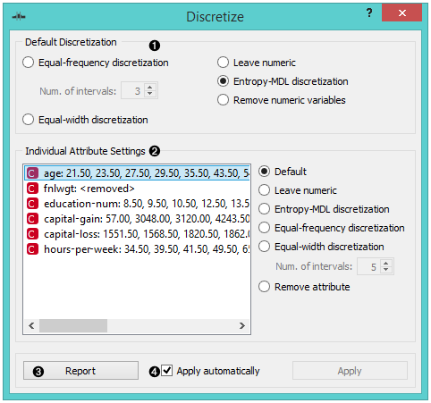
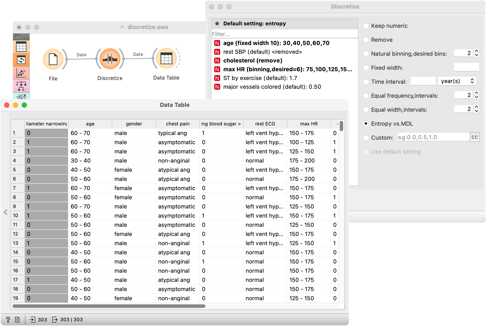

Discretize
==========

Discretizes continuous attributes from an input data set. 

Signals
-------

**Inputs**:

-  **Data**

   Attribute-valued data set.

**Outputs**:

-  **Data**

   A data set with discretized values.

Description
-----------

The **Discretize** widget
`discretizes <https://en.wikipedia.org/wiki/Discretization>`_
continuous attributes with a selected method.

1. The basic version of the widget is rather simple. It allows choosing
   between three different discretizations.

   -  `Entropy-MDL <http://ijcai.org/Past%20Proceedings/IJCAI-93-VOL2/PDF/022.pdf>`_,
      invented by Fayyad and Irani is a top-down discretization, which
      recursively splits the attribute at a cut maximizing information
      gain, until the gain is lower than the minimal description length of
      the cut. This discretization can result in an arbitrary number of
      intervals, including a single interval, in which case the attribute is
      discarded as useless (removed).
   -  `Equal-frequency <http://www.saedsayad.com/unsupervised_binning.htm>`_
      splits the attribute into a given number of intervals, so that
      they each contain approximately the same number of instances.
   -  `Equal-width <https://en.wikipedia.org/wiki/Data_binning>`_
      evenly splits the range between the smallest and the largest observed
      value. The *Number of intervals* can be set manually.
   -  The widget can also be set to leave the attributes continuous or to
      remove them.

2. To treat attributes individually, go to **Individual Attribute
   Settings**. They show a specific discretization of each attribute and 
   allow changes. First, the top left list shows the cut-off
   points for each attribute. In the snapshot, we used the entropy-MDL
   discretization, which determines the optimal number of intervals
   automatically; we can see it discretized the age into seven intervals
   with cut-offs at 21.50, 23.50, 27.50, 35.50, 43.50, 54.50 and 61.50,
   respectively, while the capital-gain got split into many intervals
   with several cut-offs. The final weight (fnlwgt), for instance, was
   left with a single interval and thus removed.

   On the right, we can select a specific discretization method for each
   attribute. Attribute *“fnlwgt”* would be removed by the MDL-based
   discretization, so to prevent its removal, we select the attribute and
   choose, for instance, **Equal-frequency discretization**. We could also
   choose to leave the attribute continuous.

3. Produce a report.

4. Tick *Apply automatically* for the widget to automatically commit changes. Alternatively, press *Apply*.

Example
-------

In the schema below, we show the *Iris* data set with continuous attributes
(as in the original data file) and with discretized attributes.

