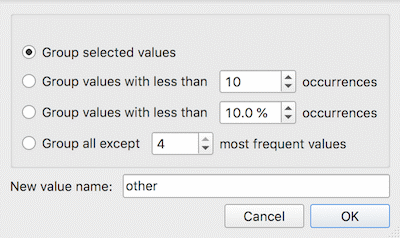

Edit Domain
===========

Rename features and their values.

**Inputs**

- Data: input dataset

**Outputs**

- Data: dataset with edited domain

This widget can be used to edit/change a dataset's domain - rename features, rename or merge values of categorical features, add a categorical value, and assign labels.

1. All features (including meta attributes) from the input dataset are listed in the *Variables* list. Selecting one feature displays an editor on the right.
2. Editing options:
   - Change the name of the feature.
   - Change the type of the feature. For example, convert a string variable to categorical.
   - *Unlink variable from its source variable*. This option removes existing computation for a variable (say for Cluster how clustering was computed), making it 'plain'. This enables merging variables with same names in [Merge Data](../data/mergedata.md).
   - Change the value names for discrete features in the *Values* list box. Double-click to edit the name.
   - Add, remove or edit additional feature annotations in the *Labels* box. Add a new label with the + button and add the *Key* and *Value* for the new entry. Key will be displayed in the top left corner of the [Data Table](../data/datatable.md), while values will appear below the specified column. Remove an existing label with the - button.
3. Reorder or merge values of categorical features. To reorder the values (for example, to display them in [Distributions](../visualize/distributions.md), use the up and down keys at the bottom of the box. To add or remove a value, use + and - buttons. Select two or more variables and click = to merge them into a single value. Use the M button to merge variables on condition.
4. Rename the output table. Useful for displaying table names in [Venn Diagram](../visualize/venndiagram.md).
5. To revert the changes made to the selected feature, press the *Reset Selected* button while the feature is selected in the *Variables* list. Pressing *Reset All* will remove all the changes to the domain. Press *Apply* to send the new domain to the output.

**Merging options**

- *Group selected values*: selected cateogorical values become a single variable.
- *Group values with less than N occurrences*: values which appear less than N times in the data, will be grouped into a single value.
- *Group values with less than % occurrences*: values which appear less then X % of the time in the data, will be grouped into a single value.
- *Group all except N most frequent values*: all values but the N most frequent will be grouped into a single variable.
- *New value name*: the name of the grouped value.

Example
-------

Below, we demonstrate how to simply edit an existing domain. We selected the *heart_disease.tab* dataset and edited the *gender* attribute. Where in the original we had the values *female* and *male*, we changed it into *F* for female and *M* for male. Then we used the down key to switch the order of the variables. Finally, we added a label to mark that the attribute is binary. We can observe the edited data in the [Data Table](../data/datatable.md) widget.

