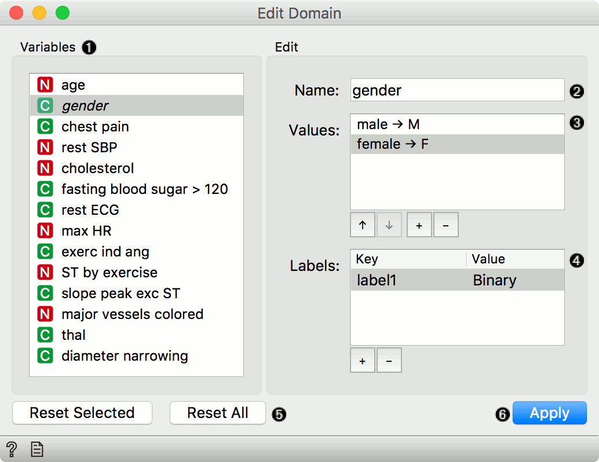

Edit Domain
===========

Rename features and their values.

Inputs
    Data
        input dataset

Outputs
    Data
        dataset with edited domain

This widget can be used to edit/change a dataset's domain. 

1. All features (including meta attributes) from the input dataset are
   listed in the *Domain Features* list in the box on the left.
   Selecting one feature displays an editor on the right.
2. The name of the feature can be changed in the *Name* line edit. For
   *Discrete* features, value names can also be changed in the *Values*
   list box. Additonal feature annotations can be added/removed/edited
   in the *Labels* box. To add a new label, click the "+" button and add
   the *Key* and *Value* columns for the new entry. Selecting an
   existing label and pressing "-" will remove the annotation.
3. To revert the changes made to the feature, press the *Reset Selected*
   button in the *Reset* box while the feature is selected in the
   *Domain Features* list. Pressing *Reset All* will reset all features
   in the domain at the same time.
4. Pressing the *Apply* button will send the changed domain dataset to the
   output channel.

Example
-------

Below, we demonstrate how to simply edit an existing domain. We selected the
*lenses.tab* dataset and edited the *perscription* attribute. Where in
the original we had the values *myope* and *hypermetrope*, we changed it
into *nearsightedness* and *farsightedness* instead. For an easier
comparison, we fed both the original and edited data into the :doc:`Data
Table <../data/datatable>` widget.

.. figure:: images/EditDomain-Example.png
