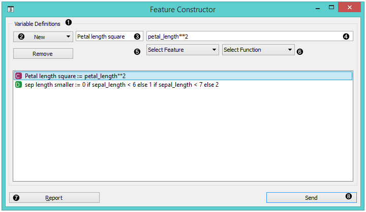
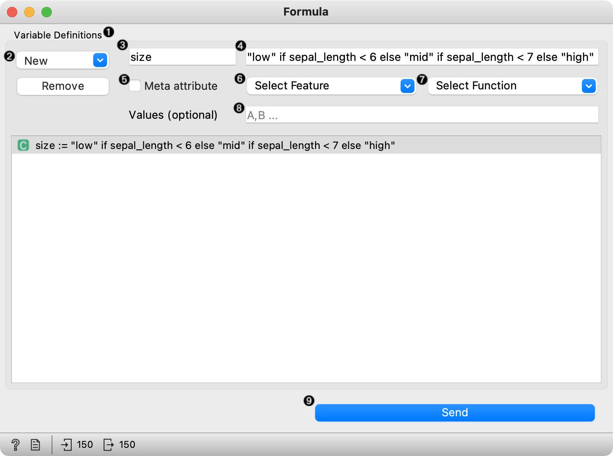
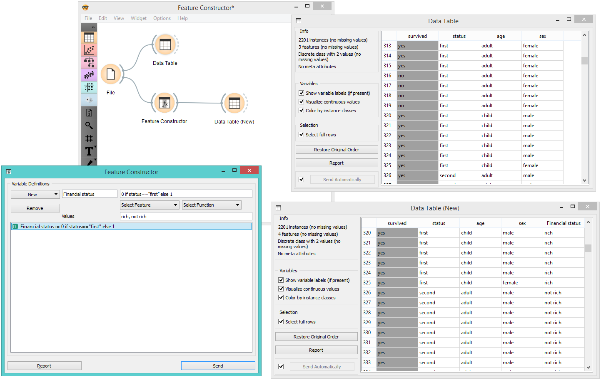

Feature Constructor
===================

Add new features to your data set.

Signals
-------

**Inputs**:

-  **Data**

A data set

**Outputs**:

-  **Data**

A modified data set

Description
-----------

The **Feature Constructor** allows you to manually add features (columns)
into your data set. The new feature can be a computation of an existing
one or a combination of several (addition, subtraction, etc.). You can
choose what type of feature it will be (discrete, continuous or string)
and what its parameters are (name, value, expression). For continuous
variables you only have to construct an expression in Python.

1. List of constructed variables 
2. Add or remove variables.   
3. New feature name
4. Expression in Python
5. Select a feature.
6. Select a function.
7. Produce a report.
8. Press *Send* to communicate changes. 

For discrete variables, however, there's a bit more work. First add or
remove the values you want for the new feature. Then select the base
value and the expression. In the example below, we have constructed an
expression with 'if lower than' and defined three conditions; the
program ascribes 0 (which we renamed to lower) if the original value is
lower than 6, 1 (mid) if it is lower than 7 and 2 (higher) for all the
other values. Notice that we use an underscore for the feature name
(e.g. petal\_length).

1. List of variable definitions 
2. Add or remove variables 
3. New feature name
4. Expression in Python
5. Select a feature.
6. Select a function.
7. Assign values. 
8. Produce a report. 
9. Press *Send* to communicate changes. 

Example
-------

With the **Feature Constructor** you can easily adjust or combine existing
features into new ones. Below, we added one new discrete feature to the
*Titanic* data set. We created a new attribute called *Financial status*
and set the values to be *rich* if the person belongs to the first class
(status = first) and *not rich* for everybody else. We can see the new
data set with :doc:`Data Table<../data/datatable>` widget.

Hints
-----

If you are unfamiliar with Python math language, here's a quick
introduction. 

- +, - to add, subtract
- \* to multiply
- / to divide
- % to divide and return the remainder
- \*\* for exponent (for square root square by 0.5)
- // for floor division
- <, >, <=, >= less than, greater than, less or equal, greater or equal
- == for equal
- != for not equal

As in the example: (*value*) if (*feature name*) < (*value*), else (*value*)
if (*feature name*) < (*value*), else (*value*)

[Use value 1 if feature is less than specified value, else use value 2
if feature is less than specified value 2, else use value 3.]

See more
`here <http://www.tutorialspoint.com/python/python_basic_operators.htm>`__.
