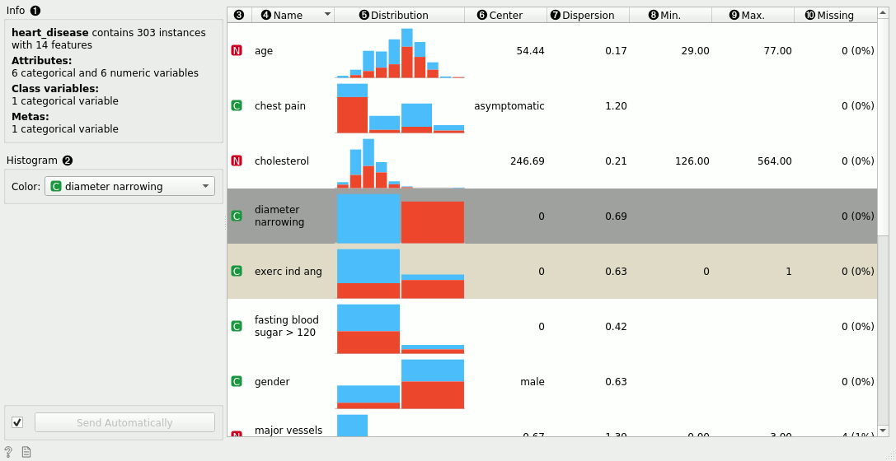
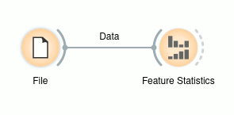
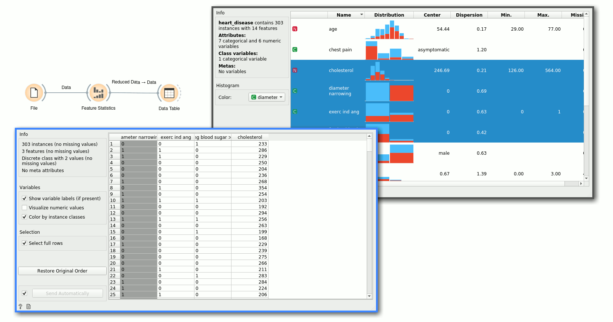
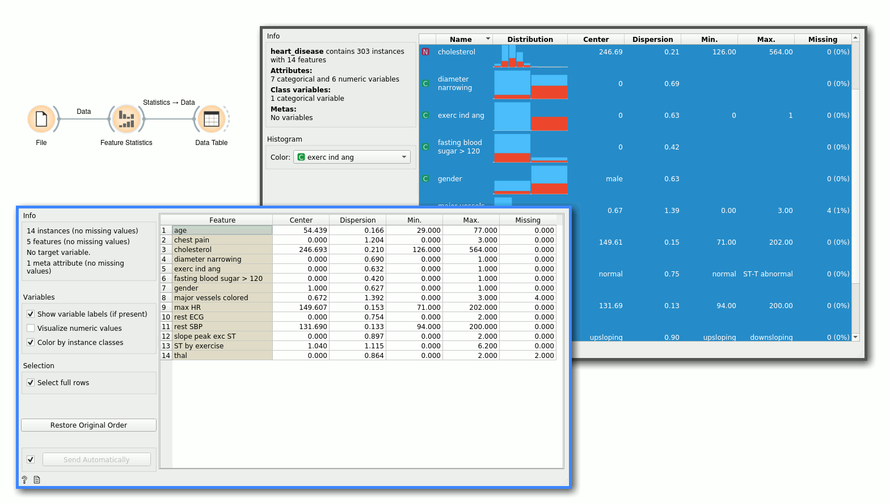

Feature Statistics
==================

Show basic statistics for data features.

**Inputs**

- Data: input data

**Outputs**
    
- Reduced data: table containing only selected features
- Statistics: table containing statistics of the selected features

The **Feature Statistics** widget provides a quick way to inspect and find interesting features in a given data set.

The Feature Statistics widget on the *heart-disease* data set.

1. The feature type - can be categorical, numeric, time and string.
2. The name of the feature.
3. The histogram showing the distribution of feature's values. Values of numeric features are split into bins.
4. Further columns show different statistics. Mean, minimal and maximal value are computed only for numeric features. Mode shows the most common value for numeric or categorical feature. Dispersion shows [coefficient of variation](https://en.wikipedia.org/wiki/Coefficient_of_variation) for numeric features, and [entropy](https://en.wikipedia.org/wiki/Entropy_(information_theory)) for categorical.
5. The bars in the histogram can be further split by value of another variable. The default choice is the target variable, but the user can change this to an arbitrary feature or none.

Example
-------

The Feature Statistics widget is most often used after the [File](../data/file.md) widget to inspect and find potentially interesting features in the given data set. In the following examples, we use the *heart-disease* data set.

Once we have found a subset of potentially interesting features, or we have found features that we would like to exclude, we can simply select the features we want to keep. The widget outputs a new data set with only these features.

Alternatively, if we want to store feature statistics, we can use the *Statistics* output and manipulate those values as needed. In this example, we display the statistics in a table.

