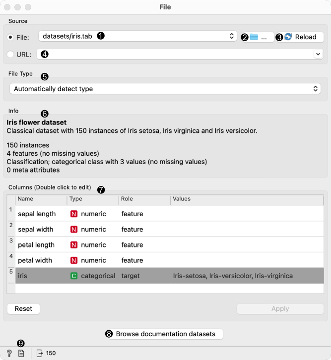
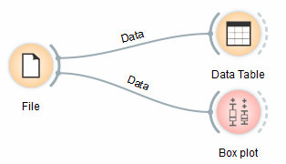

File
====

Reads attribute-value data from an input file.

Signals
-------

**Inputs**:

-  (None)

**Outputs**:

-  **Data**

   Attribute-valued data from the input file

Description
-----------

The **File** widget :doc:`reads the input data
file <../../loading-your-data/index>` (data table
with data instances) and sends the data set to its output channel.
The history of most recently opened files is maintained in the widget.
The widget also includes a directory with sample data sets that come
pre-installed with Orange.

The widget reads data from Excel (**.xlsx**), simple tab-delimited
(**.txt**), comma-separated files (**.csv**) or URLs. 

1. Browse through previously opened data files, or load any of the sample ones.  
2. Browse for a data file.
3. Reloads currently selected data file.
4. Insert data from URL adresses, including data from Google Sheets. 
5. Information on the loaded data set: data set size, number and types of data features.
6. Additional information on the features in the data set. Features can be edited by double-clicking on them. The user can change the attribute names, select the type of variable per each attribute (*Continuous*, *Nominal*, *String*, *Datetime*), and choose how to further define the attributes (as *Features*, *Targets* or *Meta*). The user can also decide to ignore an attribute. 
7. Browse documentation data sets.
8. Produce a report. 

Example
-------

Most Orange workflows would probably start with the **File** widget. In
the schema below, the widget is used to read the data that is sent to
both the :doc:`Data Table <../data/datatable>` and the :doc:`Box Plot <../visualize/boxplot>` widget.

Loading your data
-----------------

-  Orange can import any comma, .xlsx or tab-delimited data file or URL. Use the
   :doc:`File widget <../data/file>` and then, if needed, select class and meta attributes. 
-  To specify the domain and the type of the attribute, attribute names
   can be preceded with a label followed by a hash. Use c for class and
   m for meta attribute, i to ignore a column, and C, D, S for
   continuous, discrete and string attribute types. Examples: C#mpg,
   mS#name, i#dummy. Make sure to set **Import Options** in
   :doc:`File <../data/file>` widget and set the header to **Orange simplified header**.
-  Orange's native format is a tab-delimited text file with three header
   rows. The first row contains attribute names, the second the type
   (**continuous**, **discrete** or **string**), and the third the
   optional element (**class**, **meta** or **string**).

.. figure:: images/spreadsheet-simple-head1.png

Read more on loading your data :doc:`here <../../loading-your-data/index>`.
