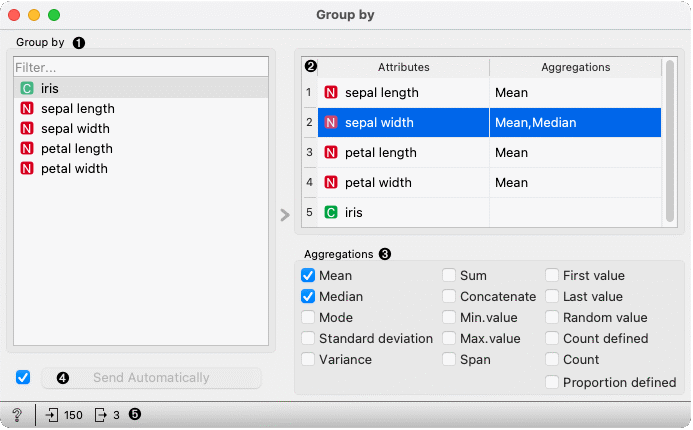
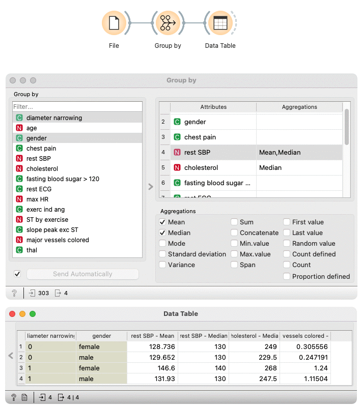

Group by
========

Groups data by selected variables and aggregate columns with selected aggregations.

**Inputs**

- Data: input data table

**Outputs**

- Data: aggregated data

Group By widget first identifies groups based on selected variables in the **Group by** list. Groups are defined by all distinct combinations of values in selected variables.

In the second step, the widget computes aggregations defined in the table on the right side of the widget for each group.

1. Select variables that define groups
2. View variables and their aggregations. To change aggregation for one or more variables, select them in the table.
3. Change aggregations for variables selected in the view above.
4. When the *Send automatically* box is ticked, all changes will be automatically communicated to other widgets.
5. Get documentation, observe a number of items on input or output

Examples
--------

We first load **heart_disease** dataset in the **File** widget. In the **Group By** widget, we set variables that define groups -- **diameter narrowing** and **gender**. Each group includes items (rows) that belong to one combination of both variables. 

In the table on the right-hand side of the widget, we set that we want to compute **mean** and  **median** for values of **rest SBP** variable in each group, **median** for values of **cholesterol** variable, and **mean** for **major vessels colored**.

In the **Data Table** widget, we can see that both females and males have lower average values for **rest SBP** when **diameter narrowing** is 0. The difference is greater for females. The median of **rest SBP** is different only for females, while for males is the same.

You can also observe differences between median **cholesterol** level and mean value of **major vessel colored** between groups.

