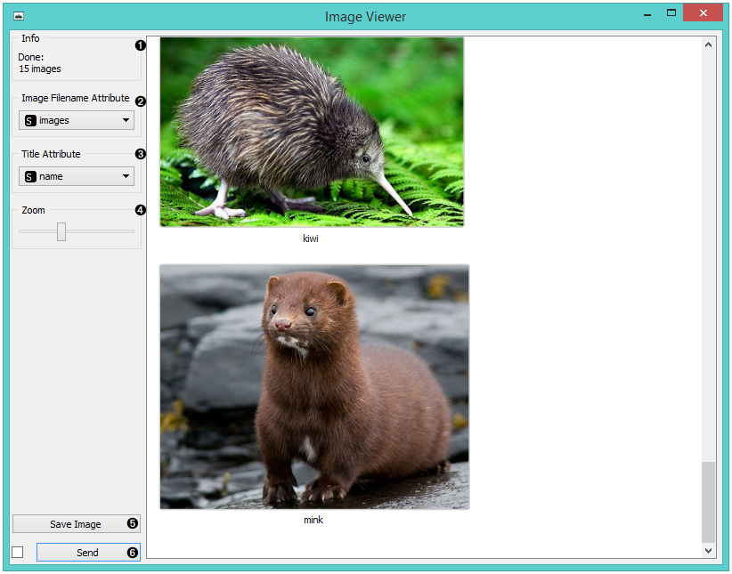
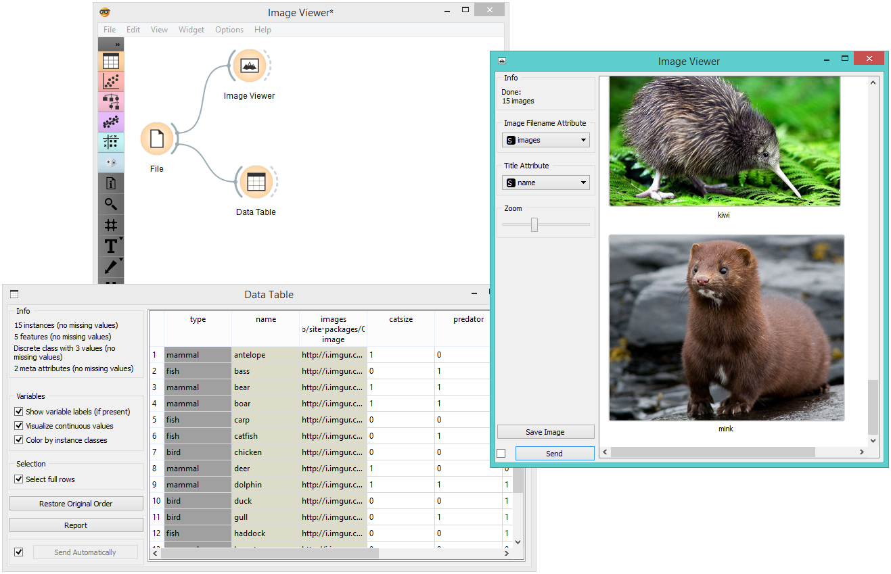
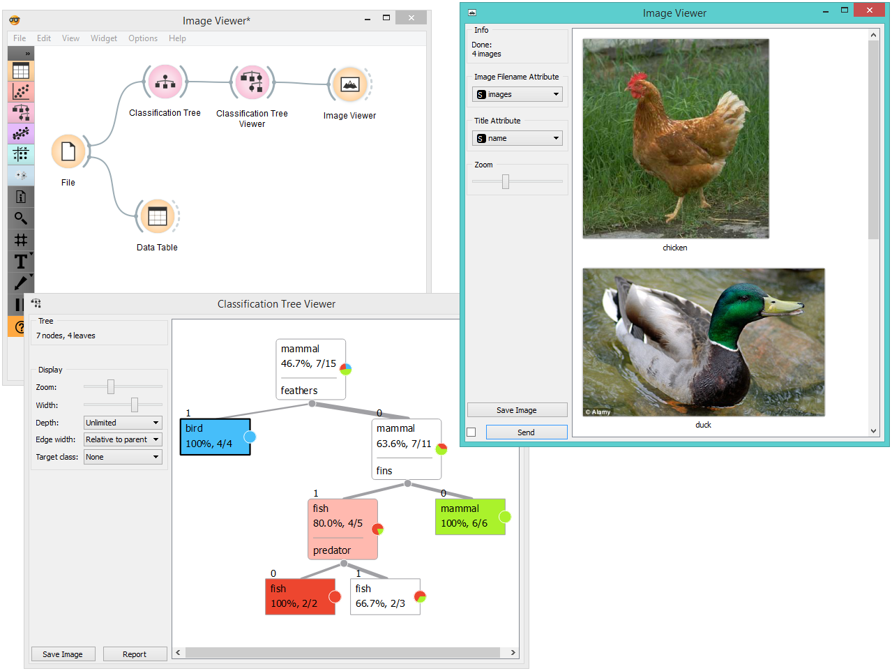

Image Viewer
============

Displays images that come with a data set.

Signals
-------

**Inputs**:

-  **Data**

   A data set with images.

**Outputs**:

-  **Data**

   Images that come with the data.

Description
-----------

The **Image Viewer** widget can display images from a data set, which are
stored locally or on the internet. It can be used for image comparison,
while looking for similarities or discrepancies between selected data
instances (e.g. bacterial growth or bitmap representations of
handwriting).

1. Information on the data set
2. Select the column with image data (links).
3. Select the column with image titles.
4. Zoom in or out.
5. Saves the visualization in a file.
6. Tick the box on the left to commit changes automatically.
   Alternatively, click *Send*.

Examples
--------

A very simple way to use this widget is to connect the :doc:`File <../data/file>` widget with
**Image Viewer** and see all the images that come with your data set.

Alternatively, you can visualize only selected instances, as shown in the
example below.

