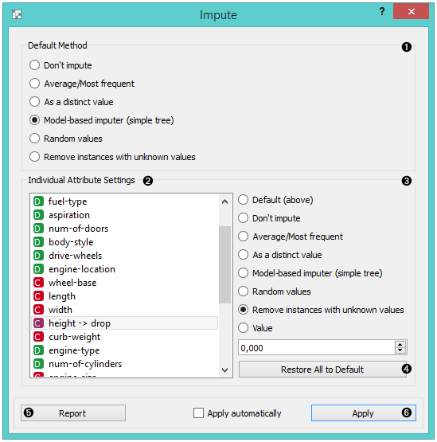
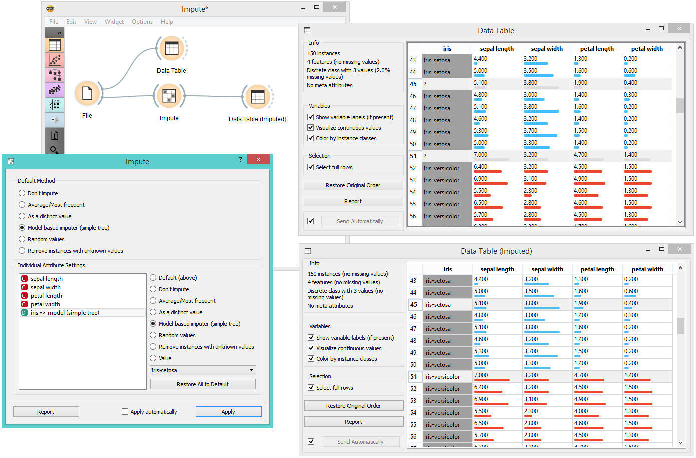

Impute
======

Replaces unknown values in the data.

Inputs
    Data
        input dataset
    Learner
        learning algorithm for imputation

Outputs
    Data
        dataset with imputed values

Some Orange's algorithms and visualizations cannot handle unknown values
in the data. This widget does what statisticians call imputation: it
substitutes missing values by values either computed from the data or
set by the user. The default imputation is (1-NN).

1. In the top-most box, *Default method*, the user can specify a general
   imputation technique for all attributes.

   -  **Don't Impute** does nothing with the missing values.
   -  **Average/Most-frequent** uses the average value (for continuous
      attributes) or the most common value (for discrete attributes).
   -  **As a distinct value** creates new values to substitute the missing
      ones.
   -  **Model-based imputer** constructs a model for predicting the missing
      value, based on values of other attributes; a separate model is constructed
      for each attribute. The default model is 1-NN learner, which takes the value from the most similar example
      (this is sometimes referred to as hot deck imputation). This
      algorithm can be substituted by one that the user connects to the
      input signal Learner for Imputation. Note, however, that if there are
      discrete and continuous attributes in the data, the algorithm needs
      to be capable of handling them both; at the moment only 1-NN learner
      can do that. (In the future, when Orange has more regressors, the Impute
      widget may have separate input signals for discrete and continuous
      models.)
   -  **Random values** computes the distributions of values for each
      attribute and then imputes by picking random values from them.
   -  **Remove examples with missing values** removes the example
      containing missing values. This check also applies to the class
      attribute if *Impute class values* is checked.

2. It is possible to specify individual treatment for each attribute,
   which overrides the default treatment set. One can also specify a
   manually defined value used for imputation. In the screenshot, we
   decided not to impute the values of "*normalized-losses*" and
   "*make*", the missing values of "*aspiration*" will be replaced by
   random values, while the missing values of "*body-style*" and
   "*drive-wheels*" are replaced by "*hatchback*" and "*fwd*",
   respectively. If the values of "*length*", "*width*" or "*height*"
   are missing, the example is discarded. Values of all other attributes
   use the default method set above (model-based imputer, in our case).
3. The imputation methods for individual attributes are the same as default. 
   methods.
4. *Restore All to Default* resets the individual attribute treatments
   to default.
5. Produce a report. 
6. All changes are committed immediately if *Apply automatically* is
   checked. Otherwise, *Apply* needs to be ticked to apply any new
   settings.

Example
-------

To demonstrate how the **Impute** widget works, we played around with the *Iris* dataset
and deleted some of the data. We used the **Impute** widget and selected the 
*Model-based imputer* to impute the missing values. In another :doc:`Data Table <../data/datatable>`, 
we see how the question marks turned into distinct values ("Iris-setosa, "Iris-versicolor"). 

