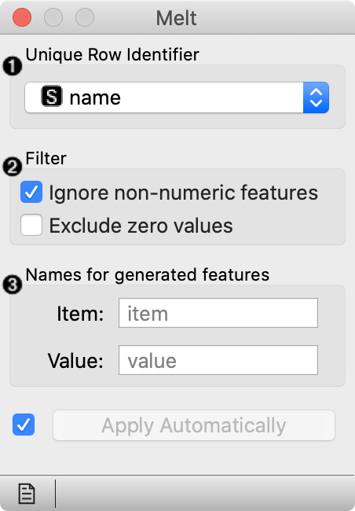
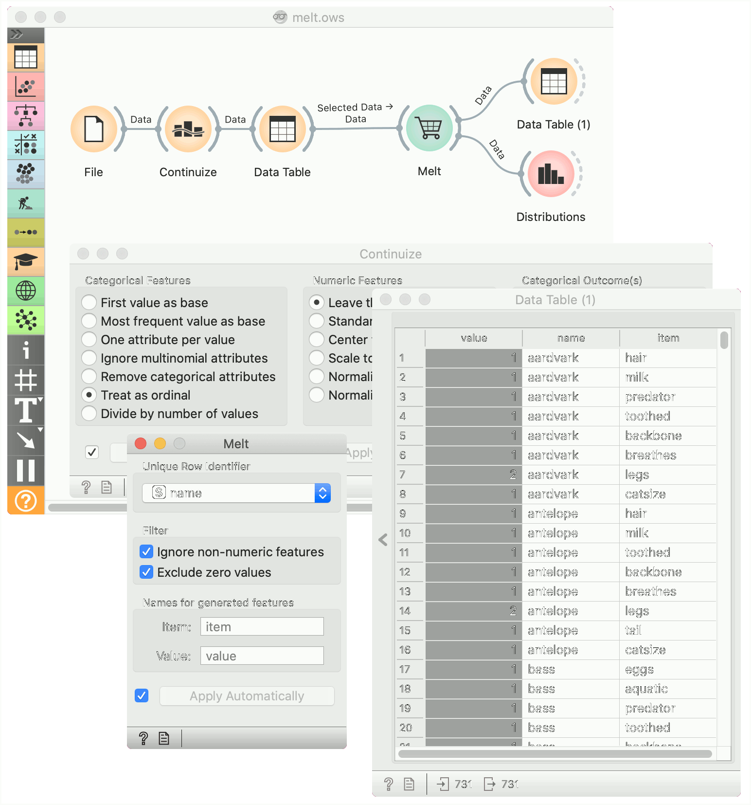
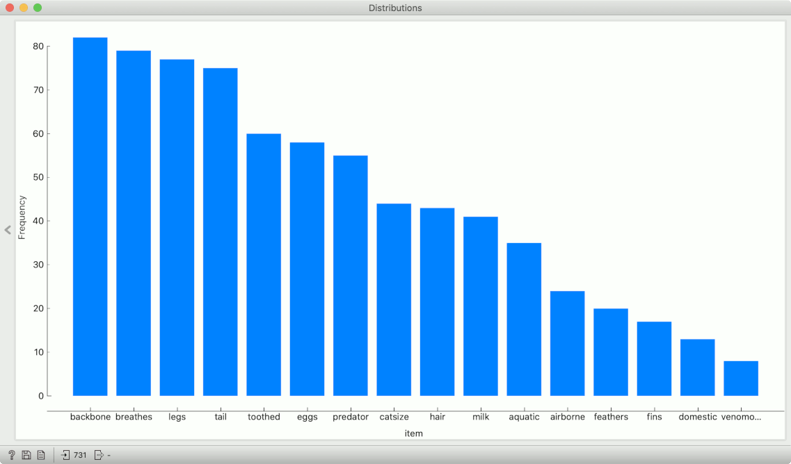

Melt
=========

Transform [wide data to narrow](https://en.wikipedia.org/wiki/Wide_and_narrow_data).

**Inputs**

- Data: wide data table

**Outputs**

- Data: narrow data table

The **Melt** widget receives a dataset in the more common wide format and outputs a table of (row_id, variable, value) triplets.

1. Select the variable used as id. The widget offers only columns without duplicated values. Alternatively, row number can be used as id.
2. Select whether to include non-numeric variables, and whether to exclude zero values.
3. Set the names of the columns with name of the variable ("item") and the corresponding value.

Example
-------

In the following workflow we play with the Zoo data set, in which we convert all variables to numeric by treating them as ordinal. All variables except the number of legs boolean (e.g. the animal lays or does not lay eggs), so a value of 1 will correspond to an animal having a particular feature. In data table we select all rows (Ctrl-A or Cmd-A) and deselect the duplicate description of the frog in order to avoid duplicate values in the "name" column.

We pass it to Melt, where we designate the name as the row id, and discard zero values. The resulting table has multiple rows for each animal: one for each of animals features.

An interesting immediate use for this is to pass this data to Distributions and see what are the most and the least common features of animals.

In the next example we show how shuffling class values influences model performance on the same dataset as above.

