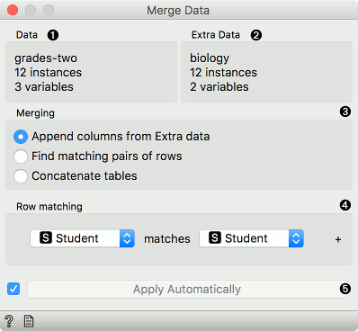
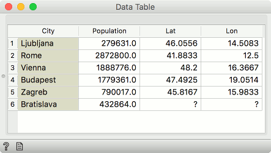
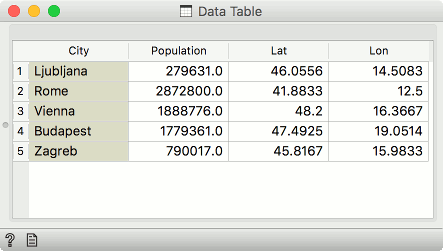
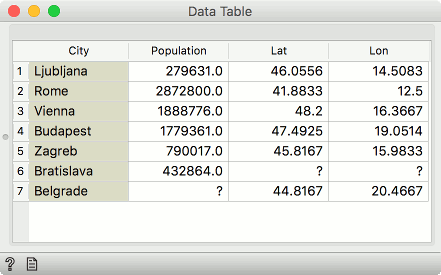
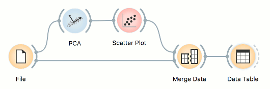
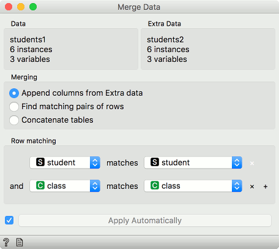
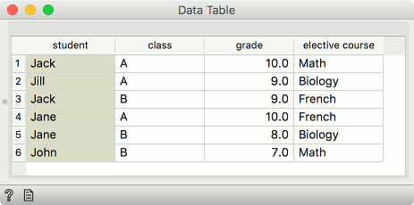

Merge Data
==========

Merges two datasets, based on values of selected attributes.

**Inputs**

- Data: input dataset
- Extra Data: additional dataset

**Outputs**

- Data: dataset with features added from extra data

The **Merge Data** widget is used to horizontally merge two datasets, based on the values of selected attributes (columns). In the input, two datasets are required, data and extra data. Rows from the two data sets are matched by the values of pairs of attributes, chosen by the user. The widget produces one output. It corresponds to the instances from the input data to which attributes (columns) from input extra data are appended.

To match by a combination of features click on the plus icon to add the features to merge on.

Depending upon the merge types, selected features may be required to have unique values (that is, no duplicates) in the data. When merging by multiple features, this pertains to a combinations of their values.

1. Information on main data.
2. Information on data to append.
3. Merging type:
   - **Append columns from Extra Data** outputs all rows from the Data, augmented by the columns in the Extra Data. Rows without matches are retained, even where the data in the extra columns are missing.
   - **Find matching pairs of rows** outputs rows from the Data, augmented by the columns in the Extra Data. Rows without matches are removed from the output.
   - **Concatenate tables** treats both data sources symmetrically. The output is similar to the first option, except that non-matched values from Extra Data are appended at the end.
4. List of attributes from Data input.
5. List of attributes from Extra Data input.
6. Produce a report.

Merging Types
-------------

#####Append Columns from Extra Data (left join)

Columns from the Extra Data are added to the Data. Instances with no matching rows will have missing values added.

For example, the first table may contain city names and the second would be a list of cities and their coordinates. Columns with coordinates would then be appended to the data with city names. Where city names cannot be matched, missing values will appear.

In our example, the first Data input contained 6 cities, but the Extra Data did not provide Lat and Lon values for Bratislava, so the fields will be empty.

For this type of merge, the values on the left (e.g. cities) may repeat (e.g. the same city appear multiple times), while the *used* value on the right must not. For example, let the right-hand table contain multiple Springfields. If Springfield does not appear on the left, the widget will show a warning but still merge the data. If Springfield does appear on the left as well, the widget will show an error. This can be resolved if the both table also include the data on the state (e.g. Illinois, Missouri, Oregon, Ohio) and this feature is added to the combination being matched.

#####Find matching pairs of rows (inner join)

Only those rows that are matched will be present on the output, with the Extra Data columns appended. Rows without matches are removed.

In our example, Bratislava from the Data input did not have Lat and Lon values, while Belgrade from the Extra Data could not be found in the City column we were merging on. Hence both instances are removed - only the intersection of instances is sent to the output.

For this type of merge, combinations of features on the left and on the right must be unique.

#####Concatenate tables (outer join)

The rows from both the Data and the Extra Data will be present on the output. Where rows cannot be matched, missing values will appear.

In our example, both Bratislava and Belgrade are now present. Bratislava will have missing Lat and Lon values, while Belgrade will have a missing Population value.

For this type of merge, combinations of features on the left and on the right must be unique.

#####Row index

Data will be merged in the same order as they appear in the table. Row number 1 from the Data input will be joined with row number 1 from the Extra Data input. Row numbers are assigned by Orange based on the original order of the data instances.

#####Instance ID

This is a more complex option. Sometimes, data in transformed in the analysis and the domain is no longer the same. Nevertheless, the original row indices are still present in the background (Orange remembers them). In this case one can merge on instance ID. For example if you transformed the data with PCA, visualized it in the Scatter Plot, selected some data instances and now you wish to see the original information of the selected subset. Connect the output of Scatter Plot to Merge Data, add the original data set as Extra Data and merge by Instance ID.

#####Merge by two or more attributes

Sometimes our data instances are unique with respect to a combination of columns, not a single column. To merge by more than a single column, add the *Row matching* condition by pressing plus next to the matching condition. To remove it, press the x.

In the below example, we are merging by *student* column and *class* column.

Say we have two data sets with student names and the class they're in. The first data set has students' grades and the second on the elective course they have chosen. Unfortunately, there are two Jacks in our data, one from class A and the other from class B. Same for Jane.

To distinguish between the two, we can match rows on both, the student's name and her class.

Examples
--------

Merging two datasets results in appending new attributes to the original file, based on a selected common attribute. In the example below, we wanted to merge the **zoo.tab** file containing only factual data with [zoo-with-images.tab](http://file.biolab.si/datasets/zoo-with-images.tab) containing images. Both files share a common string attribute *names*. Now, we create a workflow connecting the two files. The *zoo.tab* data is connected to **Data** input of the **Merge Data** widget, and the *zoo-with-images.tab* data to the **Extra Data** input. Outputs of the **Merge Data** widget is then connected to the [Data Table](../data/datatable.md) widget. In the latter, the **Merged Data** channels are shown, where image attributes are added to the original data.

The case where we want to include all instances in the output, even those where no match by attribute *names* was found, is shown in the following workflow.

The third type of merging is shown in the next workflow. The output consists of both inputs, with unknown values assigned where no match was found.

